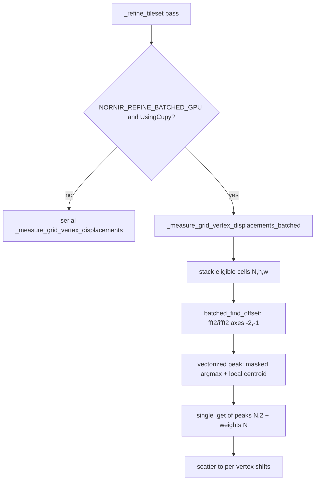

## Goal

Validate the assessment's top recommendation: replace the serial per-vertex GPU loop with a batched path and a vectorized peak finder, then gate go/no-go on (a) throughput beating CPU (~85 cells/s) and (b) registration parity against the C++ golden mosaic. No production default changes this phase; everything is opt-in.

The dominant GPU cost is `find_peak` (`phasecorrelation.py:358`), which uses connected-component `cupyx.scipy.ndimage` ops that do not batch. The prototype introduces a vectorized argmax + local-centroid peak finder that operates on a stacked `(N, h, w)` batch.

## Step 1 - Batched correlation + vectorized peak primitive

New module [nornir-imageregistration/nornir_imageregistration/batched_phase_correlation.py](nornir-imageregistration/nornir_imageregistration/batched_phase_correlation.py) (kept separate from production `phasecorrelation.py` during the gate):

- `batched_image_phase_correlation(targets, sources, correlation_coefficient=None)`: `targets`/`sources` are `(N,h,w)` device arrays. Use `xp.fft.fft2(a, axes=(-2,-1))`, cross-power normalization (mirroring `fft_phase_correlation`, lines 296-340) vectorized over the batch, `xp.fft.ifft2(..., axes=(-2,-1)).real` -> `(N,h,w)`.
- `batched_find_offset(targets, sources, overlap_mask, min_overlap, max_overlap, ...)`: correlate, `xp.fft.fftshift(..., axes=(-2,-1))`, per-image normalize (per-image `amin`/`amax` over `(-2,-1)`), zero non-overlap, call `batched_find_peak`. Returns device `peaks (N,2)` and `weights (N,)`.
- `batched_find_peak(images, overlap_mask)` (the vectorized replacement for `find_peak`):
  - mask -> per-image flat `argmax` -> `(row,col)` per image.
  - local center-of-mass refinement in a clamped `(2r+1)` window around each argmax (vectorized gather), add sub-pixel offset.
  - `offset = (shape/2) - peak_coord` to match `find_peak` sign convention (line 454-456).
  - `weight = peak_value / mean(masked)` as the signal-to-noise analog (line 449-451).
  - Flat/invalid images (per-image max<=0) -> weight 0 (matches serial weight-0 skip).
  - One `.get()` for the whole batch at the end.
- Follow Numpy/CuPy rule: resolve `xp = cp.get_array_module(targets)`, `sp = cupyx.scipy.get_array_module(targets)`; numpy arrays in -> numpy out so the same code validates on CPU.

## Step 2 - Batched vertex measurement

Add `_measure_grid_vertex_displacements_batched(...)` in [nornir-imageregistration/nornir_imageregistration/local_distortion_correction.py](nornir-imageregistration/nornir_imageregistration/local_distortion_correction.py), mirroring the gating of the serial `_measure_grid_vertex_displacements` (lines ~547-581):

- Loop vertices only to apply the same eligibility checks (center-in-fixed-buffer, `fixed_fraction`/`moving_fraction` >= `cell_min_overlap`) and collect eligible `(fixed_cell, moving_cell)` via `_extract_refinement_cell`.
- Stack eligible cells into `(N,h,w)` device arrays; one `GetOverlapMaskOnDevice(cell_shape, cell_shape, cell_shape, ...)` reused for all (cell shape is constant).
- One `batched_find_offset` call; scatter `peaks`/`weights` back to per-vertex `shifts`/`measured`, applying the same `weight<=0`/NaN guard (lines 575-579).

## Step 3 - Opt-in dispatch (no default change)

In `_refine_tileset` (the per-neighbor call site, lines ~1204-1210), dispatch to the batched function when `os.environ.get('NORNIR_REFINE_BATCHED_GPU')` is truthy and `UsingCupy()`; otherwise keep the existing serial path. Default behavior is unchanged. Reuse the existing `_PHASE_TIMER` buckets so the batched path is directly comparable.

## Step 4 - Golden parity validation

Reuse the existing Grid690 functional harness in [nornir-imageregistration/tests/grid_seam_metrics.py](nornir-imageregistration/tests/grid_seam_metrics.py) / [tests/test_refine_grid_690_functional.py](nornir-imageregistration/tests/test_refine_grid_690_functional.py) (golden bound `GOLDEN_TARGET_DELTA_MAX=2.2`, seam `MAX_SEAM_MAE=35`).

New script [nornir-imageregistration/scripts/compare_refine_peakfinder.py](nornir-imageregistration/scripts/compare_refine_peakfinder.py):
- Run `RefineGridMosaic` on the fixture twice (serial vs `NORNIR_REFINE_BATCHED_GPU=1`), report mean/max target-point delta (via `compare_mosaic_target_points_to_golden`) and seam MAE for both, plus batched-vs-serial per-vertex peak deltas.
- Gate: batched stays within golden 2.2 px and seam MAE < 35, and batched-vs-serial mean target delta within a small tolerance (target <= 1.0 working-res px).

## Step 5 - Benchmark gate

Extend [nornir-imageregistration/scripts/microbench_mosaic_refine.py](nornir-imageregistration/scripts/microbench_mosaic_refine.py) with a `--batched` flag (sets `NORNIR_REFINE_BATCHED_GPU=1` before import) so the existing matrix compares `numpy`, `cupy` (serial), and `cupy --batched`. Capture cells/s and `--phase-timing` split. Success bar: cupy-batched cells/s > numpy (~85) on the RTX 4500 Ada / Ryzen 9 9950X box.

## Step 6 - Findings + decision

Append a "Batched GPU prototype" section to [nornir-imageregistration/docs/mosaic_refine_grid_gpu_assessment.md](nornir-imageregistration/docs/mosaic_refine_grid_gpu_assessment.md): batched vs serial vs CPU table, parity numbers, and an explicit go/no-go on production integration (and whether to promote `batched_find_offset` into `phasecorrelation.py` for STOS unification).

## Step 7 - Prewarp optimization (contingency)

Pursue ONLY if Step 5/6 shows prewarp is the binding cost (it is the CPU path's dominant bucket today, and on GPU it is ~30% and forced serial). Skip if batching alone meets the goal. This is assessment hypothesis 4, scoped here as opt-in and measurement-gated - no default change.

Prewarp today (`_prewarp_all_tiles_for_grid_refine`, [local_distortion_correction.py](nornir-imageregistration/nornir_imageregistration/local_distortion_correction.py)):
- CPU branch uses `nornir_pools.GetGlobalMultithreadingPool()` (multiprocess) at line ~542; the assessment showed the dominant CPU cost is the pool dispatch/`wait_completion`, not the warp compute.
- CuPy branch is forced serial (line ~537 area: serial when `UsingCupy()`), and cross-pass caching is disabled under CuPy (`_prewarp_cache_enabled`, lines ~824-830).

Contingency levers (behind an opt-in flag, e.g. `NORNIR_REFINE_PREWARP_MODE`), prototyped and benchmarked, keeping current default:
- CPU: try `GetGlobalThreadPool()` (warp is numpy/scipy-heavy and may release the GIL) or chunked dispatch to cut per-task multiprocess overhead; quantify vs the current multiprocess pool.
- CuPy: prototype threaded prewarp that overlaps tile load + H2D with warp kernels, and/or a CuPy-safe cross-pass prewarp cache (re-rendering only tiles whose grid moved, matching the CPU cache semantics) - validate it does not change mosaic output (golden parity gate from Step 4).
- Report a per-phase split (reuse `_PHASE_TIMER` `prewarp` bucket) and a go/no-go; fold results into the Step 6 findings doc.

## Out of scope (this phase)

No change to the default CuPy or CPU paths, no STOS wiring, no regularization changes (assessment hypotheses 5-6). Production integration of either the batched vertex path or the prewarp changes is a follow-up contingent on the Step 5/6 gate. Prewarp work (Step 7) is itself contingent on prewarp remaining the binding cost after batching.