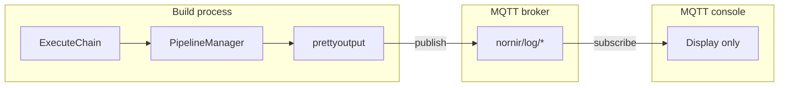
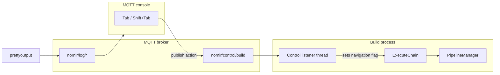

# Console Pipeline Skip / Rewind (TAB / Shift+Tab)

## Current architecture (why this does not exist today)



- Chained builds run in [`ExecuteChain`](nornir-buildmanager/nornir_buildmanager/build.py): a `for index, segment in enumerate(segments)` loop calls `call_pipeline(..., flush_at_boundary=True)` per `--then` segment.
- The MQTT console ([`nornir_shared/console.py`](nornir-shared/nornir_shared/console.py)) only **subscribes** to log topics and sleeps in a loop — no keyboard input, no publish back to the build.
- Legacy bidirectional hints exist (`PrettyOutput.Exit`, `Console.Exit` in [`console_constants.py`](nornir-shared/nornir_shared/console_constants.py)) from an old pipe-based design; they are not wired to pipeline control today.
- Pressing a key in the **debug terminal** is unreliable (VS Code debug often has non-TTY stdin; curses in [`prettyoutput.py`](nornir-shared/nornir_shared/prettyoutput.py) is disabled when streams are not TTY). The MQTT console window is the right place for keys.

## Target behavior (confirmed)

Navigation is **armed, not instant**: a key press sets a pending direction; the build executes it at the next cooperative checkpoint (section/stage boundary). This gives a window to cancel mistaken keys **before** the pipeline changes.

**No separate cancel key** — the **opposite** navigation key clears a pending arm:

| Current state | Tab | Shift+Tab |
|---------------|-----|-----------|
| **idle** | Arm **forward** skip (log: “Forward skip armed — Shift+Tab to cancel”) | Arm **backward** step (log: “Backward step armed — Tab to cancel”) |
| **pending forward** | No-op (stay armed) | **Cancel** → idle (log: “Navigation cancelled”) |
| **pending backward** | **Cancel** → idle | No-op (stay armed) |

**Example (accidental Tab):**

1. Tab → `pending_forward` (current pipeline keeps running until checkpoint)
2. Shift+Tab → cancel → `idle` (no pipeline change)
3. Shift+Tab → `pending_backward` (will re-run previous segment at next checkpoint)

**At checkpoint** (inside `PipelineManager`, not on keypress):

- `pending_forward` → raise `PipelineSkipped(forward)` → `ExecuteChain` advances to next `--then` segment
- `pending_backward` → raise `PipelineSkipped(back)` → `ExecuteChain` decrements index (no-op at index 0 + log)
- `idle` → continue normally

**Not in scope:** rewinding filesystem effects of already-completed pipelines (re-running the previous pipeline uses normal incremental/skip-existing logic in operations like `AutolevelTilesGpuPyramid`).

## Target architecture



## Implementation plan

### 1. MQTT control topic + pending navigation state machine

**Files:** [`nornir_shared/mqtt_config.py`](nornir-shared/nornir_shared/mqtt_config.py), new [`nornir_shared/build_control.py`](nornir-shared/nornir_shared/build_control.py)

- Add topic, e.g. `nornir/control/build` (env override `NORNIR_MQTT_CONTROL_TOPIC` optional).
- Payload JSON: `{"action": "tab"}` | `{"action": "shift_tab"}` (raw key events; state transitions happen in build_control, not in console).
- Thread-safe state: `idle` | `pending_forward` | `pending_backward` (+ lock).
- Listener applies transitions (see table above) and publishes a **status** log line via MQTT info topic when state changes (armed / cancelled) so the console shows feedback immediately.
- Thread-safe module API:
  - `start_build_control_listener()` — MQTT subscribe thread; started once from `ExecuteChain` when `--then` present.
  - `consume_pending_navigation()` → `None | "forward" | "back"` — called only at cooperative checkpoints; clears pending and returns direction to execute (does **not** run on raw keypress).
  - `clear_navigation()` — reset to `idle` at start of each new chain segment.
- Listener thread only updates pending state; main thread consumes at checkpoints (avoids cross-thread pipeline mutation).

### 2. Console keyboard input (Tab / Shift+Tab)

**Files:** [`nornir_shared/console.py`](nornir-shared/nornir_shared/console.py), optionally [`nornir_shared/curses_console.py`](nornir-shared/nornir_shared/curses_console.py)

Replace the idle `time.sleep(1)` loop in `MQTTConsoleLoop` with non-blocking key polling:

- **Curses mode:** `curses.nodelay(True)` + `getch()` each iteration.
  - Tab → `\t` (9) → publish `{"action": "tab"}`.
  - Shift+Tab → `curses.KEY_BTAB` → publish `{"action": "shift_tab"}`.
- **No-curses mode:** raw stdin via `select` + `termios` (Linux/WSL); document that key nav requires curses console or TTY. Windows standalone console may need `-nocurses` fallback using `msvcrt.kbhit` (optional follow-up).
- On connect, print help: `Tab: arm forward skip | Shift+Tab: arm backward step | Opposite key cancels pending navigation`.
- Subscribe to status/info topic (or reuse log handler) to show “armed” / “cancelled” feedback in the console UI.
- Publish via a small helper in `build_control.py` (`publish_navigation_action`) so console does not duplicate topic names.

**Note:** Tab in terminal emulators can steal focus; curses console is the supported surface.

### 3. Chain executor: index loop + navigation handling

**File:** [`nornir-buildmanager/nornir_buildmanager/build.py`](nornir-buildmanager/nornir_buildmanager/build.py)

Refactor `ExecuteChain` from:

```python
for index, segment in enumerate(segments):
    ...
    volume_tree = call_pipeline(...)
```

to a **`while index < len(segments)`** loop:

```python
index = 0
while index < len(segments):
    clear_navigation()
    pipeline_name = ...
    try:
        volume_tree = call_pipeline(...)
    except PipelineSkipped as e:
        prettyoutput.Log(f"Skipped {pipeline_name}: {e}")
        nornir_pools.ReleaseStagePools()
    finally:
        step_timer.End(...)
        _AppendTimingRecord(...)

    nav = consumed_direction  # from PipelineSkipped, or None on normal completion
    if nav == "forward":
        index += 1
    elif nav == "back":
        index = max(0, index - 1)
    else:
        index += 1  # normal completion
```

- If navigation was **armed** and a checkpoint fires during `call_pipeline`, `PipelineSkipped(direction=...)` is raised after `consume_pending_navigation()`; `ExecuteChain` adjusts index from the exception’s direction.
- Start `start_build_control_listener()` once before the loop; stop on chain exit via `atexit` or explicit cleanup.

### 4. Cooperative cancellation inside `PipelineManager`

**Files:** [`nornir_buildmanager/pipelinemanager.py`](nornir-buildmanager/nornir_buildmanager/pipelinemanager.py), [`nornir_buildmanager/pipeline_exceptions.py`](nornir-buildmanager/nornir_buildmanager/pipeline_exceptions.py)

Add `PipelineSkipped(PipelineError)` (or lightweight standalone exception — prefer **not** inheriting `PipelineError` so existing `except PipelineError` fatal handlers do not mis-handle it).

Check `consume_pending_navigation()` at natural boundaries (cheap, frequent enough for section-level pipelines):

| Location | Why |
|----------|-----|
| [`ProcessIterateNode`](nornir-buildmanager/nornir_buildmanager/pipelinemanager.py) — top of `for VolumeElemChild` | Per-section boundary (AutoLevelPyramid iterates sections). |
| [`ExecuteChildPipelines`](nornir-buildmanager/nornir_buildmanager/pipelinemanager.py) — top of `for ChildNode` | Per XML stage element. |
| [`_SaveNodes`](nornir-buildmanager/nornir_buildmanager/pipelinemanager.py) — before each generator yield | Stops lazy generators mid-operation (where your recent crash stack walked). |

Helper:

```python
def _raise_if_navigation_requested():
    nav = build_control.consume_pending_navigation()
    if nav is not None:
        raise PipelineSkipped(direction=nav)
```

On `PipelineSkipped` inside `PipelineManager.Execute`:

- Log via `prettyoutput.Log`
- Still call `nornir_pools.ReleaseStagePools()` (mirror normal `Execute` finally path)
- **Do not** call `VolumeManager.Save` for `flush_at_boundary` unless partial save is desired — recommend **skip flush on abort** so half-written section state is not committed as “complete”; next pipeline or re-run picks up from disk as today.

Propagate: `ExecuteChain` catches `PipelineSkipped`, releases pools if not already done, adjusts index.

**Phase 2 (optional):** checks inside long GPU loops in [`ConvertImagesInDictGpuPyramid`](nornir-imageregistration/nornir_imageregistration/core/_core.py) for sub-minute response; not required for first version if section-level checks suffice.

### 5. Tests

**Files:** new tests in [`nornir-buildmanager/tests/pipeline/test_chain.py`](nornir-buildmanager/tests/pipeline/test_chain.py), new [`nornir-shared/tests/test_build_control.py`](nornir-shared/tests/test_build_control.py)

- State machine: Tab → pending_forward; Shift+Tab → idle (cancel); Shift+Tab → pending_backward.
- Symmetric: Shift+Tab → pending_backward; Tab → idle (cancel).
- Mock `consume_pending_navigation()` returning `forward` / `back`; verify index arithmetic.
- Mock `call_pipeline` raising `PipelineSkipped(forward)`; verify second segment runs.
- `PipelineSkipped(back)` at index 1 → index 0, segment 0 re-run.
- MQTT listener: publish JSON to control topic, assert flag set (integration test with embedded broker if available, else mock client).
- Console key mapping unit test (curses key constants → action names).

### 6. Documentation / UX

- Help in MQTT console startup banner (arm + opposite-key cancel).
- Comment in [`.vscode/launch.json`](.vscode/launch.json) compound `--then` configs: “Tab arms forward skip; Shift+Tab arms backward step; opposite key cancels before next checkpoint.”
- No pipeline XML changes.

## Effort estimate

| Piece | Effort |
|-------|--------|
| MQTT control topic + build_control module | ~0.5 day |
| Console key loop (curses + nocurses fallback) | ~0.5–1 day |
| ExecuteChain index loop + listener lifecycle | ~0.5 day |
| PipelineManager cooperative checkpoints | ~0.5–1 day |
| Tests + manual verify on one `--then` launch config | ~0.5 day |
| **Total** | **~2–3 days** |

## Risks / tradeoffs

- **Responsiveness:** Without phase-2 GPU-loop checks, skip may wait until the current **section** or generator yield completes (seconds–minutes for one section, not hours for whole pipeline).
- **Shift+Tab semantics:** Re-runs the previous pipeline against current `volume_tree` + on-disk outputs; does not undo files written by that pipeline — relies on existing “skip if current” logic.
- **Accidental keys:** Opposite-key cancel covers mistaken Tab/Shift+Tab before checkpoint; same-key repeat while armed is a no-op (does not double-arm or cancel).
- **Responsiveness vs safety:** Cancel only works until the next checkpoint fires; very fast Tab→checkpoint before Shift+Tab cannot be cancelled (rare if checkpoints are per-section).
- **Single-pipeline builds:** Listener can start but keys no-op (log “not a chained build”) unless you later extend to “cancel current pipeline” for non-chain runs.

## Files to touch (summary)

1. [`nornir_shared/mqtt_config.py`](nornir-shared/nornir_shared/mqtt_config.py) — control topic
2. **New** [`nornir_shared/build_control.py`](nornir-shared/nornir_shared/build_control.py) — listener, flags, publish helper
3. [`nornir_shared/console.py`](nornir-shared/nornir_shared/console.py) — Tab / Shift+Tab → MQTT publish
4. [`nornir_buildmanager/build.py`](nornir-buildmanager/nornir_buildmanager/build.py) — `ExecuteChain` navigation loop
5. [`nornir_buildmanager/pipelinemanager.py`](nornir-buildmanager/nornir_buildmanager/pipelinemanager.py) — cooperative checks
6. [`nornir_buildmanager/pipeline_exceptions.py`](nornir-buildmanager/nornir_buildmanager/pipeline_exceptions.py) — `PipelineSkipped`
7. Tests in buildmanager + nornir-shared
