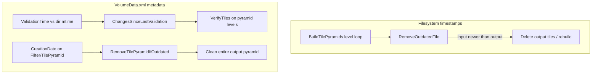

# Fixing timestamps on a copied volume (RPC3)

## Short answer

**Partially today, with a small script or new pipeline.** Nornir does not ship a `SyncValidationTimes`-style command, but the volume manager already exposes `UpdateValidationTime()` for exactly this purpose. For `/volumes/RPC3`, the most likely fix is syncing XML `ValidationTime` attributes to the copied files' current filesystem mtimes.

---

## Why a copied volume triggers spurious pyramid work

Tile-pyramid stages skip work using **two independent timestamp systems**:




| Mechanism            | Where                                                                                                                                    | What triggers rebuild                                                                                     |
| -------------------- | ---------------------------------------------------------------------------------------------------------------------------------------- | --------------------------------------------------------------------------------------------------------- |
| Per-tile mtime       | `[nornir_shared.files.RemoveOutdatedFile](nornir-shared/nornir_shared/files.py)`                                                         | Output tile deleted if input is **newer** (ties favor output — equal mtimes are safe)                     |
| Directory validation | `[XResourceElementWrapper.ChangesSinceLastValidation](nornir-buildmanager/nornir_buildmanager/volumemanager/xresourceelementwrapper.py)` | `ValidationTime` in XML **older than** level directory mtime → `VerifyTiles`                              |
| Pyramid metadata     | `[filter.RemoveTilePyramidIfOutdated](nornir-buildmanager/nornir_buildmanager/operations/filter.py)`                                     | Input filter `TilePyramid.CreationDate` **newer than** output pyramid `CreationDate` → full pyramid clean |


**Typical copy failure mode:** files get a uniform **new copy-time mtime**, but `VolumeData.xml` still records **old `ValidationTime`** from the source machine. Every pyramid level then looks "modified since last validation" and Nornir re-validates/rebuilds aggressively.

Less common: per-tile rebuilds if Raw8 tiles and Leveled outputs ended up with **different** mtimes after a non-preserving copy (input newer than output).

`CreationDate` comparisons use **XML only** — usually preserved correctly on copy unless a partial pipeline run rewrote some filter metadata.

---

## What exists today


| Tool                                                                                                                   | Status                                                                                                         |
| ---------------------------------------------------------------------------------------------------------------------- | -------------------------------------------------------------------------------------------------------------- |
| Dedicated sync/repair pipeline                                                                                         | **Does not exist**                                                                                             |
| `[ListOutdatedImagesets](nornir-buildmanager/nornir_buildmanager/config/Pipelines.xml)`                                | Diagnostic only; **commented out** in `Pipelines.xml`                                                          |
| `[diagnostics.PrintImageSetsOlderThanTilePyramids](nornir-buildmanager/nornir_buildmanager/operations/diagnostics.py)` | Can identify imageset/pyramid mismatches; not wired to CLI                                                     |
| `[UpdateValidationTime()](nornir-buildmanager/nornir_buildmanager/volumemanager/xresourceelementwrapper.py)`           | **Exists** — sets `ValidationTime` = current filesystem mtime for a node                                       |
| Copy with preserved times                                                                                              | **Best prevention** — `cp -a`, `rsync -a`, `robocopy /COPYALL`, or `shutil.copy2` (used in test repro harness) |


---

## Recommended fix for RPC3 now (no new feature required)

### Step 1 — Confirm what's triggering rebuilds

Run one pyramid stage with `-debug` and watch for:

- `Validating tiles in ... directory was modified since last check` → `**ValidationTime` mismatch** (most likely)
- `Removing outdated file:` → **per-tile mtime mismatch**
- `TilePyramid at ... is older than TilePyramid at ...` → `**CreationDate` metadata mismatch**

### Step 2 — Sync validation metadata to filesystem

Walk the loaded volume tree, call `UpdateValidationTime()` on resource nodes (`Level`, `Image`, mosaic/transform nodes that use it), then save:

```python
import nornir_buildmanager.volumemanager.volumemanager as vm
from nornir_buildmanager.volumemanager.xresourceelementwrapper import XResourceElementWrapper

volume = vm.VolumeManager.Load("/volumes/RPC3")
volume.LoadAllLinkedNodes()

for node in volume.iter():  # or targeted XPath: .//Level, .//Image, etc.
    if isinstance(node, XResourceElementWrapper) and node.FullPath:
        try:
            node.UpdateValidationTime()
        except FileNotFoundError:
            pass

vm.VolumeManager.Save(volume)
```

This aligns XML `ValidationTime` with post-copy directory mtimes and should stop the `ChangesSinceLastValidation` → `VerifyTiles` cascade.

**Caveat:** saving `VolumeData.xml` inside a level directory can bump that directory's mtime (noted in `[tile.py` VerifyTiles](nornir-buildmanager/nornir_buildmanager/operations/tile.py) line 166). A dedicated tool should update validation times **after** save, or save from parent containers where possible.

### Step 3 — If per-tile rebuilds persist

Re-copy with timestamp preservation, or touch output pyramid tiles to be **≥ input** mtimes (only if logs show `Removing outdated file`). Equal mtimes are already safe (`NewestFile` ties favor output).

### Step 4 — If `CreationDate` mismatch is the cause

Inspect a affected filter pair in `VolumeData.xml` (e.g. Raw8 vs Leveled `CreationDate` on `TilePyramid` elements). Output pyramid `CreationDate` must be ≥ input. Fixing this requires metadata adjustment (not just `ValidationTime`) — rare on a straight copy.

---

## Add a proper `nornir-build` command (recommended long-term)

Add a small maintenance pipeline, e.g. `**SyncValidationTimes`**, in `[Pipelines.xml](nornir-buildmanager/nornir_buildmanager/config/Pipelines.xml)`:

```xml
<Pipeline Name="SyncValidationTimes" Help="Sync ValidationTime metadata to filesystem mtimes after a volume copy.">
  <PythonCall Module="nornir_buildmanager.operations.migration"
              Function="SyncValidationTimes" />
</Pipeline>
```

Implementation in `[operations/migration.py](nornir-buildmanager/nornir_buildmanager/operations/migration.py)` (~40 lines):

1. `VolumeNode.LoadAllLinkedNodes()`
2. Walk `Level`, `Image`, and other `XResourceElementWrapper` nodes with on-disk paths
3. `UpdateValidationTime()` where path exists
4. Return volume root for save
5. Optional `-dryrun` flag to print nodes that would change

Usage:

```bash
nornir-build SyncValidationTimes /volumes/RPC3
```

Add a unit test with a temp volume: set stale `ValidationTime`, touch directory mtime, run sync, assert `ChangesSinceLastValidation` is false.

---

## Prevention for future copies

When cloning volumes to `/volumes/`:

- Prefer `**rsync -a**` or `**cp -a**` (preserves mtimes)
- Avoid plain `cp -r` / Explorer copy without timestamp preservation
- After any copy method, run `**SyncValidationTimes**` once before starting TEMBuild/TEMAlign chains

---

## Relation to your chained launch configs

The new `--then` chain configs (`[.vscode/launch.json](.vscode/launch.json)`) keep metadata in memory between steps but **do not bypass** timestamp checks — syncing RPC3 once before running `TEM Build: full chain` is still the right first step.