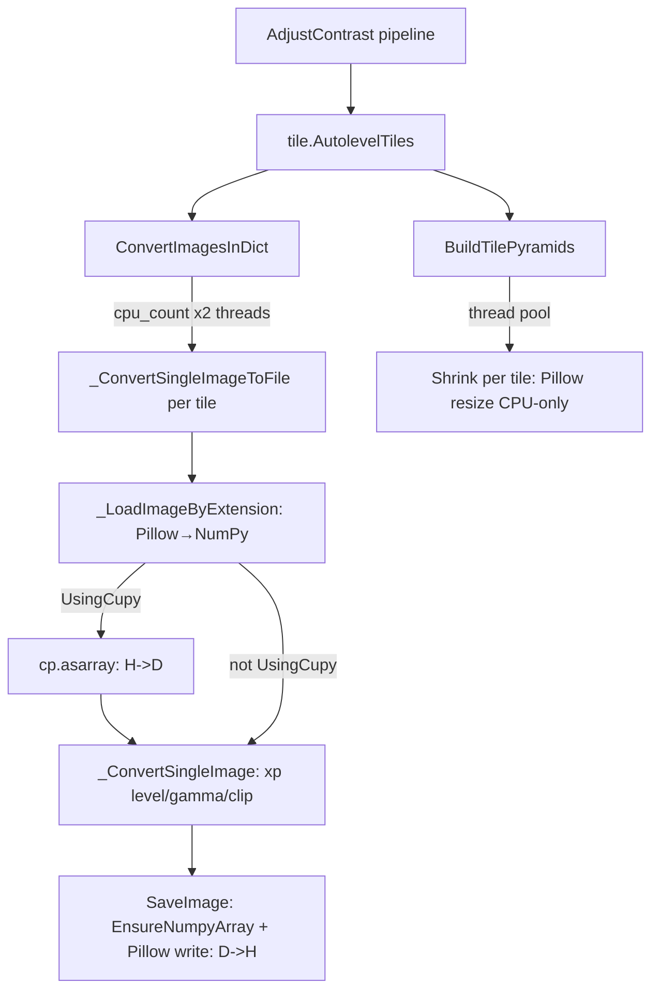

# GPU-Optimized AdjustContrast Pipeline

## Background and bottleneck analysis

The current AdjustContrast pipeline:



Bottlenecks:
- Every tile: Pillow decode (CPU) → optional H→D → element-wise math → D→H → Pillow encode (CPU)
- `SetActiveComputationLib(cupy)` is blocked in child processes (`computational_lib.py:128-129`), so thread-pool workers all run numpy
- `BuildTilePyramids` / `Shrink` never uses GPU for standard raster formats
- `ConvertImagesInDict` creates `cpu_count * 2` threads all competing for one GPU context

The GPU-optimized approach: load all tile arrays, batch them on the GPU in the **main process** (no per-tile H→D/D→H), then write outputs back in parallel threads.

---

## Files to create/modify

- **New:** [`nornir-imageregistration/nornir_imageregistration/core/_core.py`](nornir-imageregistration/nornir_imageregistration/core/_core.py) — add `ConvertImagesInDictGpu` and `_ShrinkPillowBatchGpu`
- **New:** [`nornir-buildmanager/nornir_buildmanager/operations/tile.py`](nornir-buildmanager/nornir_buildmanager/operations/tile.py) — add `AutolevelTilesGpu` generator function
- **New:** [`nornir-buildmanager/nornir_buildmanager/config/Pipelines.xml`](nornir-buildmanager/nornir_buildmanager/config/Pipelines.xml) — add `AdjustContrastGpu` pipeline entry
- **New:** [`nornir-imageregistration/scripts/bench_adjust_contrast.py`](nornir-imageregistration/scripts/bench_adjust_contrast.py) — standalone CPU vs GPU benchmark script

---

## Task 1: `ConvertImagesInDictGpu` in `core/_core.py`

Add a new function immediately after `ConvertImagesInDict` (~line 596). This replaces per-tile H→D/D→H with a single batched device roundtrip:

```python
def ConvertImagesInDictGpu(ImagesToConvertDict, InputBpp=None, OutputBpp=None,
                            MinMax=None, Gamma=None):
    """GPU-batched contrast conversion. Loads all tiles to host, stacks, uploads once,
    applies level/gamma/clip on device as a batch, downloads once, saves in parallel threads."""
    if not nornir_imageregistration.HasCupy() or not nornir_imageregistration.UsingCupy():
        return ConvertImagesInDict(ImagesToConvertDict, ...)
    # 1. Load all tiles to numpy (parallel threads, I/O bound)
    # 2. Stack into a 3D numpy array [N, H, W]
    # 3. cp.asarray(stack) — single H→D transfer
    # 4. Vectorized level/gamma/clip over batch axis using xp ops
    # 5. cp.asnumpy(result) — single D→H transfer
    # 6. Save each tile in parallel threads
```

Key CuPy ops (same as `_ConvertSingleImage` but across batch axis 0):
- `batch -= min_val; batch /= (max_val - min_val)`
- `batch[batch >= 0] = xp.power(...)` → replace with `xp.where` for broadcast safety
- `xp.clip(batch, 0, 1, out=batch)`

Constraint: tiles must be the same shape (true for a mosaic level). If shapes vary, fall back to `ConvertImagesInDict`.

---

## Task 2: `AutolevelTilesGpu` in `tile.py`

Add a new generator function after `AutolevelTiles` (~line 832). It is structurally identical to `AutolevelTiles`; the only difference is the call at lines 800–804:

```python
# Original (keep unchanged):
nornir_imageregistration.ConvertImagesInDict(TilesToConvert, ...)

# GPU variant replacement:
nornir_imageregistration.ConvertImagesInDictGpu(TilesToConvert, ...)
```

All volume-manager node logic, checksum validation, histogram lookup, and pyramid building remain identical. The function signature must match `AutolevelTiles` exactly so `Pipelines.xml` can invoke it as a `PythonCall`.

---

## Task 3: `AdjustContrastGpu` in `Pipelines.xml`

Add a new `<Pipeline Name="AdjustContrastGpu">` entry immediately after the existing `AdjustContrast` block (~line 502). It is a copy with one change:

```xml
<PythonCall Function="tile.AutolevelTilesGpu" .../>
```

All arguments, iterators, and the downstream `BuildTilePyramids` call are identical to `AdjustContrast`.

This keeps the existing pipeline completely untouched and runnable.

---

## Task 4: Benchmark script `bench_adjust_contrast.py`

Follow the pattern of [`nornir_blob_benchmark.py`](nornir-imageregistration/nornir_imageregistration/scripts/nornir_blob_benchmark.py) and [`microbench_stos_refinement.py`](nornir-imageregistration/scripts/microbench_stos_refinement.py).

```
nornir-imageregistration/scripts/bench_adjust_contrast.py
  --volume-path   path to a real or fixture RPC3/... volume dir
  --iterations    N repetitions (default 3)
  --backends      cpu gpu both  (default both)
  --profile       dump cProfile .profile file
  --output        path for JSON results (default stdout)
```

Script structure:
1. Setup: resolve volume's `InputFilter` + transform node + histogram from existing `VolumeData.xml`
2. CPU run: `SetActiveComputationLib(numpy)` → call `AutolevelTiles` directly → measure wall time via `TaskTimer`
3. GPU run: `SetActiveComputationLib(cupy)` → call `AutolevelTilesGpu` → measure wall time
4. Optional cProfile per run (same pattern as `testbase.py`)
5. Print table: tiles/sec, seconds per stage, speedup ratio

For integration with `compare_idoc_profile_runs.py`, also emit a `StageTimings.json`-compatible JSON record so the existing `summarize_stage_timings` function can compare runs.

Add `AdjustContrastGpu` to `KEY_PIPELINES` in `compare_idoc_profile_runs.py` so full-pipeline A/B comparisons include both variants.

---

## Task 5: Wire GPU variant into launch configs (optional)

Add a `TEM Build: AdjustContrast (GPU)` entry to [`.vscode/launch.json`](.vscode/launch.json) using pipeline name `AdjustContrastGpu`. This lets you trigger the GPU path directly from the debugger without editing `Pipelines.xml`.

---

## Assessment criteria

The benchmark should report:

| Metric | Expected CPU | Expected GPU benefit |
|--------|-------------|---------------------|
| Wall time (N tiles) | I/O dominated | Small-moderate speedup |
| H→D + D→H transfer overhead | N copies | 1 batched copy |
| Pillow encode/decode | N serial-ish | Unchanged (still CPU) |
| GPU utilization (`nvidia-smi`) | Low | Higher batch occupancy |
| Output correctness | Reference | Must match CPU within float32 tolerance |

If GPU wall time is not better than CPU (likely for small tile counts or fast NVMe), the benchmark surfaces that explicitly and the original pipeline remains the production path.

---

## Not in scope

- Replacing Pillow I/O with a GPU codec (nvJPEG / nvImageCodec) — separate larger effort
- GPU pyramid building (`BuildTilePyramids`) — Pillow path cannot be easily replaced without codec changes
- GPU histogram computation — separate from contrast application