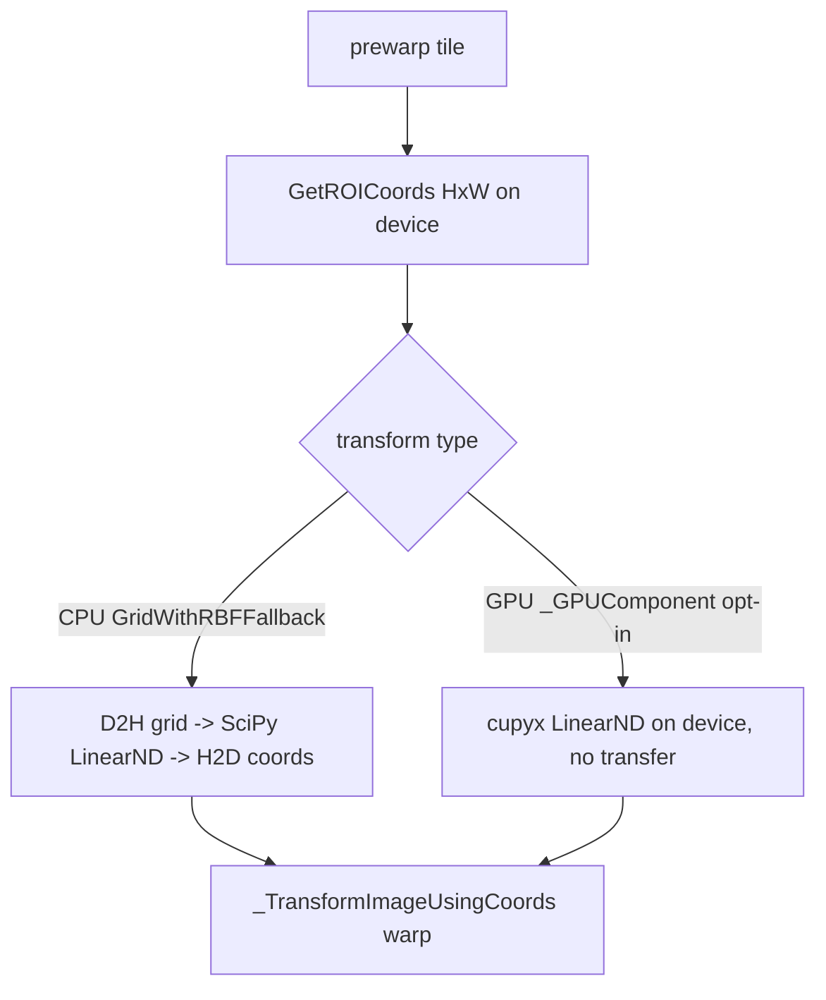

## Goal

Remove the per-tile-per-pass host round-trip in prewarp coordinate generation. Today `write_to_target_roi_coords` calls `transform.InverseTransform(...)` on a CPU `GridWithRBFFallback`, which forces the H x W ROI grid to host (`EnsurePointsAre2DNumpyArray`), runs SciPy `LinearNDInterpolator` on CPU, and returns NumPy coords that are then re-uploaded inside `_TransformImageUsingCoords`. The fix reuses the existing GPU transform so the inverse query stays on-device.

## Default policy (benchmark-driven)

Defaults follow the benchmarks, with one guardrail:
- Output byte-neutral winner -> flip the default automatically (matches what was already done for the batched vertex path and the batched cell-validity reduction).
- Output-shifting winner -> stays opt-in until explicit per-flag sign-off. This covers `NORNIR_REFINE_GPU_TRANSFORM` (cupyx vs SciPy LinearND is not bit-identical) and `NORNIR_REFINE_PREWARP_MODE=singlewarp`.
- `singlewarp` specifically is held opt-in even though it wins on throughput (126.6 vs 95.9 cells/s) and passes the mosaic-wide golden gate (2.005 < 2.2 px): the ~0.12 px delta is a mosaic average, and extreme-warp tiles need the most coverage warping, so per-tile worst-case error there could be materially larger. Promotion requires a per-tile worst-case check, not just the aggregate.
- Known losers stay off (`cache` mode regressed to 49.6 cells/s); already-proven neutral/positive defaults stay on (`NORNIR_REFINE_BATCHED_GPU`).

## Key facts (from investigation)

- Construction point: `ConvertTransformToGridTransform` ([converters.py:351-367](nornir-imageregistration/nornir_imageregistration/transforms/converters.py)) always returns CPU `GridWithRBFFallback`.
- GPU variant already implemented and used for ITK-string loads: `GridWithRBFFallback_GPUComponent` ([gridwithrbffallback.py:501-511](nornir-imageregistration/nornir_imageregistration/transforms/gridwithrbffallback.py)) -> `GridTransform_GPUComponent` whose inverse uses `cupyx.scipy.interpolate.LinearNDInterpolator` with a documented SciPy degenerate fallback (`_build_linear_nd_interpolator`, [gridtransform.py:78-99](nornir-imageregistration/nornir_imageregistration/transforms/gridtransform.py)).
- Selection pattern to mirror: `factory.ParseGridTransform` ([factory.py:237,278-280](nornir-imageregistration/nornir_imageregistration/transforms/factory.py)).
- Refinement build sites: `_initialize_tile_grid_transforms` ([local_distortion_correction.py:1224](nornir-imageregistration/nornir_imageregistration/local_distortion_correction.py)) and `_resample_transform_to_output_grid` ([:1237](nornir-imageregistration/nornir_imageregistration/local_distortion_correction.py)).
- `write_to_target_roi_coords` already has a CuPy branch ([assemble.py:119-133](nornir-imageregistration/nornir_imageregistration/assemble.py)).
- Prewarp uses `extrapolate=False`, so the RBF continuous fallback never runs in the hot path - only the discrete `cupyx` LinearND inverse matters.

## Step 0 - Measure the prize first

Add a temporary `_PHASE_TIMER` sub-section (or reuse a throwaway env timer) around `write_to_target_roi_coords` inside `_prewarp_tile_for_grid_refine` and run `scripts/microbench_mosaic_refine.py --backend cupy --batched --phase-timing` to confirm how much of the ~1.4-2.2 s prewarp bucket is coord-gen/InverseTransform vs the warp kernel. Proceed only if the inverse is a material share (expected ~0.4-0.7 s based on the singlewarp split). Remove the temporary timer after.

## Step 1 - Opt-in GPU transform selection

Add an opt-in flag `NORNIR_REFINE_GPU_TRANSFORM` (default off; helper `_refine_gpu_transform_enabled()` next to the other prewarp-mode helpers, requiring `UsingCupy()` and `cuLinearNDInterpolator is not None`).

Add a `prefer_gpu: bool = False` parameter to `ConvertTransformToGridTransform` ([converters.py:351](nornir-imageregistration/nornir_imageregistration/transforms/converters.py)) that, when true and CuPy is active and `cuLinearNDInterpolator` is available, returns `GridWithRBFFallback_GPUComponent(grid_data)` instead of the CPU class (mirroring `ParseGridTransform`). Default false keeps every other caller (STOS, tests) unchanged.

Pass `prefer_gpu=_refine_gpu_transform_enabled()` from `_initialize_tile_grid_transforms` only. Keep the final `_resample_transform_to_output_grid` / output path on the CPU class so the returned/saved mosaic transforms remain host-backed for serialization (avoids CuPy-in-MosaicFile surprises).

## Step 2 - Verify end-to-end on-device flow

Confirm the refinement loop handles a CuPy-backed grid transform with no hidden ping-pong:
- `UpdateTargetPointsByIndex` on `GridTransform_GPUComponent` ([gridtransform.py:803](nornir-imageregistration/nornir_imageregistration/transforms/gridtransform.py)) accepts the NumPy `new_targets` from `_refine_tileset` ([:1517](nornir-imageregistration/nornir_imageregistration/local_distortion_correction.py)) via `EnsurePointsAre2DCuPyArray`; invalidation clears the cupyx interpolator each pass.
- `EnsureNumpyArray(grid_transform.TargetPoints)` reads ([:1391]) still work (device->host once per tile/pass for the small control-point set - acceptable, not the H x W grid).
- `write_to_target_roi_coords` returns CuPy `read_coords`; check `InvalidIndices` and the `valid_coords_mask` indexing stay on one module (no numpy-mask-on-cupy mix). Fix any boundary if needed.
- `_grid_transform_matches_lattice` still recognizes the GPU transform so init does not loop-rebuild.

## Step 3 - Parity gate

The cupyx LinearND inverse is the same algorithm as SciPy LinearND but not bit-identical (GPU Delaunay + float). Treat as opt-in output-affecting and validate:
- `scripts/verify_cpu_vs_batched.py` with `NORNIR_REFINE_GPU_TRANSFORM=1` on the cupy leg: require CPU-vs-batched mean <= 1.0 px / max <= 3.0 px.
- `scripts/compare_refine_peakfinder.py`: golden delta <= 2.2 px, seam MAE < 35.
- Watch for the degenerate-triangulation SciPy fallback firing (would silently reintroduce D2H); log/count it during the bench run.

## Step 4 - Benchmark

`scripts/microbench_mosaic_refine.py --backend cupy --batched --phase-timing` with and without `NORNIR_REFINE_GPU_TRANSFORM=1`, and also combined with `NORNIR_REFINE_PREWARP_MODE=singlewarp`, to quantify the prewarp-bucket drop and cells/s. Success: prewarp bucket shrinks and cells/s rises with parity intact.

## Step 5 - Document + decide

Append a "GPU inverse transform" subsection to [docs/mosaic_refine_grid_gpu_assessment.md](nornir-imageregistration/docs/mosaic_refine_grid_gpu_assessment.md): coord-gen share before/after, cells/s, parity numbers (including per-tile worst-case, not just mosaic mean), and fallback frequency.

Apply the default policy:
- If `NORNIR_REFINE_GPU_TRANSFORM` wins and parity holds, it still stays opt-in (output-shifting) and I bring you the numbers for a per-flag sign-off rather than flipping the default.
- Record the recommendation for `singlewarp` promotion contingent on a per-tile worst-case error check on extreme-warp tiles; do not flip its default here.
- Note any output-neutral sub-optimization discovered along the way that can be flipped on automatically.

## Risks / out of scope

- cupyx Delaunay degeneracy fallback to SciPy (re-adds a transfer) - measure frequency; if frequent on real grids, the win shrinks.
- Output changes vs SciPy LinearND - hence opt-in + golden gate; no default change without per-flag sign-off (output-shifting). Parity must report per-tile worst-case, since extreme-warp tiles can diverge more than the mosaic-mean delta suggests.
- Forward-transform GPU residency, RBF continuous-fallback GPU parity, and STOS wiring are out of scope (prewarp uses discrete inverse with `extrapolate=False`).
- Final mosaic serialization stays CPU-backed; full GPU-resident transform end-to-end is a later step.