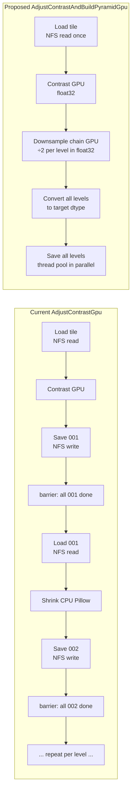

# GPU Tile Pyramid & Merged Contrast+Pyramid Pass

## Current state

The `AdjustContrastGpu` pipeline has two sequential stages in [`Pipelines.xml`](nornir-buildmanager/nornir_buildmanager/config/Pipelines.xml):

```
tile.AutolevelTilesGpu      → writes Leveled/TilePyramid/001/*.png  (GPU contrast only)
tile.BuildTilePyramids      → reads 001, writes 002, 004, 008, …    (CPU Pillow, level-by-level)
```

`BuildTilePyramids` is strictly sequential: all tiles at level N must finish before level N+1 starts. Every intermediate level is also a full NFS read-write cycle per tile.

**NFS I/O for 32 source tiles at 6 pyramid levels (current path):**
- Reads: 32 tiles × 6 levels = 192 NFS reads
- Writes: 192 NFS writes

**NFS I/O for merged path:**
- Reads: 32 (source tiles, once)
- Writes: 192 (same writes, all levels)

GPU downsampling does not exist today. `ScaleImage` / `ResizeImage` in [`_core.py`](nornir-imageregistration/nornir_imageregistration/core/_core.py) use `cupyx.scipy.ndimage.zoom` and are GPU-capable when given a CuPy array — but `Shrink` (the pyramid builder) always goes through Pillow for non-`.npy` files.

---

## Pipeline flow (proposed)



---

## Implementation plan

### 1. GPU 2× area-average downsample helper — `_core.py`

Add `_downsample2x_gpu(arr: cp.ndarray) -> cp.ndarray` using simple 2×2 area averaging:

```python
def _downsample2x_gpu(arr: cp.ndarray) -> cp.ndarray:
    # Exact 2× box-filter: no interpolation overhead, preserves mean intensity.
    return (arr[..., 0::2, 0::2] + arr[..., 1::2, 0::2] +
            arr[..., 0::2, 1::2] + arr[..., 1::2, 1::2]) * cp.float32(0.25)
```

Area averaging is preferred over `ndimage.zoom(0.5)` for pyramid downsampling: it is O(1) per output pixel, requires no interpolation kernel, and is semantically equivalent to a box filter on aligned power-of-two grids.

### 2. `ConvertImagesInDictGpuPyramid` — `_core.py`

New function extending the existing `ConvertImagesInDictGpu` pattern. Takes an extra `pyramid_output_dicts: list[dict[str, str]]` parameter — a list of `{input_path → output_path}` mappings, one per pyramid level beyond level 1 (level 1 remains in `ImagesToConvertDict`).

Per-chunk GPU loop becomes:
```
existing chunk loop:
  a–e. load + contrast (unchanged)
  NEW f. for each pyramid level beyond 1:
           gpu_arr = _downsample2x_gpu(prev_gpu_arr)   # chained, in float32
           convert to target dtype
           submit save tasks for this level to save_pool
  g. D→H + save for level 1 (unchanged)
```

All levels for a tile are dispatched to `save_pool` together, so saves for all levels overlap with GPU work on the next chunk.

### 3. `AutolevelTilesGpuPyramid` — `tile.py`

New operation function (mirrors `AutolevelTilesGpu`) that:
- Builds the `ImagesToConvertDict` for level 1 (existing logic)
- Also builds a `pyramid_output_dicts` list for each requested pyramid level
- Calls `ConvertImagesInDictGpuPyramid`
- Marks all pyramid level nodes as valid (skips `BuildTilePyramids` for these levels)

### 4. `AdjustContrastAndBuildPyramidGpu` pipeline — `Pipelines.xml`

New pipeline entry replacing the two-stage pattern:
```xml
<Pipeline Name="AdjustContrastAndBuildPyramidGpu">
    <Operation Name="AutolevelTilesGpuPyramid" ... />
    <!-- No BuildTilePyramids step needed -->
</Pipeline>
```

The existing `AdjustContrastGpu` pipeline is retained unchanged.

### 5. CPU merged path — `tile.py` (optional, lower priority)

New `AutolevelTilesAndBuildPyramid` (CPU) using the same per-tile merged logic:
- Load once → contrast (`ConvertImagesInDict` single-tile) → iterative `ResizeImage(0.5)` → save all levels
- Eliminates N×32 NFS reads, replacing them with 32 reads
- Uses the existing multithread pool — no per-level barrier

Benefits over current CPU path:
- 83% fewer NFS reads for 6 pyramid levels
- No level-barrier serialization; all pyramid levels for a tile are written independently

Not as fast as the GPU path but meaningful for CPU-only deployments.

---

## Key files

- [`nornir-imageregistration/nornir_imageregistration/core/_core.py`](nornir-imageregistration/nornir_imageregistration/core/_core.py) — add `_downsample2x_gpu`, `ConvertImagesInDictGpuPyramid`
- [`nornir-buildmanager/nornir_buildmanager/operations/tile.py`](nornir-buildmanager/nornir_buildmanager/operations/tile.py) — add `AutolevelTilesGpuPyramid` (and optionally `AutolevelTilesAndBuildPyramid` for CPU)
- [`nornir-buildmanager/nornir_buildmanager/config/Pipelines.xml`](nornir-buildmanager/nornir_buildmanager/config/Pipelines.xml) — add `AdjustContrastAndBuildPyramidGpu` pipeline entry
