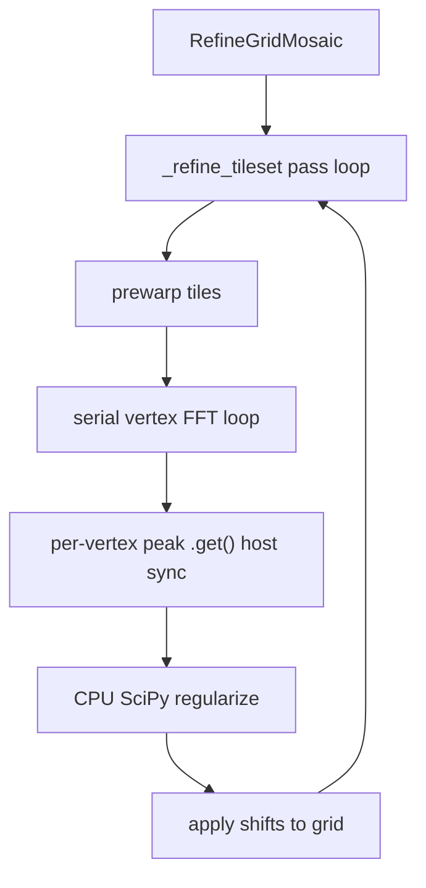

## Goal

Answer "how fast is mosaic refine grid on GPU, and where does the time go" with hard numbers, then rank concrete architecture changes for a follow-up. Assessment only: no refactor of `_refine_tileset` yet. Mosaic is the focus; capture STOS comparison data where cheap so a later unification is informed.

## What we already know (from code reading)

The hot path is `RefineGridMosaic` -> `_refine_tileset` in [nornir-imageregistration/nornir_imageregistration/local_distortion_correction.py](nornir-imageregistration/nornir_imageregistration/local_distortion_correction.py). Per pass:
- `_prewarp_all_tiles_for_grid_refine` (threaded on CPU, **serial when `UsingCupy()`**, lines ~461-486)
- nested **serial** loop tiles x neighbors x mesh-vertices, each doing one small FFT via `_phase_correlate_refinement_cell` -> `phasecorrelation.find_offset` (lines ~1186-1228)
- per-vertex `EnsureNumpyArray(record.peak)` -> `.get()` host sync (line ~573)
- `_regularize_displacements` runs **CPU SciPy ndimage** even under CuPy (lines ~584-641)

So GPU likely pays a serialization + per-vertex sync tax with no batched FFT. The harness must confirm and quantify this rather than assume.

## Step 1 - Benchmark + profile harness

New script `nornir-imageregistration/scripts/microbench_mosaic_refine.py`, modeled on [scripts/microbench_stos_refinement.py](nornir-imageregistration/scripts/microbench_stos_refinement.py):
- Inputs: `--mosaic` (a `.mosaic`/translated transform path) + `--tiles-dir` (level image dir), or `--volume-dir` auto-discovery of a built `TestIDocBuild` mosaic. Plus `--iterations`, `--cell-size`, `--mesh-shape`, `--repeats`, `--profile`, `--backend {numpy,cupy,both}`.
- Calls `RefineGridMosaic(..., return_diagnostics=True)` and reports wall time + key fields from `MosaicRefinementDiagnostics` (iterations_completed, converged, overlap_count_per_iteration, resolved_cell_size/mesh_shape, vertex counts).
- Backend toggle via `nornir_imageregistration.SetActiveComputationLib(...)` (see [computational_lib.py](nornir-imageregistration/nornir_imageregistration/computational_lib.py)); skip cupy cleanly if unavailable.
- `--profile` writes cProfile and prints top-cumulative plus needles for `_phase_correlate_refinement_cell`, `find_offset`, `_prewarp_tile_for_grid_refine`, `_regularize_displacements`.
- Emit a CPU-vs-GPU summary table (wall, vertices/sec, speedup).

## Step 2 - Phase-level timing instrumentation

Add opt-in, near-zero-overhead timers inside `_refine_tileset` (env-gated, e.g. `NORNIR_REFINE_PHASE_TIMING=1`), accumulating wall time per phase: prewarp, vertex-FFT, host-sync (peak `.get()`), regularization, grid-apply. Log a per-pass breakdown via `prettyoutput.Log`. Mirror the existing `_log_refinement_gpu_memory` gating style so default runs are unaffected. This converts the cProfile picture into a clean "% of pass per phase" split for CPU and GPU.

## Step 3 - Host/device transfer audit

Run the existing [scripts/audit_host_device_transfers.py](nornir-imageregistration/scripts/audit_host_device_transfers.py) (or its mechanism) against one cupy refine run to count per-vertex `.get()`/`asarray` transfers and confirm the per-vertex sync hypothesis with a number (transfers per pass, est. bytes).

## Step 4 - Measurement matrix

Run on one representative mosaic (and note hardware: Ada 4500 + CPU, matching prior benchmarks):
- numpy vs cupy at default cell/mesh.
- cell-size sweep (e.g. 64/128/256) to see FFT-size sensitivity and where GPU starts to win.
- capture vertices/sec and phase % split for each.
- one STOS `microbench_stos_refinement.py` run for side-by-side context (shared `find_offset` core).

## Step 5 - Findings report

Write `nornir-imageregistration/docs/` (or alongside existing benchmark notes) a concise findings doc:
- Tables: wall time, vertices/sec, phase % split (prewarp / FFT / host-sync / regularize) for numpy vs cupy.
- Ranked architecture hypotheses to validate in a follow-up, each tagged with the measured evidence that motivates it and whether it unifies with STOS:
  1. Batch many vertex cells into one GPU FFT (`fft2` over a stacked `(N, h, w)` array) instead of per-vertex calls - shared with STOS per-cell alignment.
  2. Remove per-vertex host sync: accumulate peaks on-device, single `.get()` per tile/neighbor.
  3. GPU-resident regularization via `cupyx.scipy.ndimage` (per Numpy-CuPy rule) to avoid device->host between FFT and blend.
  4. Re-enable parallel/pipelined prewarp under CuPy (or stream-overlap) since it is currently forced serial.
  5. Shared cell-extraction + phase-correlation helper reused by mosaic and STOS (unification target).
- Explicit recommendation on which 1-2 changes to prototype first based on the phase split.

## Out of scope (this phase)

No changes to the refinement algorithm or its parallelism; instrumentation is additive and env-gated. The actual GPU architecture refactor is a separate follow-up plan driven by these findings.