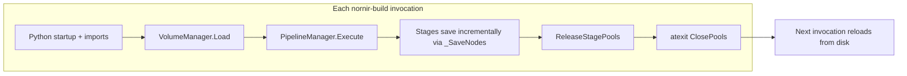

# Pipeline command chaining for the same volume

## Short answer

**Yes, this is possible** and aligns with how the system already works *within* a single pipeline run. The gap is only between separate `nornir-build` process invocations (as in [`TEMBuild.cmd`](nornir-buildmanager/scripts/TEMBuild.cmd) and [`CMPBuild.cmd`](nornir-buildmanager/scripts/CMPBuild.cmd)).

## Current behavior (baseline)



| Concern | Within one pipeline | Between separate invocations |
|---|---|---|
| Volume metadata | Loaded once; stays in memory | Reloaded from `VolumeData.xml` each time |
| Linked subtrees | Lazy-expanded on XPath; stay expanded in memory | Re-expanded after reload |
| Process pools | Kept warm via `ReleaseStagePools()` | Destroyed at process exit (`ClosePools` via `atexit`) |
| Metadata writes | After each stage that returns node(s) | Same, but next step must read from disk |

Key files:
- CLI entry: [`nornir_buildmanager/build.py`](nornir-buildmanager/nornir_buildmanager/build.py) — `Execute()` runs exactly one subcommand
- Pipeline orchestration: [`nornir_buildmanager/pipelinemanager.py`](nornir-buildmanager/nornir_buildmanager/pipelinemanager.py) — `Execute()` always calls `VolumeManager.Load()` at line 520
- Pools: [`nornir_pools/__init__.py`](nornir-pools/nornir_pools/__init__.py) — `ReleaseStagePools()` between stages; `ClosePools()` only at exit

## Proposed chained behavior

```mermaid
flowchart LR
    A[One Python process] --> B[VolumeManager.Load once]
    B --> C1[Pipeline 1 e.g. Prune]
    C1 --> S1[Explicit save + Timing.txt + StageTimings.json]
    S1 --> R1[ReleaseStagePools]
    R1 --> C2[Pipeline 2 e.g. Mosaic]
    C2 --> S2[Explicit save + timings]
    S2 --> R2[ReleaseStagePools]
    R2 --> C3[Pipeline N ...]
    C3 --> X[ClosePools at exit]
```



### What stays the same (your requirement)

- **Per-stage saves** inside each pipeline continue unchanged (`_SaveNodes` after each `<PythonCall>`).
- **After each pipeline in the chain**, add an explicit **pipeline-boundary flush** so durability matches today's batch-script semantics: if a later step crashes, earlier pipelines' metadata is on disk.
- **Timing.txt** — append one record per pipeline (same as today).
- **StageTimings.json** — append one record per pipeline (same as today).

### What improves

- **No repeated `VolumeManager.Load`** for the same volume path.
- **Expanded linked nodes stay in memory** — avoids re-parsing child `VolumeData.xml` files touched in earlier steps.
- **Process pools stay warm** across chain steps (`ReleaseStagePools` between pipelines, not `ClosePools` until the chain finishes).

### Expected speedup (rough)

Largest wins on long chains (TEMBuild, CMPBuild):
- Python startup / import cost (once vs N times)
- Volume XML parse + link expansion for already-visited subtrees
- Process-pool fork/spawn warmup (often significant for Mosaic/Assemble/registration)

Exact savings depend on volume size and how many subtrees prior steps expanded; worth measuring on a representative TEMBuild run.

## Recommended CLI syntax

**`--then` separator** — lowest friction for migrating existing `.cmd` scripts:

```bash
nornir-build -debug /data/volume Prune -InputFilter Raw8 -Downsample 4 -Channels TEM \
  --then Histogram -Filters Raw8 -InputTransform Prune -Downsample 4 -Channels TEM \
  --then Mosaic -InputFilter Leveled -InputTransform Prune -OutputTransform Grid -Channels TEM
```

Rules:
- **One `volumepath`** at the start (supports existing legacy `[volumepath, command, ...]` reordering via `_ReorderArgs`).
- **Root flags** (`-debug`, `-computational_library`, etc.) apply to the whole chain.
- **`--then`** splits pipeline segments; first token of each segment is the pipeline name, remainder are pipeline-specific args.
- **No `--then` → current behavior unchanged** (single pipeline).

Alternatives (not recommended unless you prefer them):
- Explicit `chain` subcommand — clearer but adds another command name to learn
- Chain file (`--chain-file TEMBuild.chain`) — good for very long workflows, but extra file format to maintain

## Implementation plan

### 1. Refactor `PipelineManager` to accept a pre-loaded volume

In [`pipelinemanager.py`](nornir-buildmanager/nornir_buildmanager/pipelinemanager.py):

- Add optional `volume_tree` parameter to `Execute()` (and/or `RunPipeline()`).
- When provided, skip `VolumeManager.Load()` and use the passed tree.
- Return the (possibly mutated) `VolumeTree` from `Execute()` for the caller to pass to the next step.

### 2. Add pipeline-boundary persistence

At the end of each chained pipeline (after `ExecuteChildPipelines`, before `ReleaseStagePools`):

```python
VolumeManager.Save(self.VolumeTree)  # explicit flush even if last stage returned None
```

This guarantees disk state between chain steps matches what separate invocations would see. Existing per-stage `_SaveNodes` behavior is unchanged.

### 3. Add chain parsing and orchestration in `build.py`

In [`build.py`](nornir-buildmanager/nornir_buildmanager/build.py):

- After `_ReorderArgs`, detect `--then` in argv.
- Split into segments; validate each segment's first token is a known pipeline name.
- Parse each segment with the **existing per-pipeline subparser** from `CommandParserDict` (reuse argparse definitions from `Pipelines.xml` — no duplicate arg specs).
- New `ExecuteChain(buildArgs)` loop:
  1. Init logging / computational library once
  2. Load volume once
  3. For each segment: parse → `PipelineManager.RunPipeline(..., volume_tree=tree)` → boundary save → append Timing.txt → `ReleaseStagePools()`
  4. On failure: earlier pipelines already flushed; re-raise (same as aborting a `.cmd` mid-chain)

### 4. Update `.cmd` scripts (optional follow-up)

Convert [`TEMBuild.cmd`](nornir-buildmanager/scripts/TEMBuild.cmd) etc. from N lines to one chained invocation. Keep separate `title` lines only if desired for console UX (Windows `title` is independent of `nornir-build`).

Example TEMBuild consolidation:

```cmd
nornir-build -debug %1 Prune -InputFilter Raw8 ... --then Histogram ... --then Mosaic ... --then Assemble ...
```

### 5. Tests

- Unit test: chain parser splits segments correctly (including pipelines with regex args like `-Channels "(?!(DAPI$)|...)"`).
- Integration test: run a short chain (e.g. `Prune --then Histogram`) and verify:
  - Metadata on disk matches running the same two commands separately
  - `Timing.txt` has two entries
  - `StageTimings.json` has two pipeline records
- Extend [`tests/pipeline/setup_pipeline.py`](nornir-buildmanager/tests/pipeline/setup_pipeline.py) with `RunBuildChain(...)` helper.

## Design notes / tradeoffs

**Memory:** Keeping the volume tree and warm pools in memory increases peak RAM vs separate processes (which release everything at exit). This is an intentional tradeoff for speed on the same volume. Only touched linked subtrees expand (lazy loading still applies); this does not load the entire volume tree unless pipelines touch everything.

**Not a substitute for composite XML pipelines:** Defining one mega-pipeline in [`Pipelines.xml`](nornir-buildmanager/nornir_buildmanager/config/Pipelines.xml) already chains steps with shared memory, but duplicates argument definitions and is less flexible than CLI chaining for scripts like TEMBuild where each step has different flags.

**Scope:** Chain applies to **pipeline subcommands only** (not `RecoverLinks`, `RepairXML`, etc.) unless explicitly extended later.

## Files to change

| File | Change |
|---|---|
| [`build.py`](nornir-buildmanager/nornir_buildmanager/build.py) | Chain detection, segment parsing, `ExecuteChain` orchestration |
| [`pipelinemanager.py`](nornir-buildmanager/nornir_buildmanager/pipelinemanager.py) | Optional `volume_tree`; boundary save; return tree |
| [`tests/pipeline/test_pipelinemanager.py`](nornir-buildmanager/tests/pipeline/test_pipelinemanager.py) or new `test_chain.py` | Parser + integration tests |
| [`scripts/TEMBuild.cmd`](nornir-buildmanager/scripts/TEMBuild.cmd) etc. | Optional migration to chained syntax |
