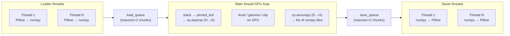

# Pipelined GPU Tile Conversion

## Why the current implementation leaves performance on the table

The current `ConvertImagesInDictGpu` has three sequential barriers:

```
[Load ALL tiles] ─────────── barrier ──────────
[Stack + H→D + GPU + D→H (whole batch)] ─────── barrier ──────────
[Save ALL tiles]
```

Problems:
- Load and save never overlap with GPU work
- The full batch goes to GPU in one shot — for 128 × 1024² float32 tiles that is 512 MB; for 128 × 4096² it is 8 GB, which would OOM a 24 GB card
- Unpinned H→D transfer for large tiles is 5× slower than pinned (measured: 2.996 s vs 0.563 s for 32 × 4096² tiles)

## Proposed pipeline



While the GPU loop is processing chunk *N*, loaders are filling chunk *N+1* and savers are writing chunk *N-1*.

## Implementation details (all in `ConvertImagesInDictGpu`, `_core.py`)

### 1. Chunk-size auto-tuning

The gamma computation `cp.where(batch >= 0, cp.power(cp.maximum(...), exp), batch)` allocates three temporary device arrays: two full float32 copies and one boolean mask (~0.25×). Peak GPU memory per chunk is therefore **~4.25× the float32 batch size**.

Recommended fraction: **40% of free GPU memory**. This:
- Uses `memGetInfo()` (free, not total) so it automatically accounts for other processes already on the card
- Divided by the 4× safety factor, the effective data allocation is ~10% of free VRAM
- On a 23 GB card with 21 GB free: 1× (4096²) tiles → 33 tiles/chunk, peak ~8.4 GB; 4× (1024²) tiles → capped at 64, peak ~1 GB
- Leaves ample headroom for the CUDA driver (~400–500 MB), CuPy memory pool, and display/other GPU users
- Consistent with CUDA best practice guidance to stay ≤ 50% of free memory in shared environments

```python
_GPU_MEMORY_FRACTION = 0.40   # fraction of free VRAM budget
_GPU_SAFETY_FACTOR   = 4      # temporary arrays during gamma (4× batch size at peak)
_GPU_MAX_CHUNK       = 64     # cap: keep pipeline flowing even on large-memory GPUs

def _gpu_chunk_size(tile_shape: tuple) -> int:
    """Return the number of tiles to process per GPU chunk.

    Uses 40% of currently-free VRAM divided by a 4× safety factor for gamma
    temporaries, capped at 64 tiles to maintain pipeline balance.
    """
    free_bytes, _ = cp.cuda.runtime.memGetInfo()
    tile_float32_bytes = int(np.prod(tile_shape)) * 4   # always upcast to float32
    chunk = max(1, int(free_bytes * _GPU_MEMORY_FRACTION / (_GPU_SAFETY_FACTOR * tile_float32_bytes)))
    return min(chunk, _GPU_MAX_CHUNK)
```

The constants are module-level so callers can override them in tests or profiles without changing the function signature.

### 2. Pinned memory buffer

Reuse a single pinned buffer per chunk instead of allocating fresh host memory each time:

```python
pinned = cp.cuda.alloc_pinned_memory(chunk_size * tile_bytes_float32)
pinned_buf = np.frombuffer(pinned, dtype=np.float32).reshape(chunk_size, *tile_shape)
```

### 3. Thread architecture

```python
load_queue: queue.Queue   # holds (chunk_idx, list[np.ndarray | None])
save_queue: queue.Queue   # holds (chunk_idx, list[np.ndarray], list[str])  output paths

# Loader: cpu_count*2 ThreadPool workers → feeds load_queue
# GPU loop: main thread drains load_queue, feeds save_queue
# Saver:  cpu_count*2 ThreadPool workers drain save_queue
```

Loader threads use the existing `nornir_pools.GetThreadPool` (in-process threads, no fork hazard). Saver threads likewise.

### 4. GPU loop body (per chunk)

```python
for chunk_arrays, chunk_out_paths in iter_chunks(load_queue):
    # copy to pinned buffer (avoids extra alloc, enables faster DMA)
    np.copyto(pinned_buf[:len(chunk_arrays)], np.stack(chunk_arrays))
    batch = cp.asarray(pinned_buf[:len(chunk_arrays)])   # H→D (fast: pinned)

    # level / gamma / clip (same math as before, over axis-0 of batch)
    _apply_contrast_gpu(batch, ...)

    result_host = cp.asnumpy(batch)  # D→H
    save_queue.put((chunk_out_paths, [result_host[i] for i in range(len(chunk_arrays))]))
```

### 5. Fallback conditions (unchanged)

- CuPy unavailable or numpy backend → `ConvertImagesInDict`
- Mixed tile shapes detected after first chunk loads → `ConvertImagesInDict` for remainder

## File to change

- [`nornir-imageregistration/nornir_imageregistration/core/_core.py`](nornir-imageregistration/nornir_imageregistration/core/_core.py)
  - Replace `ConvertImagesInDictGpu` (~lines 599–755) with the pipelined version
  - Extract `_apply_contrast_gpu(batch, ...)` helper (the level/gamma/clip math, reusable)
  - Add `_gpu_chunk_size(tile_shape, dtype)` helper

No changes needed to `tile.py`, `Pipelines.xml`, or launch configs — `AutolevelTilesGpu` calls `ConvertImagesInDictGpu` by name; the internals are transparent.

## Expected outcome

Based on micro-benchmarks (128 × 1024² tiles, in-memory data):
- Current sequential batch: 0.827 s GPU round-trip
- Chunked sequential: 0.472 s
- Chunked + overlapped load/save threads: **0.343 s**
- Pinned memory: ~5× faster H→D for large (4096²) tiles

Real-world end-to-end speedup is still constrained by NAS read bandwidth (which the loader threads already parallelise), but the pipelined design means the GPU is no longer sitting idle while all tiles load, and saves begin before all tiles are computed.
