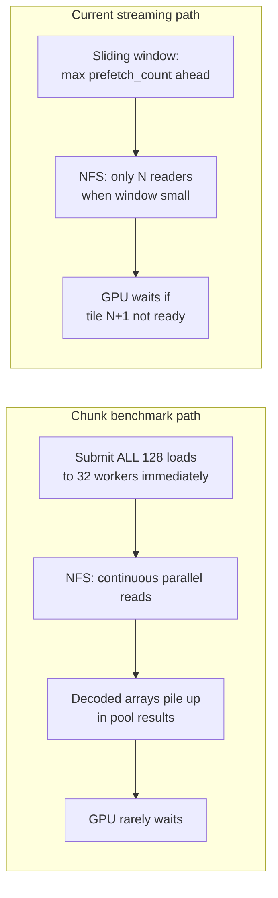

# Pyramid GPU Input Starvation Fix

## Diagnosis: yes, input starvation is the main bottleneck



| Factor | Chunk (fast) | Streaming @ 256 MB (slow) |
|--------|--------------|---------------------------|
| Loads submitted | All `n_tiles` upfront | Only `prefetch_count` ahead |
| NFS workers | `cpu×2` (~32) | Wide pool but **window caps parallelism** |
| 1× 4K prefetch | Effectively unlimited read-ahead | 4 decoded tiles (256 MB ÷ 64 MB) |
| RPC3 mean | ~7.6 s / section | ~19 s @ 256 MB, ~40 s @ 64 MB |

Secondary costs (not the main gap): 9× `cp.asnumpy` syncs per tile for pyramid levels, PNG encode in save pool. These are shared by both paths.

Increasing budget to **256 MB helped** (40 s → 19 s) because prefetch rose from 1 → 4 tiles. Chunk still wins because it keeps **all** tiles loading from second zero.

---

## Fix: Hybrid C with 2 GB budget and full-core NFS readers

### Policy

After probing `tile_float32_bytes` in [`ConvertImagesInDictGpuPyramid`](nornir-imageregistration/nornir_imageregistration/core/_core.py):

```python
prefetch_count = max(1, batch_bytes // tile_float32_bytes)
num_load_workers = multiprocessing.cpu_count()  # every core for NFS decode
section_bytes = n_tiles * tile_float32_bytes

if section_bytes <= batch_bytes:
    # Entire section fits in budget → aggressive path (match ConvertImagesInDictGpu)
    mode = "all_upfront"
else:
    # Bounded queue: parallel loaders, cap decoded tiles waiting for GPU
    mode = "bounded_queue"
```

**RPC3 section 0001** (128 × 4096²): `section_bytes ≈ 8 GB`, `batch_bytes = 2 GB` → **bounded queue** with `prefetch_count = 32` (not all-upfront). Still a major improvement over 4.

**Small sections / 4× tiles**: e.g. 37 × 1388² ≈ 200 MB → **all-upfront** (fits in 2 GB).

### Bounded-queue path (new)

Replace the current sliding-window `load_tasks` + `_submit_prefetch_through` with a proper producer-consumer queue per [Streaming-and-memory-bounded-processing](.cursor/rules/Streaming-and-memory-bounded-processing.mdc):

```python
import queue
import threading

load_queue: queue.Queue[tuple[int, np.ndarray | None]] = queue.Queue(maxsize=prefetch_count)
stop_token = object()

def _loader_worker():
    while True:
        item = work_queue.get()  # indices to load
        if item is stop_token:
            break
        idx, path = item
        try:
            arr = _LoadImageByExtension(path, None)
        except Exception:
            arr = None
        load_queue.put((idx, arr))  # blocks when prefetch_count slots full

# Main thread: enqueue indices 1..n-1 to work_queue; consume load_queue in order
# Tile 0 still uses synchronously-loaded first_array
```

- **`work_queue`**: unbounded index dispatch (cheap ints only).
- **`load_queue`**: `maxsize=prefetch_count` — caps **decoded** tiles waiting for GPU.
- **`num_load_workers = cpu_count()`** threads on `work_queue` — every core can NFS-read/decode in parallel until the result queue is full (backpressure).
- After GPU copies tile into pinned buffer, drop the `arr` reference so GC can reclaim before the next wait.

### All-upfront path (when section fits in budget)

Mirror [`ConvertImagesInDictGpu`](nornir-imageregistration/nornir_imageregistration/core/_core.py) lines 858–861:

```python
all_load_tasks = [
    load_pool.add_task(p, _LoadImageByExtension, p, None)
    for p in input_paths
]
```

Keep the existing per-tile GPU pyramid body (contrast → downsample chain → immediate saves). `wait_return()` only when the GPU reaches that index.

### Budget and env defaults → **2048 MB**

In [`_core.py`](nornir-imageregistration/nornir_imageregistration/core/_core.py):

- Change `_DEFAULT_GPU_PYRAMID_BATCH_MB` default from `"256"` → `"2048"`.
- Update comment table: 2 GB → 32 tiles ahead for 1× 4K.

Propagate to build environment:

- [`.vscode/launch.json`](.vscode/launch.json): `NORNIR_GPU_PYRAMID_BATCH_MB=2048` (replace 256 in GPU build configs).
- [`nornir-docker/compose.cursor-dev.yaml`](nornir-docker/compose.cursor-dev.yaml): default `${NORNIR_GPU_PYRAMID_BATCH_MB:-2048}`.
- [`nornir-docker/dev/example.cursor-dev.run.env`](nornir-docker/dev/example.cursor-dev.run.env): document 2048.

Contrast-only path stays at 64 MB (`NORNIR_GPU_CONTRAST_BATCH_MB`).

---

## Expected outcome on RPC3 (128 × 4096², 9 levels)

| Config | Prefetch tiles | Load parallelism | Expected |
|--------|----------------|------------------|----------|
| Current streaming @ 256 MB | 4 | Window-limited | ~19 s |
| **Hybrid @ 2 GB** | **32** | **cpu_count() workers** | **Closer to chunk (~8–12 s)** — still not full 128 read-ahead unless budget ≥ 8 GB |
| Chunk benchmark | 128 (unbounded RAM) | 32 workers | ~7.6 s |

Re-benchmark with [`bench_pyramid_chunk_vs_streaming.py`](/tmp/bench_pyramid_chunk_vs_streaming.py) or `bench_adjust_contrast.py --pyramid` on RPC3 section 0001 after implementation.

---

## Files to change

1. [`nornir-imageregistration/nornir_imageregistration/core/_core.py`](nornir-imageregistration/nornir_imageregistration/core/_core.py) — hybrid loader, 2 GB default, `cpu_count()` load workers
2. [`.vscode/launch.json`](.vscode/launch.json) — `NORNIR_GPU_PYRAMID_BATCH_MB=2048`
3. [`nornir-docker/compose.cursor-dev.yaml`](nornir-docker/compose.cursor-dev.yaml) — default 2048
4. [`nornir-docker/dev/example.cursor-dev.run.env`](nornir-docker/dev/example.cursor-dev.run.env) — comment update

No pipeline XML changes — `AutoLevelPyramid` already calls `ConvertImagesInDictGpuPyramid` without explicit `batch_bytes`.
