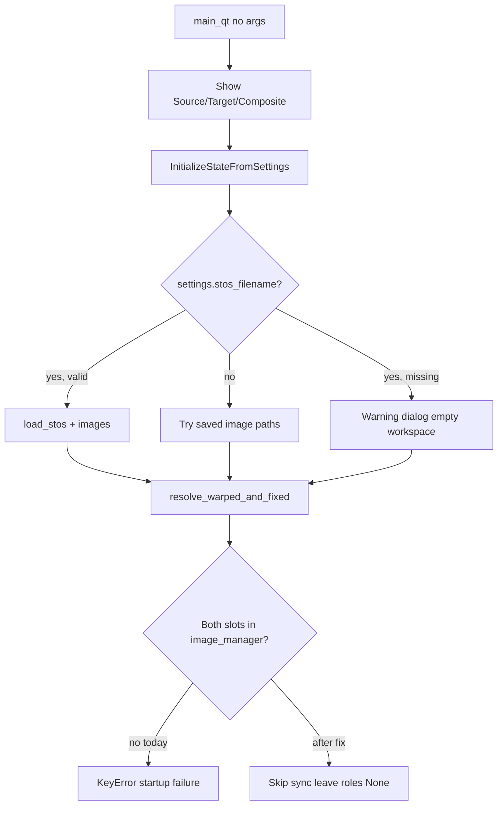

# Pyre no-argument empty startup

## Current behavior

[`launcher.py`](nornir-pyre/pyre/launcher.py) already accepts **optional** CLI flags (`-stos`, `-Fixed`, `-Warped`, etc.) and creates the three STOS windows before loading data. [`python -m pyre`](nornir-pyre/pyre/__main__.py) calls `Run()` with no required args.

On startup, `process_arguments()` (deferred via `QTimer.singleShot`) runs:

1. [`UpdateSettingsFromArguments`](nornir-pyre/pyre/state/__init__.py) — applies CLI overrides to settings
2. [`InitializeStateFromSettings`](nornir-pyre/pyre/state/__init__.py) — auto-restores last STOS from `settings.json` when present (user confirmed: **keep this**)
3. [`StosWindow.open_folder_browser_if_cached_folder_exists`](nornir-pyre/pyre/ui/windows/stoswindow.py) — opens browser if saved folder path exists

**Bug:** After restore attempts, `InitializeStateFromSettings` **always** calls [`resolve_warped_and_fixed_image_data`](nornir-pyre/pyre/stos_registration.py), which does `image_manager[source_image_key]` / `image_manager[target_image_key]` unconditionally. With no images loaded this raises **`KeyError`** and can abort startup before the UI is usable.



Secondary issues (same startup path):

- [`UpdateSettingsFromArguments`](nornir-pyre/pyre/state/__init__.py) `-Fixed`/`-Warped` branch is broken (wrong attribute names `SourceImageFullPath`, nonexistent `source_image_filename`, wrong `image_loader` type hint). Low priority but easy fix while touching startup.
- Failed STOS restore shows a dialog but does not clear stale `settings.stos.stos_filename`, so every launch retries a dead path until user loads something else.

## Implementation

### 1. Guard registration-role sync when images are absent

Add a small helper in [`stos_registration.py`](nornir-pyre/pyre/stos_registration.py) (or inline in state init):

```python
def try_resolve_warped_and_fixed_image_data(image_manager, source_key, target_key, **kwargs) -> tuple[...] | None:
    if source_key not in image_manager or target_key not in image_manager:
        return None
    return resolve_warped_and_fixed_image_data(...)
```

Update callers to skip `sync_stos_registration_roles` when result is `None`:

- [`pyre/state/__init__.py`](nornir-pyre/pyre/state/__init__.py) — both branches (STOS loaded and image-only restore)
- [`stoswindow.loadStos`](nornir-pyre/pyre/ui/windows/stoswindow.py) — after successful load (slots should exist; guard is defensive)

`StosState` already initializes `_fixed_image_permutations` / `_warped_image_permutations` to `None`; [`RotateTranslateWarpedImage`](nornir-pyre/pyre/common.py) already checks `source_image_key not in image_manager` before resolve.

### 2. Harden `InitializeStateFromSettings` for empty workspace

In [`pyre/state/__init__.py`](nornir-pyre/pyre/state/__init__.py):

- Wrap the no-STOS image-restore path: already catches `FileNotFoundError`/`ValueError` per image — keep.
- Replace unconditional `resolve_warped_and_fixed` + `sync` with `try_resolve` guard.
- On `FileNotFoundError` / `ValueError` for saved STOS: **clear** `settings.stos.stos_filename` (and optionally `source_image`/`target_image` paths) so the next no-arg launch starts clean without repeated failure dialogs. Log at INFO.

Transform model: leave default rigid transform from [`TransformController.__init__`](nornir-pyre/pyre/controllers/transformcontroller.py) when nothing loads — no change needed.

### 3. Launcher empty-startup UX (minimal)

In [`launcher.py`](nornir-pyre/pyre/launcher.py) `process_arguments()`:

- Broaden exception handling to catch `KeyError` during init (belt-and-suspenders) with the same “empty workspace” message — should not trigger after fix (1–2).
- Keep existing browser auto-open via `open_folder_browser_if_cached_folder_exists` (only when saved folder exists). **Do not** force-open browser on every empty start (user can use **File → Open Stos Folder Browser** or **Open stos file**).

Update module docstring to state explicitly: no arguments required; empty workspace is valid.

### 4. Fix `-Fixed` / `-Warped` CLI wiring (small)

In `UpdateSettingsFromArguments`:

- Use `arg_values.TargetImageFullPath` / `arg_values.SourceImageFullPath` (parser `dest` names).
- Load into correct `ViewType` slots and set `settings.stos.target_image` / `settings.stos.source_image` as `ImageAndMaskPath`.
- Fix `image_loader` parameter type to `ImageLoader`.

### 5. Tests

Add [`nornir-pyre/tests/test_empty_startup.py`](nornir-pyre/tests/test_empty_startup.py):

- `InitializeStateFromSettings` with empty `ImageManager`, no `stos_filename`, no saved images — **does not raise**; registration roles remain unset.
- `try_resolve_warped_and_fixed_image_data` returns `None` when manager empty.
- Optional: saved STOS path missing clears `stos_filename` after handled failure (mock `load_stos` / `image_loader`).

### 6. Manual verification

1. Clear or use settings with no STOS/images → `python -m pyre` (or VS Code **pyre no args**) → three windows appear, no crash, empty GL panels.
2. **File → Open Stos Folder Browser** and **Open stos file** work from empty state.
3. Settings with valid last STOS on reachable path → still auto-loads on no-arg start (restore preserved).
4. Settings with dead STOS path → one warning, then empty workspace; next launch does not repeat if filename cleared.

## Out of scope

- `--no-restore` CLI flag (not requested; restore-on-valid-path kept).
- Mosaic `-mosaic`/`-tiles` restore (still commented out in `UpdateSettingsFromArguments`).
- Auto-opening folder browser when no cached folder exists.
