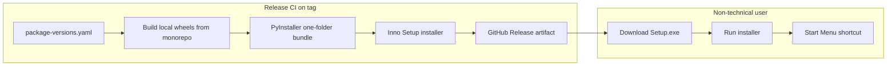
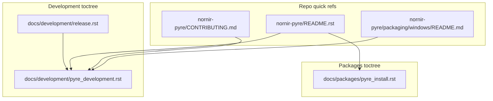

# Pyre easy Windows deployment

## Problem today

Non-technical users must install Git, Python 3.13+, create a venv, download a requirements file, and run pip against **git-hosted sibling packages**. Docs are also stale ([`nornir-pyre/README.rst`](nornir-pyre/README.rst) references `python -m pyre.main_qt`, which does not exist).

Pyre is intentionally **not** in Docker ([`release/package-versions.yaml`](release/package-versions.yaml) has `docker: false`; [`nornir-docker/README.md`](nornir-docker/README.md) points UI users to a host venv). For a desktop PyQt6 + OpenGL app, a **native Windows installer** is the right model—not containers or pip instructions.

## Target experience

1. User downloads `Pyre-<version>-Setup.exe` from GitHub Releases.
2. Runs installer (Next → Install → Finish).
3. Launches **Pyre** from Start Menu or desktop shortcut.
4. No Python, Git, venv, or CUDA setup required.

GPU acceleration stays out of v1; document it as an advanced/optional path for power users later.



## Recommended approach: PyInstaller + Inno Setup

| Option | Fit for non-technical users | Notes |
|--------|----------------------------|-------|
| **PyInstaller + Inno Setup** | Best | Single download, familiar Windows install flow, no runtime deps |
| pip + venv + batch script | Poor | Still requires Python literacy |
| Docker + VNC/X11 | Poor | Display/GPU pain, not desktop-native |
| Publish to PyPI only | Insufficient | Users still need Python + pip |

## Phase 1 — Make the tree bundle-ready (prerequisite)

These changes unblock reliable freezing; they do not change runtime behavior for developers.

### 1.1 Replace git URL deps at build time

[`nornir-pyre/pyproject.toml`](nornir-pyre/pyproject.toml) pins siblings via `git+https://github.com/jamesra/...`. PyInstaller needs a **fully local, pinned install** from the monorepo checkout.

Add a release-only constraints file, e.g. [`release/pyre-windows-constraints.txt`](release/pyre-windows-constraints.txt), generated from [`release/package-versions.yaml`](release/package-versions.yaml):

```text
nornir_shared @ file:///.../nornir-shared
nornir_pools @ file:///...
nornir_imageregistration @ file:///...
nornir_buildmanager @ file:///...
pyre @ file:///.../nornir-pyre
```

Build script installs with `pip install --no-deps` per package in BOM order (same pattern as [`nornir-docker/install-monorepo-editables.sh`](nornir-docker/install-monorepo-editables.sh)), using **CPU-only** imageregistration (no `[gpu]` extra).

### 1.2 Clean up packaging/doc drift

- Fix [`nornir-pyre/README.rst`](nornir-pyre/README.rst): correct launch command to `pyre` or `python -m pyre`; align Python version with `requires-python = ">=3.13"`.
- Retire or sync stale [`nornir-pyre/setup.py`](nornir-pyre/setup.py) (still references wxPython).
- Promote [`nornir-pyre/requirements-qt.txt`](nornir-pyre/requirements-qt.txt) as the Qt baseline; drop wxPython from user-facing install paths.

### 1.3 Launcher defaults for installed builds

In [`nornir-pyre/pyre/launcher.py`](nornir-pyre/pyre/launcher.py), when frozen (`getattr(sys, "frozen", False)`):

- Set a sensible default for `NORNIR_LOG_ROOT` under `%LOCALAPPDATA%\Nornir\Pyre\logs` (per [unified logging convention](AGENTS.md)).
- Keep [`pyre/settings.json`](nornir-pyre/pyre/settings.json) user-writable under `%APPDATA%\Nornir\Pyre\` instead of beside the exe.

This avoids permission errors in `Program Files` and gives support a predictable log location.

## Phase 2 — PyInstaller freeze

Add a packaging directory, e.g. [`nornir-pyre/packaging/windows/`](nornir-pyre/packaging/windows/):

| File | Purpose |
|------|---------|
| `pyre.spec` | PyInstaller spec (entry: `pyre.__main__:main` from [`pyproject.toml`](nornir-pyre/pyproject.toml) console script) |
| `build-freeze.ps1` | Creates clean venv, installs monorepo wheels, runs PyInstaller |
| `hook-pyre.py` (if needed) | Collect `pyre/resources/*.png`, hidden imports for DI/matplotlib/scipy |

**Spec essentials:**

- `console=False` (GUI app)
- Collect PyQt6 plugins: `platforms`, `styles`, `imageformats`
- Hidden imports for `nornir_shared`, `nornir_pools`, `nornir_imageregistration`, `nornir_buildmanager`, `dependency_injector`, `matplotlib.backends.backend_qtagg`
- Include package data: `pyre/resources/*.png`
- Output: **one-folder** bundle first (easier to debug); switch to one-file only after smoke tests pass

**Validation gate:** run the frozen exe on a **clean Windows VM** (no Python/Git) and verify:

- App launches and shows a window
- OpenGL renders (falls back to software if needed via existing `PYOPENGL_PLATFORM=software` path in README)
- Load a sample STOS/mosaic from test fixtures
- Logs appear under `%LOCALAPPDATA%\Nornir\Pyre\logs`

## Phase 3 — Inno Setup installer

Add [`nornir-pyre/packaging/windows/pyre-installer.iss`](nornir-pyre/packaging/windows/pyre-installer.iss):

- Install to `{autopf}\Nornir\Pyre`
- Start Menu + optional desktop shortcut
- `pyre.exe` as the target
- Uninstaller entry
- Display version from monorepo [`VERSION`](VERSION) file
- Optional: `.stos` file association (nice-to-have, can defer)

## Phase 3b — Documentation (users + developers)

Documentation is split by audience. **No hub page** — each document is a direct toctree entry.



### End-user guide — [`docs/packages/pyre_install.rst`](docs/packages/pyre_install.rst)

Listed directly under **Packages** in the monodoc. Audience: lab staff with no Python/Git experience.

Contents:

- Download `Pyre-<version>-Setup.exe` from GitHub Releases
- Install wizard steps (screenshots optional in v2)
- Launch from Start Menu / desktop shortcut
- Where logs live: `%LOCALAPPDATA%\Nornir\Pyre\logs`
- Basic troubleshooting (OpenGL/software rendering, “send us the log folder”)
- Explicit note: **no terminal, Python, or Git required**

### Pyre Development — [`docs/development/pyre_development.rst`](docs/development/pyre_development.rst)

Listed directly under **Development** in the monodoc. Single document for all developer/maintainer topics (no separate packaging page, no hub).

Suggested sections:

**1. Local development**

- Monorepo vs standalone clone: prefer umbrella checkout; use `venv/pyre314` (see [`docs/developer_notes.rst`](docs/developer_notes.rst), [`.vscode/launch.json`](.vscode/launch.json))
- Editable install: `pip install -e --no-deps` for sibling packages in BOM order (same pitfall as [`docs/docker/cursor_dev.rst`](docs/docker/cursor_dev.rst))
- Run / debug: `pyre` or `python -m pyre`; VS Code launch configs; optional STOS file argument
- Settings and logs in dev vs frozen builds (`pyre/settings.json` vs `%APPDATA%`)
- Testing: headless vs graphical (`@pytest.mark.graphical`, `nornir-pyre/conftest.py`)
- GPU (optional): CuPy extra on imageregistration; not required for UI work

**2. Windows packaging and release**

- Prerequisites: Windows host or VM, Python 3.13+, Inno Setup, PyInstaller; monorepo checkout at release tag
- Local build: [`nornir-pyre/packaging/windows/build-freeze.ps1`](nornir-pyre/packaging/windows/build-freeze.ps1); output paths (`dist/`, `_internal/`)
- PyInstaller spec and hooks: PyQt6 plugins, hidden imports, `pyre/resources/*.png`
- Inno Setup: [`pyre-installer.iss`](nornir-pyre/packaging/windows/pyre-installer.iss); install layout under `{autopf}\Nornir\Pyre`
- Debugging frozen builds: `sys.frozen`, `_MEIPASS`, common missing-module errors
- CI workflow and GitHub Release artifacts
- Release checklist step (cross-link to [`docs/development/release.rst`](docs/development/release.rst))
- Signing (optional): Authenticode cert, SmartScreen notes

### In-repo quick references (link to monodoc, avoid duplication)

| File | Role |
|------|------|
| [`nornir-pyre/README.rst`](nornir-pyre/README.rst) | Short landing: what Pyre is; links to `pyre_install.rst` (users) and `pyre_development.rst` (developers) |
| [`nornir-pyre/CONTRIBUTING.md`](nornir-pyre/CONTRIBUTING.md) | Contribution norms; link to `pyre_development.rst` for env setup (replace stale standalone-clone + wx requirements) |
| [`nornir-pyre/packaging/windows/README.md`](nornir-pyre/packaging/windows/README.md) | One-screen cheat sheet beside build scripts; link to packaging section in `pyre_development.rst` |
| [`docs/packages/other_packages.rst`](docs/packages/other_packages.rst) | Replace Pyre stub with links to `pyre_install.rst` and `pyre_development.rst` |

### Toctree wiring

- Add `pyre_install` directly to [`docs/packages/index.rst`](docs/packages/index.rst) toctree
- Add `pyre_development` directly to [`docs/development/index.rst`](docs/development/index.rst) toctree
- Add cross-link from [`docs/development/release.rst`](docs/development/release.rst) to the packaging section in `pyre_development.rst`
- **Do not** add a `docs/packages/pyre.rst` hub page

## Phase 4 — Automated release

Extend the existing release process ([`docs/development/release.rst`](docs/development/release.rst)) with a GitHub Actions workflow (Windows runner):

1. Trigger on monorepo tag `v*`
2. Read BOM from [`release/package-versions.yaml`](release/package-versions.yaml)
3. Run `release/verify_package_versions.py`
4. Execute `build-freeze.ps1`
5. Compile Inno Setup → `Pyre-<version>-Setup.exe`
6. Attach to GitHub Release alongside existing Docker artifacts

Optional later: Authenticode signing (reduces SmartScreen warnings; requires a cert).

## Phase 5 — Support and polish (post-v1)

- **Auto-update:** Sparkle-like or simple “new version available” check against GitHub Releases API
- **GPU add-on:** separate installer or in-app toggle that installs CUDA/CuPy stack for power users
- **Crash reporting:** bundle-friendly error dialog pointing users to log folder
- **CI smoke test:** headless launch + import check on frozen build (full GUI test stays manual/VM)

## What we are explicitly not doing in v1

- macOS/Linux installers (Windows-only per your choice)
- CUDA/CuPy in the default bundle
- Docker-based Pyre deployment
- Expecting users to run pip, Git, or manage venvs

## Success criteria

- A user with no dev tools can install and launch Pyre in under 5 minutes.
- Support can ask users to send logs from `%LOCALAPPDATA%\Nornir\Pyre\logs` without explaining Python.
- Release tags produce a downloadable Windows installer automatically.
- A new contributor can set up a local Pyre dev environment using only monodoc (`pyre_development.rst`).
- A maintainer can build and debug the Windows installer using the packaging section in `pyre_development.rst` plus `release.rst`.

## Key files to add or change

| Area | Files |
|------|-------|
| Packaging | `nornir-pyre/packaging/windows/pyre.spec`, `build-freeze.ps1`, `pyre-installer.iss`, `packaging/windows/README.md` |
| Release | `release/pyre-windows-constraints.txt` (generated), `.github/workflows/pyre-windows-release.yml` |
| Runtime | `nornir-pyre/pyre/launcher.py` (frozen-path defaults) |
| User docs | `docs/packages/pyre_install.rst` |
| Developer docs | `docs/development/pyre_development.rst`, updates to `release.rst`, `developer_notes.rst`, `packages/index.rst`, `development/index.rst` |
| Repo landing | `nornir-pyre/README.rst`, `nornir-pyre/CONTRIBUTING.md`, `docs/packages/other_packages.rst` |
| Cleanup | `nornir-pyre/setup.py` sync or removal |
