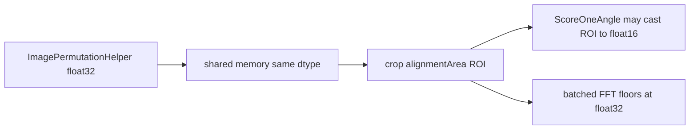

# Do not pre-convert shared Pyre images to float16

**Recommendation: no.** Keep the staged pair in the dtype `ImagePermutationHelper` already produced (typically float32). Convert only the cropped alignment ROI later, if a caller still wants float16 for scoring.

## What was accidentally converted

[`BuildAlignmentROIs`](nornir-imageregistration/nornir_imageregistration/local_distortion_correction.py) used to run `ImageParamToImageArray(..., dtype=default_image_dtype())` on the **full** target and source arrays. `default_image_dtype()` is float16 ([`__init__.py`](nornir-imageregistration/nornir_imageregistration/__init__.py)). Spacebar then did that 2–3 times per point (rigid + exact candidates, plus mask checks) on a ~7k mosaic. That is the conversion we stopped.

Pyre already stages those mosaics **once** per publish into shared memory ([`host_image_payload`](nornir-pyre/pyre/controllers/alignment_payload.py) copies `ImageWithMaskAsNoise` as-is). Staging is not per control point.

## Why not downcast at publish time

- **The FFT does not want float16.** Batched correlation explicitly floors at float32 so float16 inputs cannot run a lossy transform ([`_correlation_work_dtype`](nornir-imageregistration/nornir_imageregistration/batched_phase_correlation.py)). Serial [`ScoreOneAngle`](nornir-imageregistration/nornir_imageregistration/stos_brute.py) still downcasts the **ROI** to float16; that is a small crop (≤512), not the mosaic. Putting float16 in shared memory would not skip that ROI cast, and would force later upcasts for grid refine / batched FFT.
- **CPU float16 is not a speed win.** NumPy emulates float16; warping and cropping a 7k mosaic in float16 is often slower than float32, for half the RAM. Two 7k×7k float32 images are ~200 MB — modest next to Pyre + GPU.
- **`ImagePermutationHelper` already keeps floating source dtype** ([`image_permutation_helper.py`](nornir-imageregistration/nornir_imageregistration/image_permutation_helper.py)). Forcing float16 at staging would fight that contract and also contrast, which computes in float32 ([`apply_contrast_array`](nornir-pyre/pyre/image_contrast.py)).
- **GL already upcasts to float32** for textures. Registration and display should not share a lossy storage type just because scoring used to downcast the whole mosaic by accident.

## What to keep doing instead

- Leave [`host_image_payload`](nornir-pyre/pyre/controllers/alignment_payload.py) copying native dtype.
- Keep [`BuildAlignmentROIs`](nornir-imageregistration/nornir_imageregistration/local_distortion_correction.py) from downcasting the full arrays.
- If scoring dtype still matters, convert **after** crop (the ROI `ScoreOneAngle` already converts). Do not change the shared mosaic.

No code change for this question.
