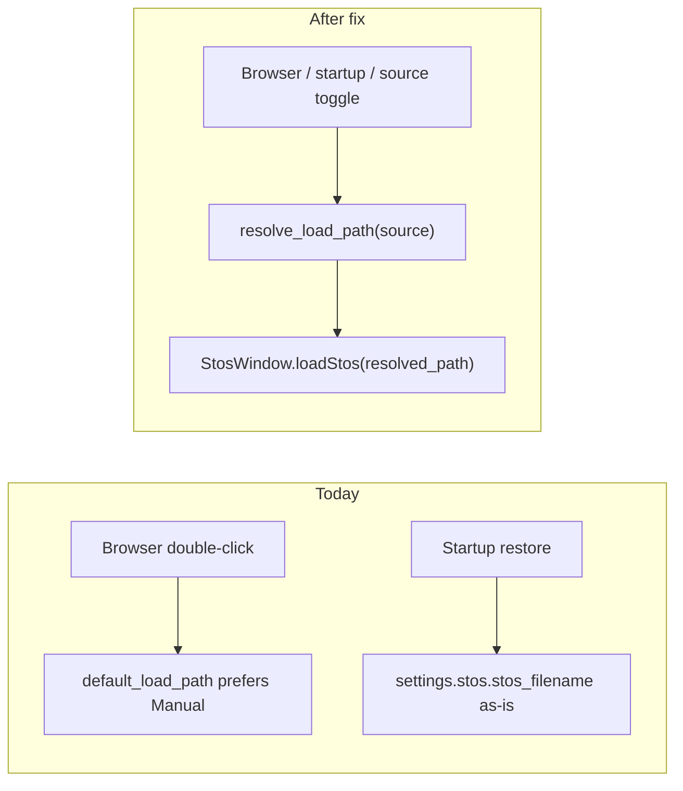

# STOS File Source selector and manual-load fix

## Problem

The browser **already** prefers manual on double-click via [`resolve_default_load_path`](nornir-pyre/pyre/stos_manual_paths.py), but other paths load the **exact saved filepath** without re-resolving:

- **Startup restore** ([`InitializeStateFromSettings`](nornir-pyre/pyre/state/__init__.py)) calls `image_loader.load_stos(settings.stos.stos_filename)` directly.
- Your current [`settings.json`](nornir-pyre/pyre/settings.json) stores the **automatic** group-root path (`StosBrute64\72-73_...stos`), not `Manual\72-73_...stos`, so restart always loads Original even when a manual override exists.



## Terminology (confirmed)

| UI label | Meaning | Path |
|----------|---------|------|
| **Auto** | Manual if present, else Original | `resolve_default_load_path` behavior |
| **Original** | Pipeline/automatic STOS in group root | `row.auto_path` |
| **Manual** | Override in `{group}/Manual/` | `row.manual_path` |

Not the buildmanager `Originals/` archive folder.

## Core API changes

Extend [`stos_manual_paths.py`](nornir-pyre/pyre/stos_manual_paths.py):

- Add `StosFileSource` enum: `auto`, `original`, `manual`.
- Add `resolve_load_path(auto_path, manual_path, source: StosFileSource) -> str | None`:
  - `auto` → existing `resolve_default_load_path`
  - `original` → `auto_path` if file exists
  - `manual` → `manual_path` if file exists
- Add `StosBrowserRow.load_path_for_source(source)` delegating to the helper.
- Add `resolve_stos_path_in_group(stos_group_folder, basename, source)` for startup / source-toggle reload without a live browser row.

## Settings persistence

In [`StosSettings`](nornir-pyre/pyre/settings/app.py):

- `stos_file_source: StosFileSource = StosFileSource.auto` (serialize as string in JSON).
- `stos_browser_basename: str | None = None` — set whenever a load comes from the browser (or derivable from basename of loaded file + browser folder); used to re-resolve when the user toggles source.

## Wire resolution into all load paths

### 1. Browser ([`stosfilebrowser.py`](nornir-pyre/pyre/ui/windows/stosfilebrowser.py))

- Inject/read `settings.stos.stos_file_source`.
- Replace `row.default_load_path` in `_load_stos_at_index` with `row.load_path_for_source(settings.stos.stos_file_source)`.
- On successful load, set `settings.stos.stos_browser_basename = row.basename`.
- If chosen source has no file (e.g. Original selected but only manual exists), show a short `QMessageBox` and skip load.
- **Flat manual mode**: enable Auto + Manual (both map to manual file); disable Original.

### 2. Startup restore ([`state/__init__.py`](nornir-pyre/pyre/state/__init__.py))

Before `load_stos(settings.stos.stos_filename)`:

- If `stos_opened_from_browser_folder` and `stos_browser_basename` (or basename from saved filename) are set, call `resolve_stos_path_in_group(..., settings.stos.stos_file_source)` and load the resolved path instead of the stale saved auto path.
- Fall back to saved filename when no browser context (File → Open, drag-drop).

### 3. `StosWindow.loadStos` ([`stoswindow.py`](nornir-pyre/pyre/ui/windows/stoswindow.py))

- When `browser_folder` is provided, persist `stos_browser_basename`.
- Add `StosWindow.reload_current_stos_for_source()` — called by the browser when the user changes source and a transform is already loaded/selected.

## UI: File Source selector on Stos Directory browser

Place the control on [`StosFileBrowserWindow`](nornir-pyre/pyre/ui/windows/stosfilebrowser.py), between the folder path label and the transform list — always visible while browsing:

```
[ Open Folder… ]

Y:/Volumes/RPC3/TEM/StosBrute64

File Source: [ Auto ▼ ]     ← QComboBox (preferred)
  or
File Source: (•) Auto  ( ) Original  ( ) Manual   ← radio buttons if combo feels too cramped

┌─────────────────────────┐
│ 72-73_...stos [Manual]  │
│ …                       │
└─────────────────────────┘
```

**Control choice**

- **Preferred:** `QComboBox` with three fixed items (`Auto`, `Original`, `Manual`) — clearly a selector, compact, matches "visible selector control."
- **Acceptable fallback:** horizontal `QRadioButton` group with `QLabel("File Source:")` if combo styling/width is awkward in the narrow browser panel.

**Behavior**

- Initialize from `settings.stos.stos_file_source` when the browser opens.
- On change: persist to settings; if the list has a current row (`_current_index >= 0`), immediately reload that row via `_load_stos_at_index` using the new source.
- On row selection change (`setCurrentRow`, navigation): enable/disable **Original** and **Manual** options when the current row lacks `auto_path` or `manual_path` (Auto always enabled).
- **Flat manual mode:** show only Auto + Manual (both resolve to the manual file); hide or disable Original.

**Implementation**

- Either inline in `_setup_ui()` or a small reusable widget `StosFileSourceSelector` in [`pyre/ui/widgets/stos_file_source_selector.py`](nornir-pyre/pyre/ui/widgets/stos_file_source_selector.py) embedded only in the browser (no composite-viewer toolbar).

**Context menu**

- Keep existing "Open Automatic Transform" / "Open Manual Override" actions as explicit overrides; default open/double-click/navigation follows the selector.

## Tests

Extend [`test_stos_manual_paths.py`](nornir-pyre/tests/test_stos_manual_paths.py):

- `resolve_load_path` for all three sources (both paths present, manual-only, auto-only, missing).

Add focused tests (headless, mock browser row / settings):

- Browser `_load_stos_at_index` uses `manual` when source is `manual` even if auto exists.
- Startup re-resolution: saved auto path + manual file on disk + source `auto` → loads manual path.

## Manual verification (post-implementation)

1. Open `StosBrute64` in browser; pick a row with `[Manual]`; double-click with **Auto** → manual transform loads.
2. Restart Pyre → same manual transform restores (not group-root auto).
3. Change **File Source** to **Original** in the browser → current row reloads automatic pipeline file; change to **Manual** → manual override loads.
4. Row with no manual: **Manual** disabled in selector; **Auto** loads Original.

## Files to touch

| File | Change |
|------|--------|
| [`nornir-pyre/pyre/stos_manual_paths.py`](nornir-pyre/pyre/stos_manual_paths.py) | `StosFileSource`, path resolver, row helper |
| [`nornir-pyre/pyre/settings/app.py`](nornir-pyre/pyre/settings/app.py) | Persist source + basename |
| [`nornir-pyre/pyre/ui/windows/stosfilebrowser.py`](nornir-pyre/pyre/ui/windows/stosfilebrowser.py) | Source selector UI, use source on load, set basename, reload on change |
| [`nornir-pyre/pyre/state/__init__.py`](nornir-pyre/pyre/state/__init__.py) | Startup re-resolution |
| [`nornir-pyre/pyre/ui/windows/stoswindow.py`](nornir-pyre/pyre/ui/windows/stoswindow.py) | `reload_current_stos_for_source()` helper only |
| [`nornir-pyre/pyre/ui/widgets/stos_file_source_selector.py`](nornir-pyre/pyre/ui/widgets/stos_file_source_selector.py) | Reusable combo/radio selector widget (browser-only) |
| [`nornir-pyre/tests/test_stos_manual_paths.py`](nornir-pyre/tests/test_stos_manual_paths.py) | Resolver unit tests |
| New test file for browser/source integration | Small Qt-headless tests |
