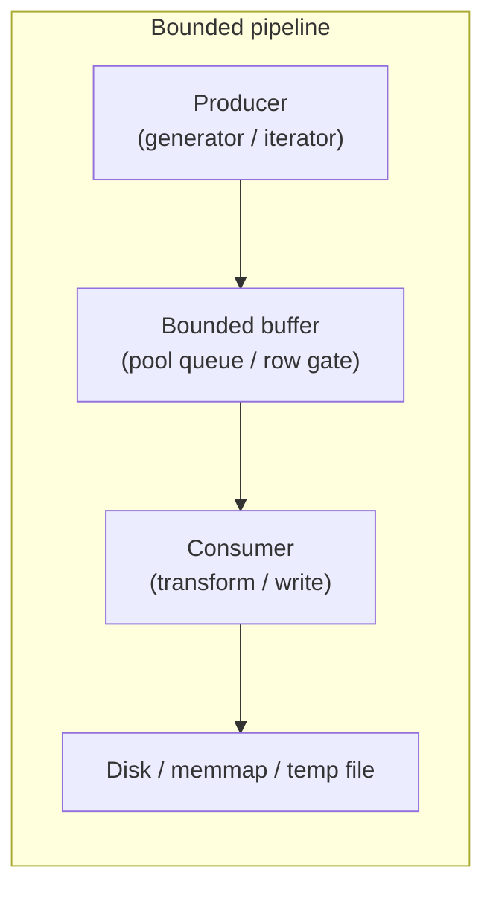

# Streaming and Memory-Bounded Processing Rule

## Placement and scope

Create a **project rule** at `[.cursor/rules/Streaming-and-memory-bounded-processing.mdc](.cursor/rules/Streaming-and-memory-bounded-processing.mdc)` (not a user-level Cursor setting).

**Scope:** Python in data/pipeline packages only, via globs:

```yaml
globs: "{nornir-buildmanager,nornir-imageregistration,nornir-pools,nornir-shared}/**/*.py"
alwaysApply: false
```

This matches your choice: apply when editing pipeline, image, or pool code—not every Python file in the monorepo.

---

## Rule content (proposed)

The rule should be concise (~45–55 lines), one concern, actionable—matching siblings like `[Numpy-CuPy-compatibility.mdc](.cursor/rules/Numpy-CuPy-compatibility.mdc)` and `[Unified-Logging-Convention.mdc](.cursor/rules/Unified-Logging-Convention.mdc)`.

### Core principle

**Bound peak memory by design.** Treat full-dataset loads as the exception, not the default. Prefer pipelines where a producer emits work units (paths, tiles, slabs, records) and consumers process them with bounded in-flight buffers.




### Required behaviors

1. **Stream work, don't hoard it**
  - Use generators/iterators for enumerating files, tiles, sections, or records (`yield`, `yield from`, `Iterator`).
  - Buildmanager pipeline stages already follow this: `[pipelinemanager.py](nornir-buildmanager/nornir_buildmanager/pipelinemanager.py)` saves nodes from generator returns via `_SaveNodes`.
  - Prefer per-item processing over `list(...)` / `[...]` over large inputs unless size is provably small.
2. **Chunk large arrays and images**
  - Process images/volumes in tiles or slabs (e.g. `[ImageToTilesGenerator](nornir-imageregistration/nornir_imageregistration/core/_core.py)`, `[TransformImage](nornir-imageregistration/nornir_imageregistration/assemble.py)` tile loop, `[ScipyRbf.Transform` chunking](nornir-imageregistration/nornir_imageregistration/transforms/scipyrbf.py)).
  - Expose chunk/tile size as a parameter or derive from available memory (see `[EstimateMaxTempImageArea](nornir-buildmanager/nornir_buildmanager/operations/tile.py)`).
3. **Spill to disk instead of RAM when outputs are large**
  - Use `np.memmap`, temp files, or `[memmap_metadata](nornir-imageregistration/nornir_imageregistration/mmap_metadata.py)` for buffers that would exceed RAM (`[assemble_tiles.py](nornir-imageregistration/nornir_imageregistration/assemble_tiles.py)`, `[TransformedImageDataViaTempFile](nornir-imageregistration/nornir_imageregistration/transformed_image_data_temp_files.py)`).
  - Pass **paths or metadata** across process boundaries; avoid pickling large arrays (`[npArrayToSharedArray](nornir-imageregistration/nornir_imageregistration/core/_core.py)` falls back to file-backed memmap when `/dev/shm` is too small).
4. **Parallelize I/O with bounded concurrency**
  - Use `[nornir_pools](nornir-pools/nornir_pools/__init__.py)` thread pools for I/O-bound work; process pools for CPU-bound stages.
  - Apply **backpressure** when queueing tasks—do not enqueue unbounded work (`[tile.py](nornir-buildmanager/nornir_buildmanager/operations/tile.py)` row gates at 256/512 active tasks; wait per row before flooding the pool).
  - Call `[ReleaseStagePools()](docs/packages/nornir_pools.rst)` at stage boundaries so outputs are flushed before the next stage.
5. **Overlap I/O and compute where practical**
  - Prefetch/copy inputs locally for network paths before many small reads (`[CreateOneTilesetTileWithPillowOverNetwork](nornir-imageregistration/nornir_imageregistration/tileset_functions.py)`).
  - Queue the next read/transform while the current unit is processed. 

### When full in-memory load is acceptable

Document the reason when choosing a load-all path:

- Input is **provably small** (metadata, config, single tile)—use a configurable threshold, not a magic number.
- Algorithm requires a global pass with no practical streaming alternative (rare; call out in code review).
- Prototype/debug code (must not ship to production pipelines without revisiting).

### Anti-patterns (call out explicitly)

- `data = np.array(...)` / `read()` of an entire volume, mosaic, or file list when only sequential access is needed.
- Accumulating all results in a list/dict before writing any output.
- Unbounded `pool.add_task` loops without queue-depth or row/column gates.
- Repeated `.get()` / host copies inside loops (see NumPy/CuPy rule for GPU boundaries).
- Loading remote datasets entirely into RAM to avoid local temp/cache dirs when level-based temp dirs are the established pattern.

### Cross-rule references

- **NumPy/CuPy rule:** keep array work on the input backend; minimize host↔device transfers in chunked pipelines.
- **Unified logging:** no ad hoc debug dumps of full datasets to repo-local files.
- **Design-choice confirmation:** loading an entire dataset into memory for a production pipeline stage is a **material** design choice requiring explicit user confirmation.

---

## Example snippets to include in the rule

**Good — generator pipeline stage:**

```python
def ExportTiles(...):
    for tile_path in iter_tile_paths(source_dir):
        write_tile(tile_path)
        yield volume_node  # incremental save
```

**Bad — load everything first:**

```python
all_tiles = [load_tile(p) for p in glob.glob(f"{dir}/*.png")]
for tile in all_tiles:
    process(tile)
```

**Good — bounded pool queue:**

```python
for row in range(n_rows):
    first = pool.add_task(...)
    for col in range(n_cols):
        pool.add_task(...)
    if pool.tasks.qsize() > MAX_IN_FLIGHT:
        first.wait()
```

---

## Implementation steps

1. Add `[.cursor/rules/Streaming-and-memory-bounded-processing.mdc](.cursor/rules/Streaming-and-memory-bounded-processing.mdc)` with frontmatter and content above.
2. Keep under ~55 lines; trim examples if needed.
3. No code changes to packages—rule-only deliverable unless you later ask to refactor existing violations.

---

## Out of scope

- Enforcing the rule via lint/CI (could be a follow-up: grep for `glob` + list comp patterns, etc.).
- Refactoring existing load-all code paths in buildmanager/imageregistration.
- Applying to non-pipeline Python (pyre, shared utilities, tests) unless expanded later.

