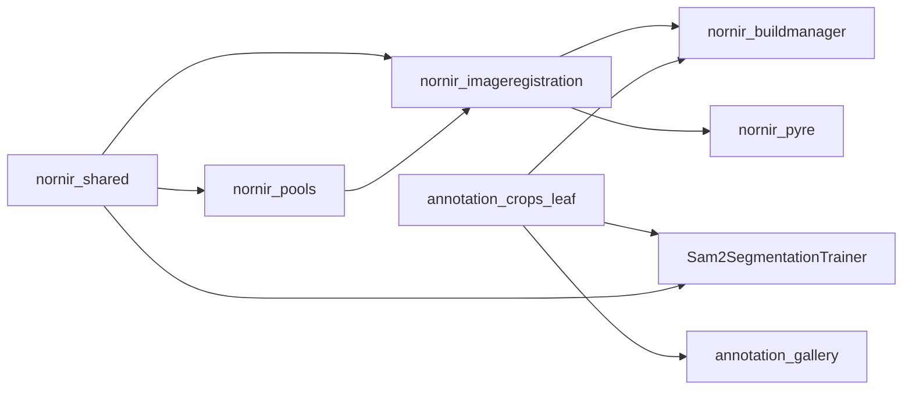

# Package-boundary and duplication proposals

Review of Sam2SegmentationTrainer and the Nornir packages, one chunk at a time. Notes are `chunk-01.md` through `chunk-17.md` in this folder. This document proposes changes. It does not move code.

Most items are local dedup or a small record. Two boundary changes are larger and called out as such: a leaf AnnotationCrops module so the gallery can stop stubbing `nornir_buildmanager`, and a raw image load in `nornir-imageregistration` that is not `LoadImage`.

## Target purposes

- **nornir-shared** — logging, filesystem, argparse, MQTT presentation. No image arrays and no crop catalog.
- **nornir-pools** — bounded task execution, including the sliding submit window now copied in two places.
- **nornir-imageregistration** — registration image load (`LoadImage`, with mask and extrema fill), filters, mosaic assemble, transforms, phase correlation. Also the right home for a *raw* pixel read/write that does not run that preprocessing. It must not import buildmanager, Pyre, or the trainer.
- **nornir-buildmanager** — volume XML, stage orchestration, calling imageregistration. Crop export stays here. Shared crop *file formats* (ignore list, mask names, score table) should not require importing the pipeline.
- **nornir-pyre** — UI over transforms. It already loads images through imageregistration. Its buildmanager dependency is only the smoke test.
- **volumemodel / volumecontroller / web / dashboard** — model, control, HTTP. Volumecontroller’s use of imageregistration for mosaic bounds is the right direction.
- **dm4** — DM4 tags and arrays only.
- **Sam2SegmentationTrainer** — fine-tune, dataset, loss, checkpoints, training MQTT via `nornir_shared`. It should not gain an imageregistration dependency for ImageNet normalization or percentile stretch. Those are trainer contracts.
- **annotation-gallery** — review UI over AnnotationCrops. It should read the same ignore list, mask names, and score table as the trainer and buildmanager without stubbing package inits.

The leaf does not exist yet. Until it does, gallery and trainer keep their copies. Imageregistration still does not depend on buildmanager. The trainer still does not depend on buildmanager.

## Cross-repo duplicates

### 1. Ignore list

Three readers of `{AnnotationCrops}/ignore.json`, a JSON array of location ids:

| Function | On bad JSON |
| --- | --- |
| `sam2_segmentation_trainer.data.manifest.load_ignore_ids` | prints and returns an empty set |
| `annotation-gallery/catalog.py.load_ignore_ids` | raises |
| `nornir_buildmanager...catalog.load_ignore_ids` | raises |

`save_ignore_ids` in the gallery and in nornir both write a sorted array. Parameters: crops directory, iterable of ids. Output: the same file the trainer reads at index time.

Pick one error policy (recommend the trainer’s tolerant read, so a corrupt list does not abort a long index) and call it from all three. Straightforward once the leaf in proposal 8 exists. Until then, do not “fix” the trainer to raise; that changes index behavior.

### 2. Mask filename

Contract: `{imageKey}_{locationId}.png`.

- Trainer `mask_location_id(name) -> int | None` (`rpartition`, tail must be digits).
- Gallery `image_key_from_mask_name(name) -> str | None` (same split, plus `IMAGE_KEY` match).
- Nornir `catalog._location_id_from_mask_name(path) -> int | None` (`rsplit("_", 1)`).

Same stem, three parsers. A `MaskName` record with `image_key`, `location_id`, `format()`, and `parse()` should be the only implementation. Output strings stay `{image_key}_{location_id}.png`. Gallery may keep the `IMAGE_KEY` check as a caller-side filter so a stricter pattern is not silently applied to nornir.

### 3. COCO RLE

`masks.encode_coco_rle(mask) -> {counts, size}` writes uncompressed Fortran-order runs. `size` is `[height, width]`. A mask that starts on foreground gets a leading 0. Empty mask is `counts: []`.

`sam2_segmentation_trainer.data.rle.decode_coco_rle` reads that dict and returns HxW uint8 `{0,1}`. List counts use `_decode_uncompressed`. String counts go through `pycocotools`.

`pipeline._bbox_area_from_rle` and `update._bbox_area_from_rle` walk the same counts. Input: RLE dict. Output: `([x, y, w, h], area)` with column `index // height` and row `index % height`. The update copy also requires `height` to be non-zero before counting a foreground run. One function, the update guard included.

Do not put RLE in imageregistration. It is a serialization format for annotation masks. The encoder and the bbox walk can live next to `encode_coco_rle` now (straightforward, buildmanager only). The decoder stays in the trainer until proposal 8, then both sides import it. Round-trip output: `decode(encode(mask))` equals `(mask > 0)` as uint8, Fortran layout preserved.

### 4. Training-loss table vs SAM2 columns

These are not the same scores.

- `train._ensure_score_schema` and gallery `catalog._ensure_score_schema` are the same migration. Table `location_scores (location_id, image_key, epoch, score)`, primary key those three. Legacy rows are copied with `image_key=''`. `record_location_scores` upserts training loss per window per epoch into `annotation_crops.sqlite`.
- `catalog.upsert_sam2_scores` updates `locations` columns `sam2PredIou`, `sam2ObjectScore`, `sam2Stability`, `sam2GtIou`, `sam2Checkpoint`, `sam2ScoredAt`.

Keep both stores. Delete the duplicated migration so only one function creates `location_scores`. Callers that pass `(location_id, image_key, epoch, score)` get the same rows.

### 5. Checkpoint load

`export_serve.finetuned_state_dict` accepts a raw state dict or `{"model": state_dict}` and returns the parameter dict. `evaluate` and `EMPredictor.__init__` each call `build_em_sam2`, `torch.load(..., weights_only=True)`, `load_state_dict`, and `eval`, and they assume a raw state dict.

One `load_finetuned_model(finetuned, base_ckpt, model_cfg, device)` should use `finetuned_state_dict`. Output: an eval-mode SAM2 module with the fine-tuned weights. `export_serve_checkpoint` can call it and then save `{"model": model.state_dict()}`. Trainer-only. No new Nornir dependency.

### 6. EM image contracts

Do not merge these.

- Train / eval dataset: `_load_gray_uint8` → `to_rgb_uint8` → `imagenet_normalize`. No percentile stretch. Mean `(0.485, 0.456, 0.406)`, std `(0.229, 0.224, 0.225)`.
- Inference: `normalise_em` (percentile 1–99 to uint8) then stack. `set_image_array` repeats the stack for a 2-D array.
- `evaluate._denorm_preview` inverts ImageNet norm but hardcodes the mean and std.

`to_rgb_uint8` does not cast to uint8. Name and output should match: HxWx3 uint8, or the function should be renamed. `load_em_rgb` should call the stack helper after the stretch so inference and a 2-D `set_image_array` share one path.

`_denorm_preview` should use `IMAGENET_MEAN` and `IMAGENET_STD`. Output stays HxWx3 uint8 in 0–255.

Do not route either path through `LoadImage`. That function also masks and replaces extrema with noise. Weights trained on ImageNet-normalized gray stacks would see different pixels.

## Records and local reuse

### 7. Records that already work

Keep and prefer these over new parallel dicts:

- `LocationRecord` — one annotation. JSONL shape from `to_json` / `from_json` stays stable.
- `MaskJob` — picklable raster spec. Result dict keys stay `location_id`, `image_key`, `mask_path`, `rle_path`, `bbox`, `area`.
- `CropExample` — one training sample. Add `meta()` returning `volume`, `location_id`, `image_key`, `downsample`, `category` is not on the example (it comes from the sidecar). The collate meta dict and MQTT `_sample_label` should take that meta mapping so the keys exist once.
- `TileRect`, `CropWindow`, `PlannedCrop`, `ImageWatermark`, `SectionWatermark`, `ExportParams` — crop lattice and freshness. Leave the axis comment in `geometry.py` in force.

### 8. New records, straightforward

- **`SampleMeta`** — `volume`, `image_key`, `location_id`, `downsample`, `category_name`, `split_key`. Produced by `EMSegDataset._item_from_example`, consumed by `collate_em`, `format_batch_samples`, and `record_location_scores`. Same keys, same string label `{volume}/{image_key}#{location_id}`.
- **`TrainerRoots`** — data, output, checkpoint, pretrained. Replaces the unlabeled 4-tuple from `_resolve_paths`.
- **`RunInputs`** — the seventeen fields of `_write_run_inputs` (run name, roots, volume counts, seed, fraction, image size, batch, epochs, model config, pretrained path). File JSON stays the same.
- **`TrainSnapshot`** — the dict `_snapshot` builds (`model`, `optimizer`, `scheduler`, `scaler`, epoch, steps, `best_val_iou`, `freeze_mode`, `rng`). Checkpoint bytes stay compatible; this is a constructor, not a new file format.
- **`EvalRequest`** — the eleven keywords of `evaluate`. `main` fills one object instead of forwarding each flag.

### 9. Small functions to collapse

- `make_location_split` and `include_new_keys` both clamp `n_train` so a group of size `>= 2` keeps at least one train and one val key. One `_train_count(n, fraction) -> int`. Membership of existing keys must not change.
- `annotation_ids_in_json` is unused. Delete it. Callers that need ids already use `sidecar_ids_and_size`.
- `_counts_by_volume` is the volume half of `summarize_index`. Call that, or a one-liner on `CropExample.volume`. Counts per volume stay the same.
- `index_volumes` should not move masks. `move_ignored_masks` stays a separate call so a read-only index does not rewrite `masks/` and `ignored/`. Behavior of training’s current index changes only in that the move is explicit at the call site. Today it is a hidden side effect.
- `validate.build_report` indexes twice and can move ignores twice. One index with `skip_missing`, plus a missing-file count from the names already listed.
- `server.intersect_keep` and `identity.intersect_grants` — one function. Input: grant dict and allowed names. Output: grants whose keys are in that list.

## Package moves

### 10. AnnotationCrops leaf (the boundary that pays off)

`segmentationtraining/__init__.py` imports catalog, pipeline, and cleanup. `catalog.py` imports ingest, stitch, and the product index. The gallery therefore stubs `nornir_buildmanager` and its parents in `refresh.py` so `maskrefresh` can load without that init.

Extract a leaf with no imageregistration, pools, or pipeline imports:

- ignore.json load/save (one error policy)
- `MaskName` parse/format
- `location_scores` schema ensure
- RLE encode, decode, and bbox/area
- `LocationRecord` if mask refresh needs it without pulling WKT parsers that import the pipeline

Buildmanager, the trainer, and the gallery import the leaf. `maskrefresh` stays in buildmanager but its module must import without executing `segmentationtraining/__init__.py` (move the pipeline re-exports to a submodule, or stop importing pipeline from the package init). The gallery then deletes `_stub_package`.

This adds a dependency from the trainer and the gallery to that leaf. It does not add imageregistration to the trainer image. The gallery image still does not install the rest of Nornir.

Raster polygon fill (`rasterize_mask_job`) stays in buildmanager. It is Pillow drawing of annotation rings, not mosaic registration. Moving it into imageregistration would pull `PolygonRings` the wrong direction.

### 11. Bounded submit belongs in pools

`poolutil.submit_bounded(submit, items, max_in_flight, on_in_flight=None)` and `tile._submit_bounded(submit, items, max_in_flight=...)` are the same deque window: yield tasks in submission order, never more than `max_in_flight` queued. The caller must exhaust the generator.

Put one function on `nornir_pools`. Keep the optional `on_in_flight` callback. `tile.py` and `poolutil.run_process_jobs` call it. Queue depth and FIFO order stay the same. This is the pools package’s job, not segmentation’s and not tile orchestration’s.

### 12. Raw pixel I/O in imageregistration

`LoadImage` is the registration loader: greyscale, mask, extrema replaced with noise. Annotation crops, stitch, tile pyramids, and MRC import must not call it.

`pillow_helpers` only reports dtype. Add a raw read next to it, for example `load_image_array(path) -> ndarray`, that returns Pillow’s pixels with no noise fill and no mask. `SaveImage` remains the encoded writer.

Call sites to switch only after a pixel compare on real small inputs:

- `stitch.probe_tile_pixel_size`, `stitch.write_png`
- `pipeline._repair_one_overlay`
- `tile._load_image_pixels` and the pillow tileset builder
- `importers/mrc.py` image opens

Stable-path rule: checksum or pixel-exact compare before and after. Importers and `tile.py` have been in production for years. A wrong dtype or axis here is a bad volume.

Do not point the trainer at this loader. Proposal 6 is the trainer’s contract.

### 13. What not to merge into imageregistration

- Segmentation stitch (`stitch_from_loader`, column bands, shared-memory prefetch) vs `assemble_tiles.TilesToImage`. One copies axis-aligned tiles into a crop. The other warps a mosaic. Sharing a prefetcher is a later performance change, not a move.
- `TileRect` / `CropWindow` vs `iRect` / `BoundingBox`. Mosaic Y vs image row is an explicit flag in `geometry.py`. No written axis contract (review issue 174). Leave them.
- Serial and batched phase correlation. They are a required pair. `cell_measurement` already wraps the batched offset. Do not collapse them.
- Pyre `ImageViewModel` padding for GL textures. It already calls `LoadImage` and `image_to_uint8`. Display tiling stays in Pyre.

### 14. Pyre’s buildmanager dependency

`nornir-pyre/pyproject.toml` depends on `nornir_buildmanager`. The only import is `pyre/__main__.py` inside `--smoke-test`, beside imageregistration, pools, and shared. The registration UI does not need it.

Removing it drops buildmanager from the Pyre install and from that smoke check. Keep it if the frozen build is supposed to prove buildmanager imports. Drop it if Pyre’s purpose is only the UI. Either way, do not start importing pipeline stages into commands.

### 15. Volumecontroller, dm4, web

No change. Volumecontroller already calls imageregistration for mosaic bounds and downsample. `dm4` stays the file-format reader; the buildmanager importer should keep calling it. Web and dashboard did not duplicate the crop catalog or pixel algorithms. `volumemodel/model_old.py` commented imports can be deleted when that file is next touched. They are not live.

## Left alone

- **`LoadImage` noise fill.** Registration depends on it. A raw loader is a new function, not a change to this one.
- **Refine-grid gates** in `local_distortion_correction` and `refine_shared`. No duplicate trust check was strong enough to merge. Thresholds stay.
- **Serial vs batched phase correlation.** Alignment is a verification task, not a dedup.
- **`ResizeToPowerOfTwo` in Pyre.** Column count is multiplied by `tile_height` and row count by `tile_width`. Square tiles hide it. Do not change it without a display-size compare. Axis names in that function are easy to misread.
- **OData paging.** Gallery `_odata_values` fetches one location. Ingest `_iter_odata_pages` walks a volume. Different callers. Do not import ingest into the gallery.
- **Torch IoU vs NumPy IoU.** `iou_prediction_loss_per_sample` and `metrics.iou_dice_pr` both use eps `1e-6` on different frameworks. Keep both. A shared formula would force a dependency neither side should take.
- **Importer and tile-pyramid behavior.** Proposals 12 names the call sites. No silent switch.

## Suggested order

1. One `_bbox_area_from_rle` and one `_train_count`. No package move.
2. ImageNet constants shared inside the trainer; `finetuned_state_dict` used by eval and `EMPredictor`.
3. `MaskName`, ignore-list, and `location_scores` schema as one leaf. Point trainer, gallery, and buildmanager at it. Delete the gallery package stubs after `maskrefresh` imports without the pipeline init.
4. Move `submit_bounded` to `nornir_pools`.
5. Add raw image load in imageregistration and switch buildmanager call sites only with before/after pixel compares.
6. Decide the Pyre buildmanager dependency explicitly. Do not leave it as an unused install requirement by accident.
