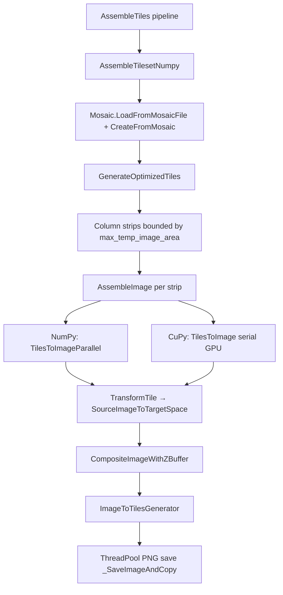

# Assemble Tiles Performance Plan (RPC3 601, 512×512)

**Status:** Not started  
**Overview:** Benchmark and profile optimized 512×512 tile assembly on RPC3 section 601 (NumPy and CuPy), then iterate on the active `AssembleTilesetNumpy` path without changing interpolation. Legacy and on-demand assemble paths may be archived if the production path is faster.

---

## Scope

**In scope:** Level-1 optimized tile generation — mosaic transform + source `TilePyramid/001` tiles → fixed 512×512 output grid.

**Out of scope:**
- Changing pixel interpolation (`map_coordinates` / `SourceImageToTargetSpace` in `nornir-imageregistration/assemble.py`)
- `BuildTilesetPyramid` (coarser levels) — separate concern; `bench_build_pyramids.py` covers downsampling
- Keeping on-demand assemble working (`nornir-web`, `volumecontroller`)
- Maintaining legacy tileset generation if replaced (`AssembleTileset` / `ir-assemble`, full-image CLI `nornir_assemble_tiles`)

## Compatibility scope (narrowed)

**Must keep working** — active production path only:

| Entry | Role |
|-------|------|
| `AssembleTiles` pipeline → `AssembleTilesetNumpy` | Buildmanager production entry |
| `GenerateOptimizedTiles` / `AssembleImage` | Core grid assembly |
| `TilesToImage` / `TilesToImageParallel` (and successors) | Warp + composite engines |
| `TransformTile` from assemble | Shared warp primitive (`local_distortion_correction` also uses it) |

**May archive, disconnect, or leave broken** once optimized path is validated:

| Entry | Notes |
|-------|-------|
| `AssembleTileset` (shells to `ir-assemble`) | Not used by current `AssembleTiles` pipeline |
| `nornir_assemble_tiles.py` CLI | Full-image output, not optimized grid |
| `AssembleTransformScipy` | Full-section assemble, not tileset grid |
| On-demand assemble | `nornir-web` / `volumecontroller` — deferred |
| `filter.AssembleTilesetFromImageSet` | ImageMagick crop path |

`AssembleImage` dispatch **may be redesigned** (e.g. wire `TilesToImageThreaded` for CuPy) when benchmarks justify it.

## Fixture (provided)

**Read-only input** — nornir testdata (`TESTINPUTPATH`, typically `/nornir-testdata`):

| Path | Contents |
|------|----------|
| `$TESTINPUTPATH/Volumes/RPC3/VolumeData.xml` | Volume metadata |
| `$TESTINPUTPATH/Volumes/RPC3/TEM/601/` | Section 601 — `Leveled/TilePyramid/001` + Grid transform |

Defaults: channel `TEM`, filter `Leveled`, transform `Grid`, section `601`.

**Writable output:**

```
$TESTOUTPUTPATH/assemble_bench/rpc3_601/
  tileset/          # assembled 512×512 level-1 PNGs
  profiles/         # cProfile + StageTimings JSON
  golden/           # --verify checksum manifest
  volume_work/      # optional writable volume copy for buildmanager smoke tests
```

Testdata stays read-only. Bench harness discovers paths from `VolumeData.xml`.

**Pipeline smoke test** (writable copy):

```bash
nornir-build $TESTOUTPUTPATH/assemble_bench/rpc3_601/volume_work/RPC3 \
  AssembleTiles -Sections 601 -Shape 512,512 -Transform Grid -Filters Leveled
```

## Hot-path architecture



Key files:
- [`assemble_tiles.py`](nornir-imageregistration/nornir_imageregistration/assemble_tiles.py)
- [`mosaic_tileset.py`](nornir-imageregistration/nornir_imageregistration/mosaic_tileset.py) — `GenerateOptimizedTiles`, `AssembleImage`
- [`tile.py`](nornir-buildmanager/nornir_buildmanager/operations/tile.py) — `AssembleTilesetNumpy`
- [`Pipelines.xml`](nornir-buildmanager/nornir_buildmanager/config/Pipelines.xml) — `AssembleTiles` pipeline

## Pre-work

### Fix stale `usecluster=True` kwarg

`AssembleTilesetNumpy` passes `usecluster=True` to `GenerateOptimizedTiles`, but that function accepts no such parameter — `TypeError` on fresh level-1 builds. Remove the dead kwarg.

### Verify fixture mount

Confirm `$TESTINPUTPATH/Volumes/RPC3` is visible in the dev container. Buildmanager expects `VolumeData.xml` casing at volume root.

## Phase 1 — Benchmark harness (new)

Create [`nornir-imageregistration/scripts/bench_assemble_tiles.py`](nornir-imageregistration/scripts/bench_assemble_tiles.py) modeled on [`bench_adjust_contrast.py`](nornir-imageregistration/scripts/bench_adjust_contrast.py).

**CLI flags:**
- `--volume-root` — default `$TESTINPUTPATH/Volumes/RPC3`
- `--section 601`
- `--output-root` — default `$TESTOUTPUTPATH/assemble_bench/rpc3_601`
- `--mosaic` / `--tile-dir` — optional overrides
- `--tile-size 512 512`
- `--max-temp-image-area` — override; default `EstimateMaxTempImageArea()`
- `--backends cpu,gpu`
- `--iterations 3` (one warmup discarded)
- `--profile` — cProfile per backend
- `--include-save` — PNG encode + copy phase
- `--output` — StageTimings-compatible JSON
- `--verify` / `--save-golden` — checksum gate

**Measured stages:** `load_mosaic`, `assemble_warp`, `save_png` (optional), `total`

**cProfile needles:** `TransformTile`, `SourceImageToTargetSpace`, `_TransformImageUsingCoords`, `map_coordinates`, `CompositeImageWithZBuffer`, `CreateDistanceImage`, `ImageToTilesGenerator`, `TilesToImage`, `TilesToImageParallel`, `SaveImage`

Force `multiprocessing` start method `fork` for NumPy parallel path (same as `bench_adjust_contrast.py`).

## Phase 2 — Baselines (NumPy and CuPy)

```bash
python nornir-imageregistration/scripts/bench_assemble_tiles.py \
  --volume-root "$TESTINPUTPATH/Volumes/RPC3" --section 601 \
  --tile-size 512 512 --backends cpu --iterations 3 \
  --output "$TESTOUTPUTPATH/assemble_bench/rpc3_601/profiles/cpu_baseline.json"

python nornir-imageregistration/scripts/bench_assemble_tiles.py \
  --volume-root "$TESTINPUTPATH/Volumes/RPC3" --section 601 \
  --tile-size 512 512 --backends gpu --iterations 3 --profile \
  --output "$TESTOUTPUTPATH/assemble_bench/rpc3_601/profiles/gpu_baseline.json"
```

Record: wall times per stage, grid dimensions, column-strip count, source tile count, cProfile top functions, GPU utilization notes (`_gpu_warp_lock` serializes warps).

## Phase 3 — Profile analysis and improvement backlog

Time buckets:
1. Source tile I/O / prefetch
2. Per-tile warp (do not change interpolation)
3. Composite (z-buffer, distance images)
4. Column-strip orchestration vs `max_temp_image_area`
5. Grid slicing (`ImageToTilesGenerator`)
6. PNG encode

**Candidate improvements** (verify with `bench --verify`):

| Candidate | Notes |
|-----------|-------|
| Wire `TilesToImageThreaded` as CuPy default | Unused in production today |
| Tune prefetch defaults | `_PREFETCH_WORKERS`, `_PREFETCH_DEPTH` |
| Overlap column-strip assembly with save | May increase `max_workers` in `GenerateOptimizedTiles` |
| `max_temp_image_area` default tuning | Bench sweep |
| Scaled-transform cache | `_scaled_transform_assemble_cache` |
| Save-pool backpressure | `AssembleTilesetNumpy` queues all saves before `as_completed` |
| Remove redundant `.get()` / host sync | CuPy path only |

**Guardrails:**
- No edits to `_TransformImageUsingCoords` interpolation mode/order
- `AssembleImage` dispatch may change when benchmarked
- Primary correctness gate: `bench --verify`
- Targeted tests: `test_assemble_gpu_threaded.py`, `test_assemble_preload.py`, `test_assemble_phase2.py`

## Phase 4 — Iterate until diminishing returns

Stop when: &lt;5% improvement for two consecutive attempts, `--verify` fails, or change requires interpolation modification.

Optional late step: archive legacy `AssembleTileset` / `ir-assemble` in cleanup PR.

## Todos

- [ ] Verify RPC3 601 fixture at `$TESTINPUTPATH/Volumes/RPC3` (mount + `VolumeData.xml`)
- [ ] Remove dead `usecluster=True` kwarg from `AssembleTilesetNumpy`
- [ ] Add `scripts/bench_assemble_tiles.py`
- [ ] Run NumPy and CuPy baselines; archive JSON + profiles
- [ ] Analyze TaskTimer + cProfile; rank improvement candidates
- [ ] Implement top improvements; verify with `bench --verify` + pipeline smoke test
- [ ] Optionally archive legacy assemble paths after validation

## Regression test strategy

- **Primary:** `bench --verify` golden manifest under `$TESTOUTPUTPATH/assemble_bench/rpc3_601/golden/`
- **Targeted unit tests:** GPU-threaded parity, prefetch, phase-2 env flags
- **Pipeline smoke:** one `AssembleTilesetNumpy` run on writable volume copy
- **Not required:** on-demand web, `ir-assemble`, full PMG/IDOC `test_assemble_tiles.py` matrix unless touching those paths
