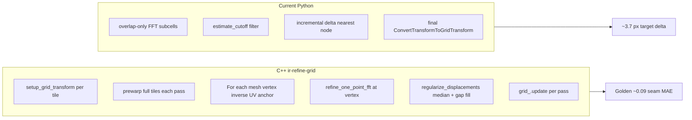
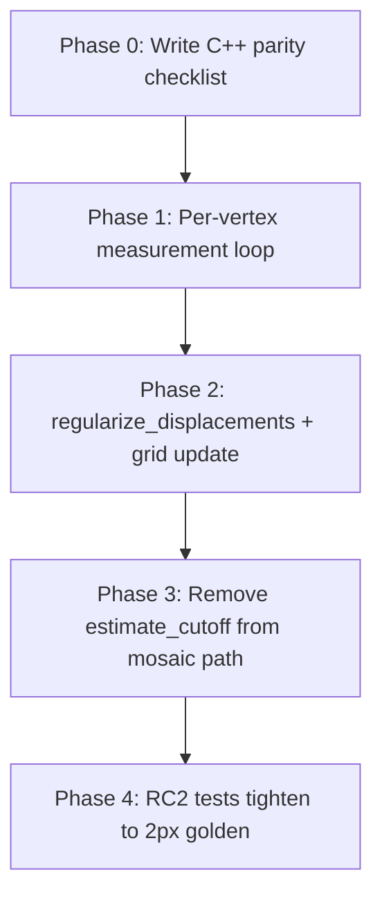

# Fix Grid690 Python Refine-Grid Parity (Restored)

## Plan storage

Write the durable copy to [`/workspace/.cursor/plans/fix_grid690_python_parity.plan.md`](/workspace/.cursor/plans/fix_grid690_python_parity.plan.md) on execution (survives container restarts). Ephemeral copy was previously at `/root/.cursor/plans/fix_grid690_python_parity_494025ac.plan.md`.

---

## Ground truth

| Role | Path |
|------|------|
| **C++ source** | Host: `D:\src\SVN\SCI\trunk` — Container: **`/legacycode`** |
| **Entry point** | [`/legacycode/code/ir-tools/ir-refine-grid.cxx`](/legacycode/code/ir-tools/ir-refine-grid.cxx) |
| **Core algorithm** | [`/legacycode/code/the/itk/mosaic_refinement_common.hxx`](/legacycode/code/the/itk/mosaic_refinement_common.hxx), [`mosaic_refinement_common.cxx`](/legacycode/code/the/itk/mosaic_refinement_common.cxx) |
| **FFT cell math** | [`/legacycode/code/the/itk/grid_common.hxx`](/legacycode/code/the/itk/grid_common.hxx) |
| **Golden output** | `D:\nornir-testdata\PlatformRaw\IDOC\RC2_4Square_Assembled\TEM\0690\TEM\Grid_Cel96_Mes8_sp4_Mes8_Thr0.5.mosaic` |
| **Params** | `cell=96`, `mesh=8×8`, `sp=4`, `threshold=0.5`, **`-it 10`** (C++ default) |

Mount verified: `/legacycode/code/ir-tools/ir-refine-grid.cxx` exists. Devcontainer bind documented in [`nornir-docker/dev/example.cursor-dev.run.env`](nornir-docker/dev/example.cursor-dev.run.env) (`NORNIR_LEGACY_CODE_HOST` → `/legacycode`).

---

## Current Python status (partial implementation)

Phases 1–4 were partially implemented in a prior session:

| Area | Status | Key files |
|------|--------|-----------|
| Overlap ROI from `overlapping_target_rect` | Done | [`local_distortion_correction.py`](nornir-imageregistration/nornir_imageregistration/local_distortion_correction.py) |
| Inverse-warp cell anchors | Done | `_refinement_cell_geometry` |
| Translate-style FFT preprocess | Done | `_phase_correlate_refinement_cell` |
| Incremental delta grid updates | Done (wrong model) | `_apply_point_pair_updates_to_grid_transform` |
| `estimate_cutoff` weight filter | Done (not C++ equivalent) | `_filter_weighted_point_pair_updates` |
| RC2 fixture + Cel96/Thr0.5 tests | Done | [`grid_seam_metrics.py`](nornir-imageregistration/tests/grid_seam_metrics.py) |
| Golden delta | **~3.7 px** (threshold 4.0) | vs 2.0 px target |

**Root cause of remaining gap:** Phase 0 shows C++ uses a **different architecture** than the current Python port.



---

## Phase 0 — C++ source audit (run first)

**Deliverable:** [`docs/refine-grid-cpp-parity-checklist.md`](/workspace/docs/refine-grid-cpp-parity-checklist.md) mapping C++ blocks → Python symbols.

### 0.1 CLI and initialization ([`ir-refine-grid.cxx`](file:///legacycode/code/ir-tools/ir-refine-grid.cxx))

| C++ | Python equivalent |
|-----|-------------------|
| `std_tile(..., shrink_factor, pixel_spacing)` | `imageScale = 1/sp`, tile loading in `_create_tileset_for_refinement` |
| `cell/mesh auto formulas` (`3 * dim / (mesh-1)`) | `_resolve_mesh_shape_and_cell_size` |
| `setup_grid_transform(..., mesh_rows-1, mesh_cols-1, ...)` | `_initialize_tile_grid_transforms` / `ConvertTransformToGridTransform` |
| `refine_mosaic_mt(..., prewarp=true, min_overlap=0.25, median_radius=1, iterations, displacement_threshold)` | `RefineGridMosaic` defaults |

### 0.2 Measurement loop ([`calc_displacements`](file:///legacycode/code/the/itk/mosaic_refinement_common.hxx) ~L224–395)

Critical findings to document:

- **Scope:** loops **`mesh_size` = all grid vertices**, not overlap FFT subcells only.
- **Anchor:** `gt.transform_inv(vertex.uv_, center)` — inverse map source UV → mosaic center (matches Python `_refinement_cell_geometry` intent but applied per **full mesh**, not overlap subgrid).
- **FFT:** `refine_one_point_fft` at mosaic center with `neighborhood` (= `-cell`) and `min_overlap=0.25`.
- **Prewarp path:** `prewarp_tiles=true` — uses already-warped full tiles; non-prewarp extracts neighborhoods via transforms.

Read and document: `refine_one_point_helper`, `refine_one_point_fft` in [`grid_common.hxx`](file:///legacycode/code/the/itk/grid_common.hxx) (normalization, padding, masking).

### 0.3 Displacement regularization ([`regularize_displacements`](file:///legacycode/code/the/itk/mosaic_refinement_common.cxx) L36–171) — verified

Three-stage pipeline (order matters):

1. **Median filter** on `dx`, `dy` with `median_radius=1` (outlier rejection).
2. **Gap-fill**: unmeasured vertices (`db==0`) average from nearest measured ring neighbors (expanding radius until `w >= 3` samples or exhausted).
3. **Gaussian blur sigma=1.0** on the **entire** dx/dy fields (`smooth<image_t>(dx_blurred, 1.0)`) — applies to measured vertices too. This is the "noise reduction filtering" from the docs and a key smoothness source in golden output.
4. Output: `xy_shift[i] = (dx, dy)`; `mass[i] += db` (mass accumulates per vertex **across neighbors**).

- **Not** `estimate_cutoff` — Python's STOS-style filter is a mismatch.

### 0.4 Per-pass update ([`refine_one_tile_t` + `refine_mosaic_mt`](file:///legacycode/code/the/itk/mosaic_refinement_common.hxx) L1329–1434, L1700–1802) — verified

- Per tile: sum shifts from each neighbor `shift[i][k] += shift_i[j][k]`, then normalize **`scale = 1/(1+mass[k])`** (this generalizes the d/2 split: 1 neighbor → 1/2, 2 neighbors → 1/3; Python `SplitDisplacements` d/2 is the single-neighbor special case).
- **`gt.grid_.update(&(shift[i][0]))`** adds shift directly to vertex mosaic positions (`v.xy_ += shift`), then `transform[i]->setup(gt)` rebuilds.
- **No** separate end-of-run lattice resample — grid IS the transform.
- Convergence metric: `avg = mean(|sx| + |sy|)` over all vertices of all tiles (unweighted; count += 2 per vertex).
- **Early stop has TWO conditions:** break when `avg <= threshold` **OR `avg >= last_average`** (stop as soon as a pass fails to improve). Python currently only checks the threshold — port both.

### 0.5 Resolve Python comment conflicts

Update [`local_distortion_correction.py`](nornir-imageregistration/nornir_imageregistration/local_distortion_correction.py) comments to reflect C++ mesh-vertex + regularization model only.

---

## Phase 1 — Measurement parity (revise overlap-only model)

Current overlap-subcell path in `_refine_single_tile_overlap_pair` must be **replaced or supplemented** to match C++:

### 1.1 Per-vertex measurement against each neighbor

For each tile `i` and overlapping neighbor `j`:

1. Iterate all mesh vertices on tile `i`'s grid transform.
2. Compute mosaic-space center via `InverseTransform(source_uv)`.
3. Skip if center falls outside overlap with neighbor `j` (or weight=0).
4. Extract `cell_size` neighborhoods from pre-warped tiles at that center.
5. Run phase correlation (reuse `_phase_correlate_refinement_cell` after reading C++ `refine_one_point_fft` preprocessing).

### 1.2 Prewarp semantics

Match C++ `prewarp_tiles=true`: warp full tiles to mosaic space each pass before vertex matching (reuse `_warp_overlap_for_grid_refine` pattern or full-tile warp cache).

### 1.3 Parameters

- `min_overlap = 0.25` (C++ hardcoded in ir-refine-grid call; Python tests use `0.001` — **change for refine path**)
- `median_radius = 1` for regularization step

---

## Phase 2 — Transform update: C++ mesh-vertex model (user decision)

**Replace** incremental delta hot path with C++-aligned update:

### 2.1 Port `regularize_displacements`

New module function in [`local_distortion_correction.py`](nornir-imageregistration/nornir_imageregistration/local_distortion_correction.py):

- Input: per-vertex `(dx, dy, db)` images on the mesh lattice (rows×cols), one set per neighbor pair
- Stage 1: median filter radius 1 on dx/dy (`scipy.ndimage.median_filter` / `cupyx` per array-module rules)
- Stage 2: gap-fill unmeasured vertices from expanding ring neighbors (port [`mosaic_refinement_common.cxx`](file:///legacycode/code/the/itk/mosaic_refinement_common.cxx) L62–148)
- Stage 3: Gaussian blur sigma=1.0 over full dx/dy fields (L151–158) — do not skip; this produces the legacy smoothness
- Output: per-vertex shift + mass increment (`mass[i] += db[i]`)

### 2.2 Apply displacements via grid vertex update

Port semantics of `refine_one_tile_t` + `the_acceleration_grid_t::update`:

- Sum per-neighbor regularized shifts, scale by `1/(1+mass[k])`
- Add scaled shift directly to grid target points (all vertices — gap-fill/blur means every vertex moves)
- Invalidate transform caches (Python equivalent of `setup()`)

**Remove** per-iteration `_apply_point_pair_updates_to_grid_transform` from hot path. **Remove** Python `SplitDisplacements` d/2 convention from this path — the `1/(1+mass)` scaling replaces it.

### 2.2b Convergence

Match C++ dual stop condition: break when `avg <= displacement_threshold` or `avg >= last_average` (no longer improving). Use the C++ metric: unweighted mean of `|sx| + |sy|` over all vertices.

### 2.3 Final resample

C++ does **not** resample at end. Python should **skip** final `_resample_transform_to_output_grid` when transform is already on the output lattice (only resample if converting from non-grid input).

---

## Phase 3 — Quality gating

- **Remove** `_filter_weighted_point_pair_updates` / `estimate_cutoff` from mosaic refine path (keep for STOS).
- Use C++ `regularize_displacements` + median outlier rejection instead.
- Add diagnostic counts: vertices measured / regularized / updated per tile per pass in [`grid690_diagnostics.py`](nornir-imageregistration/tests/grid690_diagnostics.py).

---

## Phase 4 — RC2 validation

Fixture: [`grid_seam_metrics.py`](nornir-imageregistration/tests/grid_seam_metrics.py) → RC2 under `TESTINPUTPATH`.

### 4.1 Re-calibrate after C++ alignment

- Set `REFINE_MAX_PASSES = 10` to match C++ default / pipeline XML
- Tighten `GOLDEN_TARGET_DELTA_MAX` from 4.0 → **2.0 px**
- Assert seam MAE ≤ golden (~0.09 mean) + tolerance

### 4.2 Optional exe parity

[`test_refine_grid_legacy_parity.py`](nornir-imageregistration/tests/test_refine_grid_legacy_parity.py) with:

- `NORNIR_LEGACY_IR_REFINE_GRID` → `/legacycode/bin/ir-refine-grid` (or Windows build)
- RC2 translated mosaic + L4 tile dir

### 4.3 Run command

```bash
NORNIR_HEADLESS=1 TESTOUTPUTPATH=/tmp/nornir-test-output \
  PYTHONPATH=/workspace/nornir-imageregistration:/workspace/nornir-imageregistration/tests \
  pytest nornir-imageregistration/tests/test_refine_grid_690_functional.py -v
```

---

## Execution order



---

## Risk notes

- **Architectural pivot:** Phase 2 replaces overlap-subcell + incremental delta with full-mesh vertex loop — larger diff than prior session.
- **Performance:** C++ measures all vertices × neighbors; may need tile-centric batching (keep existing memory optimizations where possible).
- **min_overlap 0.25** may reduce measured vertices vs Python's 0.001 — matches C++ behavior.
- **SCI mount:** use `/legacycode`, not `/mnt/d/...`, inside devcontainer.
