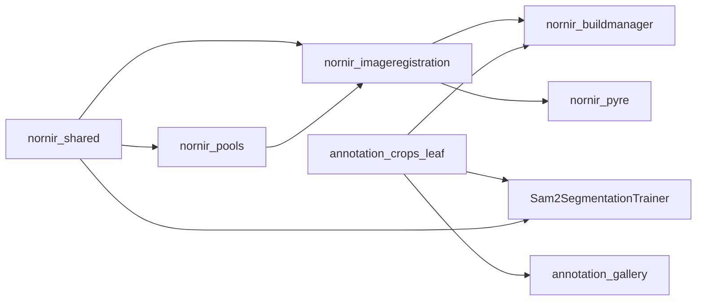

# Package-boundary and duplication plan

**Status:** Not started  
**Overview:** Deduplicate AnnotationCrops file formats, trainer helpers, and the bounded task window. Add a leaf the gallery can import without stubbing `nornir_buildmanager`, and a raw image loader in `nornir-imageregistration` that is not `LoadImage`. Do not change registration output, refine-grid gates, or importer pixels in the same change.

This plan assembles the review in `.cursor/issue-handoff/package-boundary-review/` (`chunk-01.md` through `chunk-17.md` and `proposals.md`). Those notes stay as the source. Implementation is a later pass.

---

## Package purposes

- **nornir-shared** — logging, filesystem, argparse, MQTT. No image arrays and no crop catalog.
- **nornir-pools** — bounded task execution, including the sliding submit window now copied in two places.
- **nornir-imageregistration** — registration load (`LoadImage`, with mask and extrema fill), filters, mosaic assemble, transforms, phase correlation. Also the home for a raw pixel read that does not run that preprocessing. It must not import buildmanager, Pyre, or the trainer.
- **nornir-buildmanager** — `VolumeData.xml`, stage orchestration, calling imageregistration. Crop export stays here. Shared crop file formats should not require importing the pipeline.
- **nornir-pyre** — UI over transforms. Image load already goes through imageregistration. The buildmanager dependency is only the smoke test.
- **volumemodel / volumecontroller / web / dashboard** — model, control, HTTP. Volumecontroller’s imageregistration use for mosaic bounds is the right direction.
- **dm4** — DM4 tags and arrays only.
- **Sam2SegmentationTrainer** — fine-tune, dataset, loss, checkpoints, training MQTT via `nornir_shared`. It must not take an imageregistration dependency for ImageNet normalization or percentile stretch.
- **annotation-gallery** — review UI over AnnotationCrops. It should share ignore list, mask names, and the score table without stubbing package inits.

The leaf does not exist yet. Until it does, the gallery and the trainer keep their copies.

## Out of scope

- Changing `LoadImage` (mask and extrema-to-noise stay).
- Merging segmentation stitch with `assemble_tiles.TilesToImage`.
- Mapping `TileRect` / `CropWindow` onto `iRect` (mosaic Y vs image row is unsettled; review issue 174).
- Collapsing serial and batched phase correlation.
- Retuning refine-grid trust gates.
- “Fixing” Pyre `ResizeToPowerOfTwo` (column count times `tile_height`, row count times `tile_width`) without a display-size compare.
- Sharing Torch IoU (`iou_prediction_loss_per_sample`) with NumPy IoU (`metrics.iou_dice_pr`). Both use eps `1e-6`. Keep both.
- Importing ingest OData paging into the gallery. Gallery `_odata_values` fetches one location; ingest `_iter_odata_pages` walks a volume.
- Silent importer or tile-pyramid output changes.

---

## Phase 1 — local dedup, no new package

Buildmanager only:

- One `_bbox_area_from_rle`. Copies live in `pipeline.py` and `update.py`. Input: COCO RLE dict. Output: `([x, y, w, h], area)` with column `index // height` and row `index % height`. Keep the update guard (`value == 1 and height`). `encode_coco_rle` still computes bbox from the bitmap; this walk is the sidecar-only path.

Trainer only:

- One `_train_count(n, fraction) -> int` used by `make_location_split` and `include_new_keys`. When `n >= 2`, the count stays in `[1, n-1]`. Existing key membership must not change.
- Delete unused `annotation_ids_in_json`. Callers use `sidecar_ids_and_size`.
- `_counts_by_volume` uses the volume tally already in `summarize_index` (or a one-liner on `CropExample.volume`). Counts stay the same.
- `evaluate._denorm_preview` uses `dataset.IMAGENET_MEAN` and `IMAGENET_STD`. Output stays HxWx3 uint8 in 0–255.
- `to_rgb_uint8` either casts to uint8 or is renamed. `load_em_rgb` and `EMPredictor.set_image_array` share that stack after `normalise_em` (percentile 1–99). Training still does not percentile-stretch.
- `load_finetuned_model(finetuned, base_ckpt, model_cfg, device)` uses `export_serve.finetuned_state_dict` (raw state dict or `{"model": ...}`). `evaluate` and `EMPredictor.__init__` call it. Output: eval-mode SAM2 with the fine-tuned weights. `export_serve_checkpoint` can call it and save `{"model": model.state_dict()}`. No new Nornir dependency.
- `index_volumes` stops calling `move_ignored_masks`. The training entry calls the move explicitly. A read-only index no longer rewrites `masks/` and `ignored/`.
- `validate.build_report` indexes once. It must not move ignores twice.
- Gallery: one of `server.intersect_keep` and `identity.intersect_grants`. Input: grant dict and allowed names. Output: grants whose keys are in that list.

Optional records in the trainer, file formats unchanged:

- `SampleMeta` — `volume`, `image_key`, `location_id`, `downsample`, `category_name`, `split_key`. Used by `EMSegDataset._item_from_example`, `collate_em`, MQTT labels, and `record_location_scores`. Label stays `{volume}/{image_key}#{location_id}`.
- `TrainerRoots` — replaces the unlabeled 4-tuple from `_resolve_paths`.
- `RunInputs` — the seventeen fields of `_write_run_inputs`. JSON on disk stays the same.
- `TrainSnapshot` — constructor for the `_snapshot` dict. Checkpoint bytes stay compatible.
- `EvalRequest` — the eleven keywords of `evaluate`.

Keep `focal_loss` and `iou_prediction_loss` as the `.mean()` of the per-sample functions.

## Phase 2 — AnnotationCrops leaf

`segmentationtraining/__init__.py` imports catalog, pipeline, and cleanup. `catalog.py` imports ingest, stitch, and the product index. `annotation-gallery/refresh.py` stubs those packages so `maskrefresh` can import.

Extract a leaf with no imageregistration, pools, or pipeline imports:

- ignore.json load/save. One error policy: the trainer’s tolerant read (print and return an empty set on bad JSON) so a corrupt list does not abort a long index. `save_ignore_ids` still writes a sorted JSON array of ints.
- `MaskName` parse/format. Output strings stay `{image_key}_{location_id}.png`. Gallery keeps the `IMAGE_KEY` check at the call site.
- `location_scores` schema ensure. Table `(location_id, image_key, epoch, score)`, primary key those three. Legacy rows copy with `image_key=''`. This is training loss. It is not `locations` columns `sam2PredIou`, `sam2ObjectScore`, `sam2Stability`, `sam2GtIou`, `sam2Checkpoint`, `sam2ScoredAt` (`upsert_sam2_scores`). Keep both stores.
- RLE encode, decode, and bbox/area. `decode(encode(mask))` equals `(mask > 0)` as uint8, Fortran order, `size: [height, width]`. Empty mask is `counts: []`. A foreground-first mask inserts a leading 0. String counts may still use `pycocotools` on the trainer side.

Callers: buildmanager catalog/masks, the trainer (`manifest.load_ignore_ids`, `data/rle.py`, `train._ensure_score_schema`), and the gallery catalog. Then stop importing the pipeline from `segmentationtraining/__init__.py` (move those re-exports) so `maskrefresh` imports without the gallery’s `_stub_package`. Delete the stubs after that.

`rasterize_mask_job` stays in buildmanager. It fills annotation rings. Moving it into imageregistration would pull `PolygonRings` the wrong way.

`LocationRecord` JSONL (`to_json` / `from_json`) stays stable. `MaskJob` result keys stay `location_id`, `image_key`, `mask_path`, `rle_path`, `bbox`, `area`.

This adds a leaf dependency to the trainer and the gallery. It does not add imageregistration to the trainer image. The gallery image still does not install the rest of Nornir.

## Phase 3 — bounded submit in pools

`poolutil.submit_bounded(submit, items, max_in_flight, on_in_flight=None)` and `tile._submit_bounded` are the same deque: yield in submission order, never more than `max_in_flight` queued. The caller must exhaust the generator.

One function on `nornir_pools`, with the optional callback. `tile.py` and `poolutil.run_process_jobs` call it. `run_process_jobs` stays in segmentation (in-process when `workers <= 1`, otherwise `GetMultithreadingPool`). Document at the pools call site that `GetMultithreadingPool` runs pickleable callables in processes. Queue depth and FIFO order stay the same.

## Phase 4 — raw pixel I/O, after a compare

Add `load_image_array` beside `pillow_helpers` (today it only sniffs dtype). It returns Pillow pixels with no mask and no noise fill. `SaveImage` stays the encoded writer.

Switch these only after a pixel-exact or checksum compare on a small real section under `TESTINPUTPATH`:

- `stitch.probe_tile_pixel_size`, `stitch.write_png`
- `pipeline._repair_one_overlay`
- `tile._load_image_pixels` and `BuildTilesetLevelWithPillow`
- `importers/mrc.py` image opens

Importer policy (which page, dtype, axis) stays in the importer. Do not point the trainer at this loader. Training is gray uint8, RGB stack, ImageNet normalize. Inference is percentile stretch, then stack.

`stitch_from_loader` stays in buildmanager. `TilesToImage` warps a mosaic. Do not merge them. Do not point `write_png` at `SaveImage` until a PNG parity check.

## Phase 5 — Pyre buildmanager dependency

`nornir-pyre/pyproject.toml` depends on `nornir_buildmanager`. The only import is `pyre/__main__.py` inside `--smoke-test`. Decide explicitly: Drop it so Pyre is only the UI. Do not import pipeline stages into commands.

---

## Chunk findings

### 1. `sam2_segmentation_trainer/data/`

`CropExample` already holds volume, z, downsample, image_key, location_id, paths, split_key, width, height. Mask files are `{imageKey}_{locationId}.png` (`mask_location_id`). `ignore.json` is a JSON array of location ids, with mtime stamps in `ignore_list_stamps`. RLE decode is uncompressed column-major COCO (`counts` + `size` `[height, width]`). Gray load is PIL `convert("L")` then a channel stack with no dtype cast and no percentile stretch.

`annotation_ids_in_json` is an unused wrapper. The train/val clamp is duplicated. `index_volumes` both lists crops and moves ignored masks. `summarize_index` lists directories the indexer already listed. Sidecar JSON is parsed at index time and again per sample. `collate_em` rebuilds meta fields that already live on `CropExample`.

### 2. Model, metrics, infer, evaluate, validate

ImageNet mean `(0.485, 0.456, 0.406)` and std `(0.229, 0.224, 0.225)` are named on the dataset and hardcoded in `_denorm_preview`. Training and inference are two image contracts. `evaluate`, `EMPredictor`, and export each load a checkpoint. `evaluate()` takes eleven keyword arguments. `validate._read_json_stats` repeats the annotation-id scan. `build_report` indexes twice, so ignore moves can run twice. Per-sample loss `.mean()` wrappers stay. NumPy and Torch IoU stay separate.

### 3. Train, checkpoint, MQTT, paths, export

`train._ensure_score_schema` matches the gallery migration. `record_location_scores` writes training loss into `annotation_crops.sqlite`. That is not the `locations.sam2*` columns. `_write_run_inputs` has seventeen parameters. `_snapshot` has twelve. `_counts_by_volume` repeats `summarize_index`. Only `finetuned_state_dict` accepts both a raw state dict and a `model` wrapper. `paths.data_root`, `output_root`, and `checkpoint_root` share one env-or-default shape. MQTT labels use the same meta keys as collate.

### 4. Annotation gallery

Gallery ignore load/save matches nornir, except the trainer swallows bad JSON. Score schema SQL is copied from train. Three mask-name parsers: trainer `mask_location_id` (`rpartition`), gallery `image_key_from_mask_name` (plus `IMAGE_KEY`), nornir `_location_id_from_mask_name` (`rsplit`). `refresh.py` stubs `nornir_buildmanager` because the package init imports the pipeline. `intersect_keep` and `intersect_grants` do the same filter. `_write_jpeg` is the one-size case of `_write_jpegs`. Leave OData paging split.

### 5. Records, geometry, masks, curves, WKT

Keep `LocationRecord` and `MaskJob`. `encode_coco_rle` is the writer for `decode_coco_rle` and they can drift across repos. `TileRect.image_key` is `{z}_X{ix0}-{ix1}_Y{iy0}-{iy1}`. `MOSAIC_Y_INCREASES_WITH_IMAGE_ROW` stays. Do not fold `TileRect` into `iRect` yet. Polygon fill stays with the mask job. `location_from_odata_entity` returns `LocationRecord` or None and is what the gallery reaches through `maskrefresh`.

### 6. Stitch, planning, pipeline, catalog, freshness

RLE bbox is copied in `pipeline.py` and `update.py`. Catalog ignore/sqlite paths match the gallery. Nornir `connect` also migrates `locations` (`jpeg_relpath` to `image_relpath`, drops origin columns). Two score stores. `probe_tile_pixel_size` and `_repair_one_overlay` use `PIL.Image.open`. `LoadImage` is the wrong replacement. `write_png` and `_save_rgb_png` are different PNG writers. `stitch_from_loader` is not `TilesToImage`. `PlannedCrop`, `ImageWatermark`, `SectionWatermark`, `ExportParams`, and `ResolvedTileset` are already records. `catalog.py` imports ingest, stitch, and the product index, so the gallery cannot use it for ignore-list I/O alone.

### 7. Ingest, update, cleanup, poolutil, SAM2 writer

`update.refresh_existing_location_masks` already delegates to `maskrefresh`. The package init still imports pipeline and catalog. `submit_bounded` matches `tile._submit_bounded`. Ingest owns OData, section JSONL, and `source.json`. Gallery `load_source_document` is a second reader. `maskrefresh._crop_image` and `stitch.resolve_crop_image` both find `{image_key}` under `images/`.

### 8. Buildmanager pixel operations

`tile.py` mixes volume orchestration with `_load_image_pixels`, `_crop_or_pad_to_shape`, and tileset level build. Orchestration stays. Pixel work calls imageregistration only after a compare. `filter.py` and `registration.py` already call imageregistration. `registration.py` star-imports `nornir_shared`; clean that when the file is next edited, not as its own move.

### 9. Importers

`importers/mrc.py` opens images with Pillow. Conversion policy stays in the importer. Byte decode of a standard image waits for the raw loader and a real-section compare.

### 10. Volumemanager and pipeline

Volumemanager owns `VolumeData.xml` and dirty flags. No pixel algorithm should move. Segmentation stage names stay in pipeline XML. The package init import is what forces the gallery stub.

### 11. Imageregistration image I/O and assemble

`LoadImage` greyscale-converts, masks, and replaces extrema with noise. `pillow_helpers.get_image_file_dtype` does not return pixels. `SaveImage` already owns encoded writes for the registration stack. Assemble prefetch and segmentation stitch prefetch are different contracts until a profile says otherwise. `image_to_uint8` is the GL boundary, not the trainer’s uint8 path.

### 12. Transforms

`ITransform` and the grid, RBF, triangulation, factory, and converters stay here. Pyre and buildmanager already depend downward. No second transform implementation in segmentation.

### 13. Registration

Serial and batched phase correlation stay a pair. `cell_measurement` already wraps `batched_find_offset`. `stos_brute` and `arrange_mosaic` stay in imageregistration. Buildmanager `registration.py` orchestrates nodes and calls in. No crop-mask function duplicates a phase-correlation peak.

### 14. Refine grid

`refine_shared` is already split (roles, validity, measurement, cutoff, discontinuity, progress, diagnostics). `AttemptAlignPoint` should keep calling those helpers. No duplicate gate pair was strong enough to merge. A cell-measurement record is optional and must not change mesh membership.

### 15. Pyre

`ImageViewModel` correctly uses `LoadImage`. Display padding for GL textures stays in the view model. `ResizeToPowerOfTwo` axis naming is easy to misread; leave it. The buildmanager dependency is smoke-test only. Pyre must not be imported by buildmanager or imageregistration.

### 16. Pools and shared

`submit_bounded` belongs in `nornir_pools`. `run_process_jobs` stays segmentation-specific and should call the shared helper. MQTT and `prettyoutput` stay in `nornir_shared`. Do not move image or catalog code into shared.

### 17. Volumemodel, volumecontroller, web, dashboard, dm4

Volumecontroller already uses imageregistration for mosaic bounds and downsample. `model_old.py` commented imports are dead. `dm4` stays the file-format reader. Web and dashboard did not copy the crop catalog or pixel algorithms. No move.