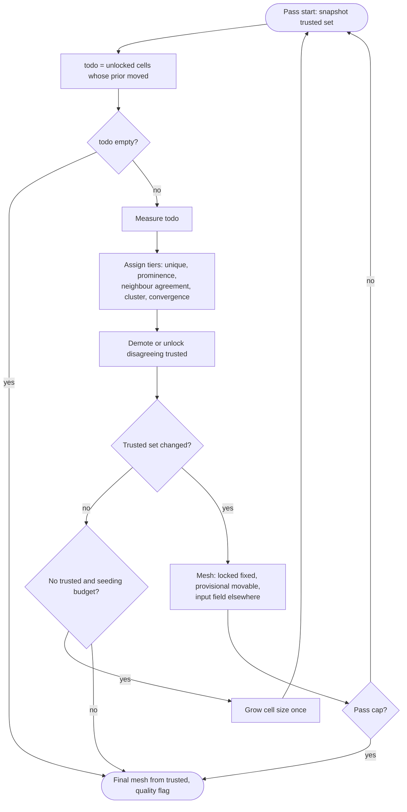

# Refine-grid trusted-mesh consolidation

Companion inventory: [`nornir-imageregistration/docs/refine_grid_step_inventory.md`](nornir-imageregistration/docs/refine_grid_step_inventory.md) (rows referenced below by number). Original algorithm: `git show 896e41e:nornir_imageregistration/local_distortion_correction.py` in `nornir-imageregistration` (April 2025, pre-2026 changes).

## Principle

Only trusted cells shape the field. A cell earns trust from its own measurement (unique peak, prominent ZNCC) and from agreement with trusted neighbours; it keeps trust by converging under the field it helped build. Untrusted cells never enter the mesh; where nothing is trusted the input transform stands.

## What the original did that we keep

- Lock by convergence: re-measured under the current field, travel below `max_travel_for_finalization` (original `CalculateFinalizedAlignmentPointsMask` with weight cutoff 0).
- Re-measure locks every pass and replace with a stronger converged peak (`TryToImproveAlignments`).
- Data-relative inclusion (inflection cutoff on the pass distribution) rather than absolute constants.
- Stop when locks stop growing, not after N passes.

## Trust tiers

- `LOCKED`: unique peak (`peak_ratio >= PEAK_RATIO_MIN`), ZNCC prominence passes, converged (travel below bar) under the current field. Enters the mesh as a fixed point. Subject to unlock-stale every rebuild.
- `PROVISIONAL`: unique peak that agrees with its trusted neighbours (or, with no locks yet, belongs to a mutually consistent cluster of unique peaks: same direction within `INLIER_COS_MIN`, travel within a factor of the cluster median, 4-connected size at least 3). Enters the mesh as a movable control point using its measured peak. Re-measured every time its prior moves; promoted to `LOCKED` when it converges, demoted to `UNTRUSTED` when it stops agreeing.
- `UNTRUSTED`: everything else (ambiguous, low content, disagreeing). Never in the mesh. Re-measured only when the field under it moves.

Agreement tolerance for a cell scales with local anchor support: tight (about `max_travel`) when 3 or more locks lie within two hops, looser (up to the cell half-size) when only one; a cell with no trusted cell within two hops can be `PROVISIONAL` only through the cluster rule.

## Core loop

```text
trusted = {}                      # id -> record with tier
last_prior = {}                   # id -> field position when last measured
for pass in range(cap):
    before = frozenset((id, tier) for id, tier in trusted)
    todo = [c for c in grid if c not locked and (pass == 0 or |prior(c) - last_prior[c]| > eps)]
    if not todo: break
    measure(todo); update last_prior
    assign tiers (unique, prominence, neighbour agreement, cluster rule, convergence)
    unlock/demote trusted cells that disagree with the field or with their neighbours
    if frozenset(trusted) == before:
        if no trusted at all and seeding budget: grow cell size once, continue
        break                      # same trusted set -> same field -> nothing new to learn
    mesh = MeshWithRBFFallback(locked as fixed + provisional as movable); input field elsewhere
final mesh from trusted; quality flag if lock fraction below LOCK_FRAC_TRIGGER
```

The "front" is not a phase: `todo` is exactly the cells whose prior moved, which after a rebuild is the neighbourhood of newly trusted cells. Compare the trusted *set* (ids plus tier), not the count, so a demotion also triggers rebuild and re-measure.



## Phase 0: before the refactor (small, independent, keep regardless)

- Commit today's Track B uniqueness gate and remeasure revert with tests (`coherent_residual.py`, `test_refine_recovery.py`), bump umbrella pointer.
- Quality flag when final lock fraction is below `LOCK_FRAC_TRIGGER` (old plan item 1). Both 1215-1214 runs today would have been flagged; the new loop needs the same flag.
- Unify serial `AttemptAlignPoint` dual-ROI pick with the batched `peak_ratio` rule (old plan item 2). Measurement-layer correctness, independent of the mesh.
- Treat missing `peak_ratio` as non-lockable (old plan item 11). Part of the trust gate.
- Capture baseline `PASS_DIAGNOSTICS` NPZ plus final control-point deltas on the fixture pairs (below) with current code. This is both old plan item 6 (ZNCC calibration data) and the A/B baseline; without it the refactor cannot be judged.

## Phase 1: build the trusted-mesh path behind `NORNIR_REFINE_TRUSTED_MESH=1`

- New module `refine_shared/trust_tiers.py`: tier assignment (unique, prominence, neighbour agreement with support-scaled tolerance, cluster rule, convergence), demotion, and trusted-set snapshot/compare. Pure functions over `EnhancedAlignmentRecord` lists; unit-testable without images.
- New module `refine_shared/measure_schedule.py`: `cells_whose_prior_moved(grid, transform, last_prior, eps)`; pass 1 returns all.
- `_attempt_align_points_translation_batched` and `_RefineGridPointsForTwoImages` accept a cell subset (ids) instead of always measuring the whole grid; keep `MeasuredRoiSink` and `ZnccNullCache` behaviour.
- `RefineTransform`: when the flag is on, run the core loop above; mesh built only from trusted records (`_build_mesh_transform_or_keep` with locked as `fixed_points`, provisional as records); skip Track A, Track B, best-effort, anchor-smooth, raw-preserve, travel filter, sparse-mesh preserve. Keep unlock-stale, finalize convergence check, adaptive cell grow (seeding only), diagnostics, phase timer.
- Seeding: zero trusted after a full measure grows cell size once (existing `adaptive_cell_size`); still zero, stop with flag. Cluster rule handles the band case (1215-1214 pass 1: 36 unique cells, band-coherent).
- Pyre: `num_iterations` becomes a cap; progress reporter gets per-pass `todo` count so a pass measuring 20 cells does not look stalled.

## Phase 2: A/B on the corpus, then retire

- Fixtures: 1215-1214 (band, drying front), 240-241 (coherent residual), 241-242 (identity bubble), 252-254 (tear front), 228-229 (high-weight outliers), 953-952 (sub-par), one healthy pair. Metric per pair: lock fraction, unique fraction among unlocked over passes (must not fall as it did 196 to 103 today), control-point delta vs baseline at locked cells, wall time.
- Retire when the flagged path is not worse on every fixture: rows 7, 8, 9 (Track A/B and revert), 11 as separate mechanism (disc front), 12 (field branding), 14 (best-effort), 15 (anchor-smooth and raw-preserve), 16 (travel filter and REJECT drop as mesh gates), 17 and 20 (sparse-mesh preserve). Delete code and constants, not just disable.
- Absolute constants that remain must be fractions of `n_grid` or of the pass distribution; none of `50`, `100`, `6` survive.

## Phase 3: documentation and guidance

- Rewrite `grid16_stos_cell_role_theory.md` around tiers; fold `grid16_rc2_refine_failure_modes.md` into per-fixture expectations; update the inventory with final dispositions.
- Trust-question rule/skill (wording handed to another agent; see chat).
- Pyre grid dialog: default `max_angle` to 0 (per-cell angle search disables the batched path and is not how global rotation should be fixed).

## Old plan items not carried forward

- Items 3, 4 (anchor-smooth gating, unlock on branding): replaced by tiers plus demotion.
- Item 5 (best-effort validation): mechanism retired.
- Item 8 (disc front min cells): replaced by neighbour agreement and cluster rule.
- Item 9 (soft-exact by travel): measurement-layer perf idea; revisit after Phase 2 if extraction dominates.
- Item 10 (FOV rigid residual): wrong model for drying-front deformation; replaced by provisional propagation.
- Item 12 (grid spacing with cell size): folds into seeding; revisit only if seeding grows cells often.
- Item 7 (mask-aware low content): still valid, measurement layer; schedule after Phase 2 unless a fixture needs it earlier.

## Risks

- Feedback through provisional cells (252-254 style): mitigated by demotion on disagreement, support-scaled tolerance, and stop-on-unchanged-set; A/B metric watches unique fraction over passes.
- Cluster rule admitting wrap-peak clusters (240-241 soup): clusters must agree in direction and magnitude; opposing modes split into two clusters and neither reaches size 3 with agreement, verify on fixture.
- Batched path must accept subsets without changing results for the full set (Stable-path-output-parity); parity test measuring all cells via subset API vs today.
