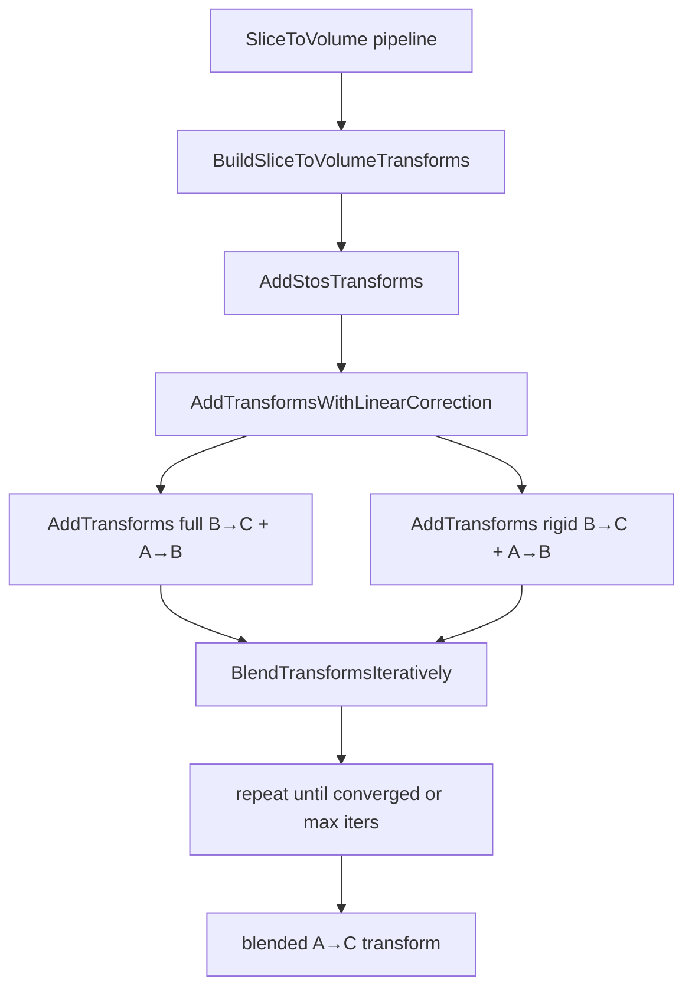

# SliceToVolume Linear Blend Restoration

## Summary

The SliceToVolume linear-blend plumbing exists but is inactive by default. Rigid estimation was broken until Jan 2025 (`685fad8c`). The current `travel_limit` ramp causes rigid snaps. **User request: add iterative re-blend** so correction releases once points are close enough to the rigid prediction.

---

## Architecture



Key files:
- [`nornir-imageregistration/nornir_imageregistration/transforms/utils.py`](nornir-imageregistration/nornir_imageregistration/transforms/utils.py)
- [`nornir-imageregistration/nornir_imageregistration/transforms/addition.py`](nornir-imageregistration/nornir_imageregistration/transforms/addition.py)
- [`nornir-imageregistration/nornir_imageregistration/files/stosfile.py`](nornir-imageregistration/nornir_imageregistration/files/stosfile.py)
- [`nornir-buildmanager/nornir_buildmanager/operations/block.py`](nornir-buildmanager/nornir_buildmanager/operations/block.py)
- [`nornir-buildmanager/nornir_buildmanager/config/Pipelines.xml`](nornir-buildmanager/nornir_buildmanager/config/Pipelines.xml)

---

## 1. Fix `travel_limit` ramp (unchanged from prior plan)

Replace the `T/2` dead-zone piecewise ramp in `BlendTransforms` with smoothstep on `t = clip(d / travel_limit, 0, 1)`:

```python
travel_weight = t * t * (3.0 - 2.0 * t)
base = linear_factor if linear_factor is not None else 0.0
linear_factors = base + (1.0 - base) * travel_weight
```

Optional `max_blend` cap (e.g. 0.9) to avoid full rigid snap at `d ≥ travel_limit`.

Extract `_travel_blend_weights(distances, travel_limit, linear_factor)` for unit tests.

---

## 2. Iterative re-blend (new)

### Goal

One-shot blend per hop pulls toward linear once; deviation from rigid on the **next** hop can reopen. **Re-blend** on the **same composed transform** lets per-point weight fall as `current` approaches `linear_ref`, so acute tear correction **releases** instead of over-correcting to rigid.

### Algorithm: `BlendTransformsIteratively`

New function in [`utils.py`](nornir-imageregistration/nornir_imageregistration/transforms/utils.py):

**Fixed references (computed once per `AddTransformsWithLinearCorrection` call):**
- `nonlinear_ref` — output of `AddTransforms(B→C, A→B)`
- `linear_ref` — output of `AddTransforms(rigid B→C, A→B)`

**State:**
- `current` — control-point transform, initialized with `nonlinear_ref` target points (same mesh/grid topology)

**Each iteration:**
1. `linear_points = linear_ref.Transform(current.SourcePoints)` — rigid prediction for current source layout
2. `d = ||linear_points - current.TargetPoints||` per control point
3. Compute per-point weights via smoothstep `travel_limit` (+ optional `linear_factor` floor)
4. `current.TargetPoints = (1 - w) * current + w * linear_points` (same blend as `BlendTransforms`)
5. **Stop when** any of:
   - `max(||ΔTargetPoints||) < reblend_tolerance` (default e.g. 0.5 px at working resolution)
   - `max(w) < reblend_weight_tolerance` (e.g. 0.01) — all points released
   - `reblend_iterations` reached (default e.g. 8)

**Important:** Distance is measured from **current** blended position to **linear_ref**, not from fixed `nonlinear_ref`. As `current` moves toward rigid, `d` shrinks, `w` drops, updates stop — equilibrium can sit **between** nonlinear and linear, preserving fold warp.

`reblend_iterations=0` or `1` preserves today's one-shot behavior.

### Wiring

| Layer | Change |
|-------|--------|
| `utils.py` | `BlendTransformsIteratively(...)` |
| `addition.py` | `AddTransformsWithLinearCorrection` calls iterative helper when `reblend_iterations > 1` |
| `stosfile.py` | `AddStosTransforms(..., reblend_iterations=, reblend_tolerance=)` |
| `block.py` | Pass through `BuildSliceToVolumeTransforms` / `SliceToVolumeFromRegistrationTreeNode` |
| `Pipelines.xml` | New args on `SliceToVolume` and `LinearizeVolume` |
| `transformnode.py` | Persist `reblend_iterations`, `reblend_tolerance`, `travel_limit` on output nodes |

### Pipeline arguments (SliceToVolume)

| Flag | Default | Purpose |
|------|---------|---------|
| `-travel_limit` | `512` (full res; scale by downsample like Tolerance) | Spatial scale for per-point weight |
| `-linear_factor` | `0.05` | Floor weight when using travel_limit |
| `-reblend_iterations` | `8` | Max iterative passes; `1` = one-shot |
| `-reblend_tolerance` | `0.5` | Stop when max target-point movement below this (px) |

All optional; `reblend_iterations=0` with both blend params `None` keeps legacy uncorrected path.

### `LinearizeVolume` pipeline

Same re-blend args — applies when post-hoc flattening an existing stos group via `LinearBlendStosGroup` / `BlendWithLinear`.

---

## 3. Cache invalidation

SliceToVolume output `TransformNode` must store and check on rebuild:
- `linear_blend_factor`
- `travel_limit`
- `reblend_iterations`
- `reblend_tolerance`

Mirror [`LinearBlendStosGroup`](nornir-buildmanager/nornir_buildmanager/operations/block.py) invalidation pattern (lines ~2768–2769).

---

## 4. Unit tests

`nornir-imageregistration/tests/transforms/test_blend_transforms.py`:

- Smoothstep has no cliff at old `T/2`
- **Re-blend convergence**: synthetic transform with one acute outlier — after iterations, outlier moves toward linear, weight drops, point stabilizes short of full rigid if `max_blend < 1`
- **Release**: normal-distortion points (small `d` initially) move less than tear points; final `max(w) < reblend_weight_tolerance`
- **Iteration cap**: respects `reblend_iterations`
- **One-shot regression**: `reblend_iterations=1` matches single `BlendTransforms` call
- Chained `AddTransformsWithLinearCorrection` over 3 hops vs uncorrected `AddTransforms`

---

## 5. Scripts / verification

Update [`TEMAlign.cmd`](nornir-buildmanager/scripts/TEMAlign.cmd), CMP scripts, [`.vscode/launch.json`](.vscode/launch.json).

Re-run SliceToVolume on tissue volume: tears clamped, normal regions preserved, no section-boundary snaps, metadata records blend params.
