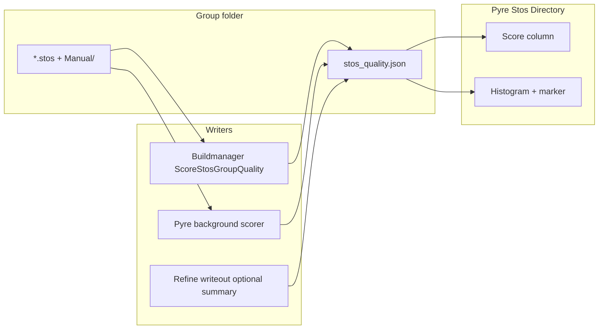

# STOS quality scores for browser and batch

## Design choice (locked)

- **Primary store:** one sidecar JSON per STOS group folder (filesystem-first; matches today’s browser).
- **Not primary:** VolumeData Transform attributes alone (browser does not load volume XML). Batch stage may **also** write a scalar `PairZNCC` on the Transform for pipeline/XPath consumers.
- **No separate histogram file.** Histogram is derived in memory from the score map (O(n)); regenerating it is trivial vs ZNCC compute.
- **UI histogram model:** use in-memory [`nornir_shared.histogram.Histogram`](nornir-shared/nornir_shared/histogram.py) via `Histogram.Init` + `Add` for bins and percentiles (`Median` / percentile helpers already on the class). Fixed score range e.g. `Init(minVal=-1.0, maxVal=1.0, numBins=50)` (ZNCC); rebuild from the current non-stale `pair_zncc` list whenever scores change. Fast enough on the fly (binning is negligible vs scoring). **Do not** persist a score `Histogram.xml` (that XML remains for intensity/contrast pipelines). Matplotlib only renders `Bins` + the selected-score marker; it is not the binning source of truth.
- **Scores:** both full-pair ZNCC (browser column) and optional refine summary fields in the same record.
- **Compute:** both a buildmanager batch stage and lazy Pyre background fill/refresh for missing or stale entries.



## Sidecar format

Path: `{stos_group}/stos_quality.json` (sibling to Automatic `.stos` files; Manual variants keyed under `Manual/…`).

Schema (concrete):

```json
{
  "version": 1,
  "entries": {
    "1034-1032_ctrl-TEM_Leveled_map-TEM_Leveled.stos": {
      "pair_zncc": 0.71,
      "downsample": 16,
      "stos_checksum": "…",
      "stos_mtime_ns": 123,
      "scored_at": "2026-08-03T…",
      "refine": {
        "median_lock_zncc": 0.68,
        "lock_frac": 0.76,
        "pass": 4
      }
    },
    "Manual/1034-1032_….stos": { "pair_zncc": 0.82, "...": "..." }
  }
}
```

### Invalidation / refresh (answer to “older than…”)

**Score vs `.stos` — yes.** A cache entry is stale (recompute `pair_zncc`) when:

- the `.stos` is missing, or
- `stos_checksum` mismatches (preferred), or
- checksum unavailable and `stos_mtime_ns` is older than / not equal to the current file mtime, or
- `pair_zncc` is missing.

So: if the transform file is newer than the scored snapshot, the score updates. Refine fields are optional; absence does not force a pair recompute.

**Histogram vs scores — same idea, but no histogram file.** There is no on-disk histogram to age-check. The UI histogram is always rebuilt from the current in-memory set of non-stale `pair_zncc` values whenever:

- the folder is opened / rescanned, or
- any score is added, refreshed, or dropped as stale.

That is equivalent to “histogram updates when any score changes.” Rebuild with `Histogram.Init` + `Add` over the current score list (milliseconds); the expensive part is computing `pair_zncc`, not the histogram. Do **not** write a score `Histogram.xml`.

## Reuse map (concrete hooks)

**Warp + score (pair ZNCC)**

- [`SourceImageToTargetSpace`](nornir-imageregistration/nornir_imageregistration/assemble.py) (+ `return_valid_mask`) — primary in-memory warp; [`TransformImage`](nornir-imageregistration/nornir_imageregistration/assemble.py) for large tiles.
- Downsample clamp pattern in [`coherent_residual.py`](nornir-imageregistration/nornir_imageregistration/refine_shared/coherent_residual.py) (`max_dim` → `ResizeImage` → temporary `Scale` → warp).
- [`masked_zncc`](nornir-imageregistration/nornir_imageregistration/refine_shared/cell_roles.py) — pair score.
- [`StosFile.Load`](nornir-imageregistration/nornir_imageregistration/files/stosfile.py) / `LoadChecksum` — load paths + preferred `stos_checksum`.
- [`file_mtime_ns`](nornir-shared/nornir_shared/files.py) / `OutdatedFile` — mtime stale checks (do **not** use `RemoveOutdatedFile` for the JSON cache; it deletes dependents).
- Optional refine block: [`pass_diagnostics`](nornir-imageregistration/nornir_imageregistration/refine_shared/pass_diagnostics.py) NPZ/`PassDiagnosticRow.zncc`.
- JSON idiom: [`GetOrSaveTranslateSettings`](nornir-imageregistration/nornir_imageregistration/settings/__init__.py) style `json.load`/`dump` (no existing `stos_quality.json`).

**Histogram / plot**

- [`Histogram.Init` / `Add` / `Median` / `Bins`](nornir-shared/nornir_shared/histogram.py) — UI model (also used for non-intensity in [`GenerateWarpHistogram`](nornir-imageregistration/nornir_imageregistration/views/transformwarp.py)).
- [`nornir_shared.plot.Histogram`](nornir-shared/nornir_shared/plot.py) — PNG/axes helper with `LinePosList` for a marker line; adapt for Qt embed (no FigureCanvas in pyre yet).

**Buildmanager batch**

- Loop/Manual templates: [`AssembleStosOverlays`](nornir-buildmanager/nornir_buildmanager/operations/block.py) / [`CalculateStosGroupWarpMeasurementImages`](nornir-buildmanager/nornir_buildmanager/operations/block.py) — **iteration/stale only**, not `ir-stom` scoring.
- [`StosGroupNode.TransformsForMapping`](nornir-buildmanager/nornir_buildmanager/volumemanager/stosgroupnode.py), `PathToManualTransform`, `ManualInputDirectory`.
- Transform attrib pattern: `"%g"` setters like `min_blend` on [`TransformNode`](nornir-buildmanager/nornir_buildmanager/volumemanager/transformnode.py) for `PairZNCC`.

**Pyre browser**

- [`StosBrowserRow`](nornir-pyre/pyre/stos_manual_paths.py) + commented `quality_score`; `scan_stos_browser_rows` / Manual merge.
- [`ThreadPoolExecutor` + `qt_post_to_main`](nornir-pyre/pyre/ui/windows/stosfilebrowser.py) — lazy score same as load path.
- QtAgg already set in [`launcher.py`](nornir-pyre/pyre/launcher.py); **QTableWidget** and **FigureCanvasQTAgg** are greenfield in pyre.

**Poor fits (do not reuse as core path)**

- `AssembleStosOverlays` / `ir-stom` (PNG overlays, not ZNCC).
- Phase-correlation `weight`, mosaic `QualityScore` / tile feature scores.
- Intensity `Histogram.xml` / `HistogramNode` volume metadata.
- `__SelectAutomaticOrManualStosFilePath` when it deletes Automatic after Manual exists.

## Shared scoring API (`nornir-imageregistration`)

New module e.g. [`nornir_imageregistration/stos_quality.py`](nornir-imageregistration/nornir_imageregistration/stos_quality.py):

- `compute_pair_zncc(stos_path, *, downsample=None, max_side=None) -> PairZnccResult`  
  `StosFile.Load` → bound downsample (coherent_residual-style) → `SourceImageToTargetSpace`/`TransformImage` with valid mask → `masked_zncc`.
- `load_quality_cache(folder) / save_quality_cache(folder, cache)` (settings-style JSON).
- `entry_is_stale(entry, stos_path)` via `StosFile.LoadChecksum` + `file_mtime_ns`.
- Optional: `refine_summary_from_diagnostics(...)` from pass-diagnostics NPZ.

Keep host/device rules: prefer input array backend; full-pair warp may stay NumPy for browser unless already on device.

## Buildmanager batch stage

Add operation (near [`AssembleStosOverlays`](nornir-buildmanager/nornir_buildmanager/operations/block.py) / warp metrics): `ScoreStosGroupQuality` that iterates StosGroup transforms, scores Automatic (and Manual if present), updates `stos_quality.json`, and sets Transform attrib `PairZNCC` (`%g` string) when a Transform node exists.

Wire a pipeline argument under an existing align/report section in [`Pipelines.xml`](nornir-buildmanager/nornir_buildmanager/config/Pipelines.xml) (or a small dedicated stage) so volumes can be scored offline.

After refine save (existing Apply path), if pass diagnostics are available, write/merge the `refine` block into the same sidecar entry for that output `.stos` without recomputing pair ZNCC unless requested.

## Pyre STOS browser UI

Extend [`StosBrowserRow`](nornir-pyre/pyre/stos_manual_paths.py) with `quality_score: float | None` (and optionally refine tooltip fields).

In [`stosfilebrowser.py`](nornir-pyre/pyre/ui/windows/stosfilebrowser.py):

1. Replace `QListWidget` with a two-column `QTableWidget` (filename | ZNCC); preserve colors, context menu, nav, source selector.
2. On folder open/rescan: load `stos_quality.json`, attach scores for the **active/default load path** (Manual preferred when present, else Auto); show blank/`—` when missing.
3. Background worker (existing `ThreadPoolExecutor` + `qt_post_to_main` pattern): queue stale/missing paths, compute via shared API, rewrite cache, update row + histogram on main thread.
4. New widget under the table: keep a `Histogram` instance as the UI model (`Init` + `Add` from current scores); plot `Bins` with matplotlib (prefer adapting `nornir_shared.plot.Histogram` / `LinePosList` for the marker) and a vertical line at the selected row’s score. Refresh model + plot on selection change and when scores arrive. Prefer score of the currently selected File Source path when both auto/manual are scored.

## Tests

- Imageregistration: pair ZNCC on a tiny synthetic identity/shift pair; cache stale detection; JSON round-trip.
- Buildmanager: stage writes cache + `PairZNCC` attrib with fixtures (or mocked warp).
- Pyre: row model + cache attach; helper that builds `Histogram` from score list and reports bin counts / median (no GUI smoke required if logic is extracted).

## Out of scope

- Embedding scores inside `.stos` format.
- Persisted histogram sidecar.
- Making the browser volume-XML-native (folder + JSON is enough).

## Todos

- [ ] Add `stos_quality.py`: pair ZNCC, JSON cache load/save, stale checks, optional refine summary merge
- [ ] Add `ScoreStosGroupQuality` batch op + Pipelines.xml wiring; optional `PairZNCC` Transform attrib; refine summary merge on save
- [ ] Table score column, background refresh, `Histogram.Init`/`Add` UI model + matplotlib plot with selected-score marker
- [ ] Unit tests for pair ZNCC, cache staleness, and browser score attach helpers
