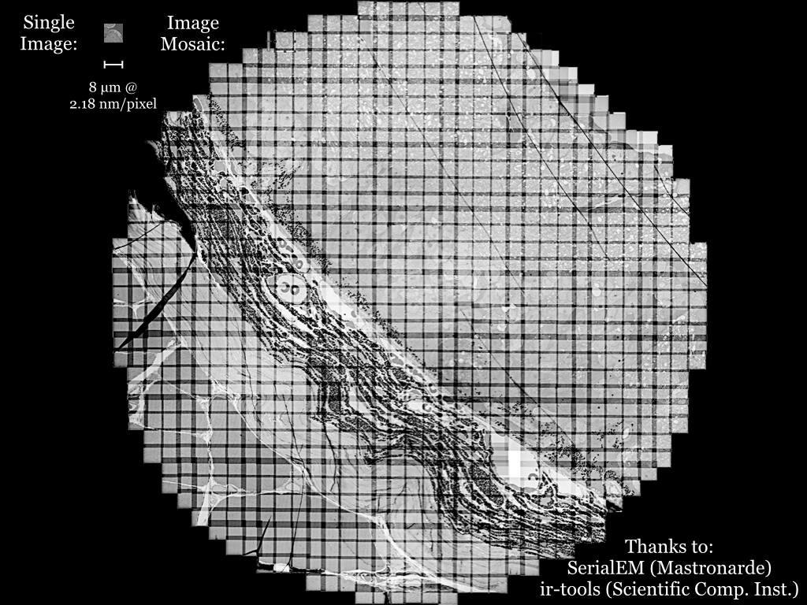
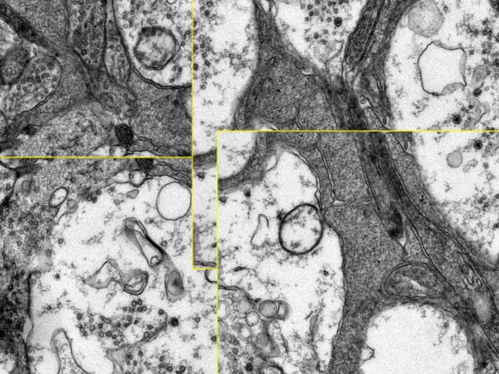
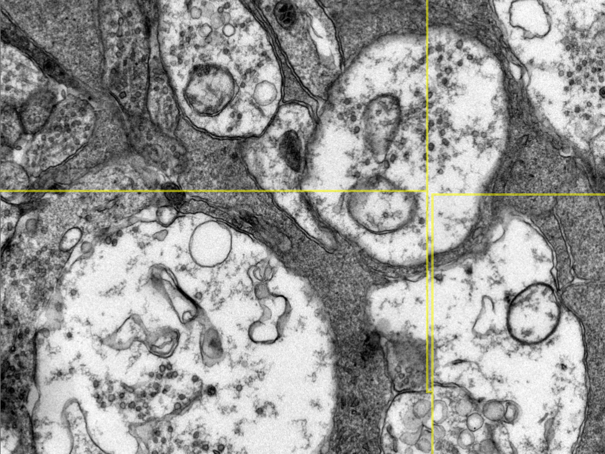
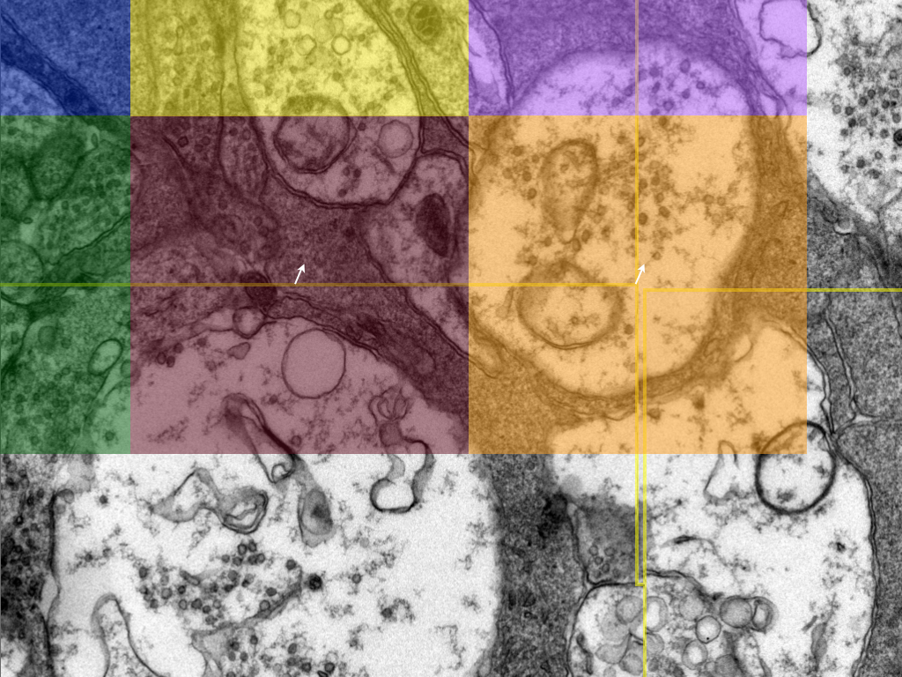
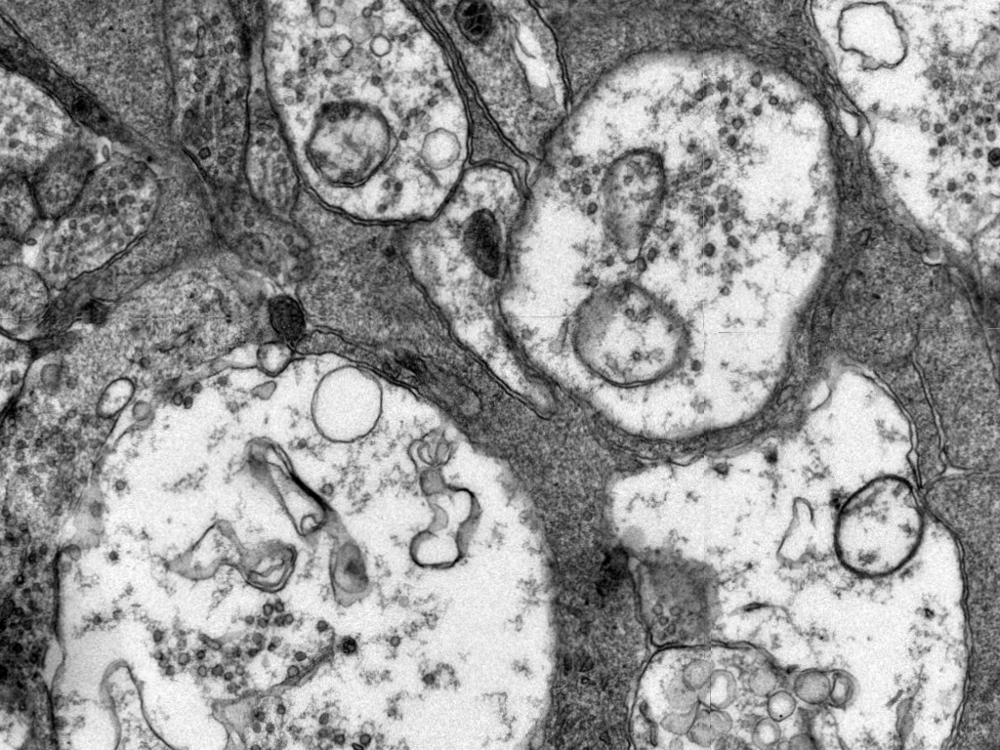
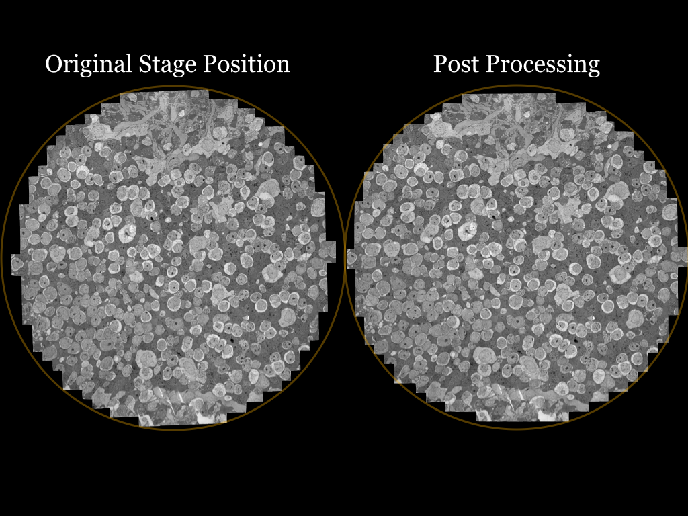
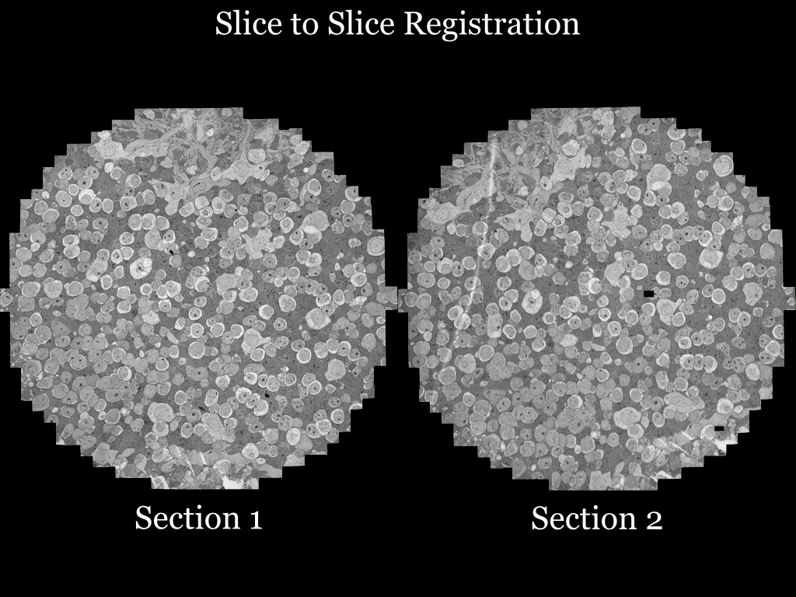
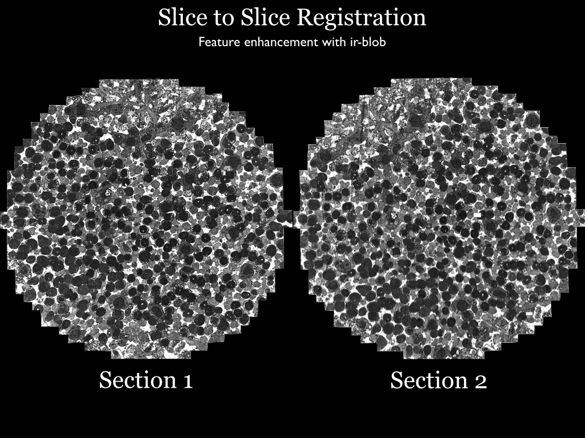
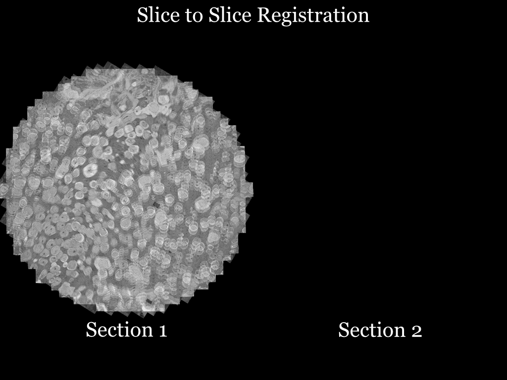
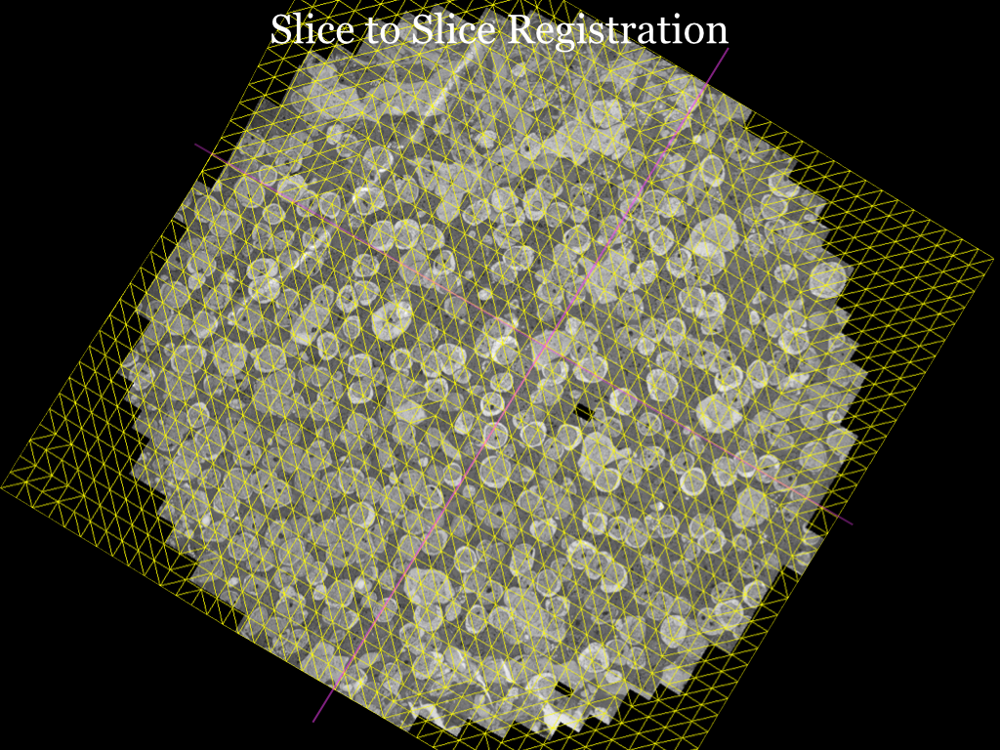

.. _overview-alignment-theory:

Overview of volume building
===========================

To build a 3D volume using transmission electron microscopes we begin by taking a sample and embedding it in a **block** of plastic resin. This block is then cut into thin, about 70--90 nm, **sections**. Each section is placed on a grid or a slide. At 5000× our transmission electron microscope can produce an image representing an 8 µm square. To collect a larger area we collect a **mosaic** of images with a 10%--12% overlap. We refer to an image in a mosaic as a **tile** even though proper tiles would not overlap. Nornir figures out how to lay out the tiles so we can **assemble** a single image of the entire mosaic.

We assemble a mosaic image for each section cut from the block. Sometimes we call a section a **slice**. Each section is then registered to the adjacent sections to produce **slice-to-slice** (``.stos``) transformations. We decide which mosaic is the **center** of the volume. Transforms can then be added such that any point on a mosaic can be mapped through slice-to-slice transforms until the center is reached. This produces a mapping for each section to the volume. The **slice-to-volume** transforms can be used with Viking_ or, if the mosaic images are small enough, volume-aligned section images can be produced.

.. _Viking: https://connectomes.utah.edu/

Mosaic registration
-------------------

Mosaic capture
^^^^^^^^^^^^^^

Our lab uses SerialEM to capture a mosaic on a JEOL JEM 1400.

   Tiles are captured at 5000×, equivalent to 2.18 nm/pixel. Our 4K Gatan camera captures an 8 µm square area. We use a 12% tile overlap. A typical section is 250 µm in diameter requiring 813 images to cover.

Stage metadata
^^^^^^^^^^^^^^^^

Having stage metadata saves Nornir from needing to calculate the offsets between all tiles and estimating a layout.

Stages are not perfect. Below are four overlapping tiles positioned using the stage coordinates reported by the JEOL scope.

   Yellow lines mark the borders between tiles.

Tile translation
^^^^^^^^^^^^^^^^

The first registration step is to translate the tiles to an optimal initial layout. This removes errors in the reported stage position.

   Nornir uses phase correlation for this and most other registrations.

The translation of tiles results in a much better alignment, but minor distortions in the tiles still produce imperfections.

Grid-based refinement (mosaic)
^^^^^^^^^^^^^^^^^^^^^^^^^^^^^^^^

The remaining registration errors are not fixable via simple translation. To repair these, a grid of cells is laid over each tile, and an offset vector is calculated to determine the optimal position for that cell.

   After translation, residual error remains where tiles do not match perfectly.

Output
^^^^^^

A mesh, essentially a texture mapping, is defined for each tile. The final result is an image largely free of seams.

Taken as a whole, we can see the overall movement of the tiles to produce the finished mosaic.

   Note the distance from the circular bounds between the mosaic laid out with the stage position and the mosaic after processing.

Slice-to-slice registration
---------------------------

Once the mosaics are built for each section we begin aligning sections into a volume. The initial registration is done via brute force: the image is rotated by a small angle and a strength score is calculated for the resulting registration.

Feature enhancement
^^^^^^^^^^^^^^^^^^^

Measuring registration quality is time consuming for large images, so downsampled versions are often used. Unfortunately downsampling can erase features useful to registration. For this reason a "blob" filter is available and used by our TEM images.

"Blob" remaps pixel intensity based on the surrounding pixels' variance relative to the entire image. The median variance is calculated for the entire image. A neighborhood is defined for each pixel. If the variance is above or below the median it is assigned to black or white. The result is that regions of similar texture are assigned to the same color.

Rotation and translation
^^^^^^^^^^^^^^^^^^^^^^^^^^

Sections rarely survive processing without significant distortion. This can be seen by overlaying the sections after brute-force alignment.

This is the most error-prone step of volume construction. Nornir includes **Pyre**, which allows users to interactively fix the alignment.

   The clear area is relatively well aligned, but the blurry regions are distorted relative to each other.

Grid-based refinement (slice-to-slice)
^^^^^^^^^^^^^^^^^^^^^^^^^^^^^^^^^^^^^^

As in the mosaics, the solution is to lay a grid of cells over the images and determine a local offset for the center of each grid cell.

   Straight purple lines have been overlaid onto the yellow mesh to highlight the subtle deformation required.

Volume registration
^^^^^^^^^^^^^^^^^^^

The final step is to map all sections to a single coordinate system. Nornir designates a section as the **center**. It passes the control points for each slice-to-slice registration through any intermediate transformations between the section and the center. The result is a mapping that warps a section directly to the volume in a single step.

Figure 2 of the `Viking Viewer for Connectomics`_ paper demonstrates the concept. The modern implementation of Nornir uses radial basis functions to estimate the positions of control points that fall outside the boundaries of a mesh.

.. _Viking Viewer for Connectomics: https://www.ncbi.nlm.nih.gov/pmc/articles/PMC3017751/
